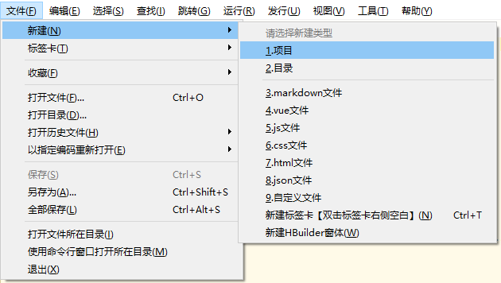
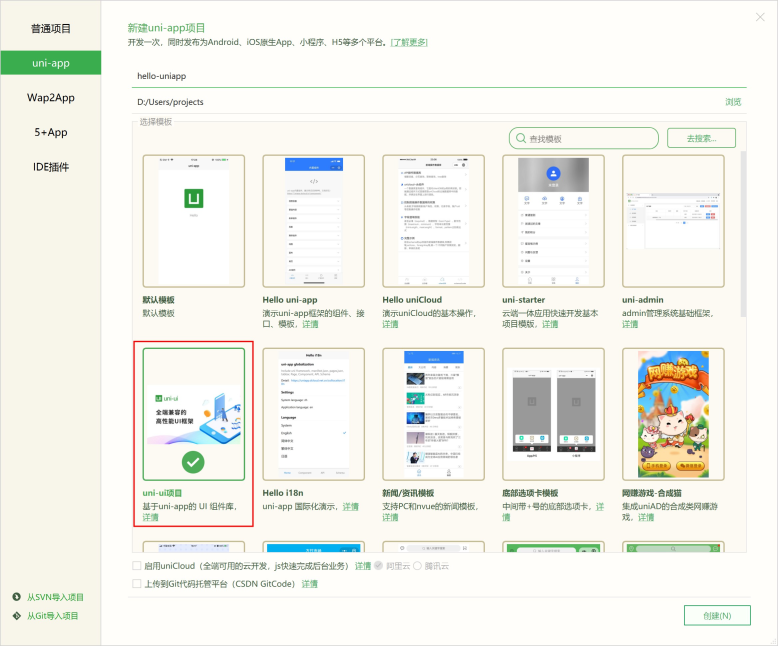
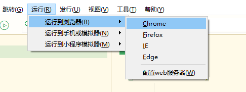
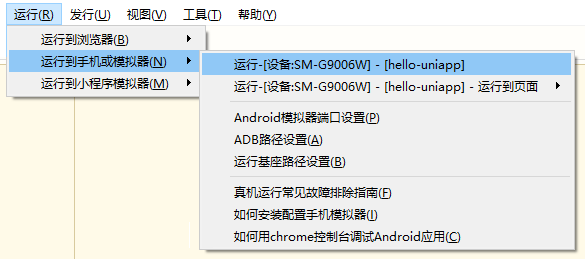
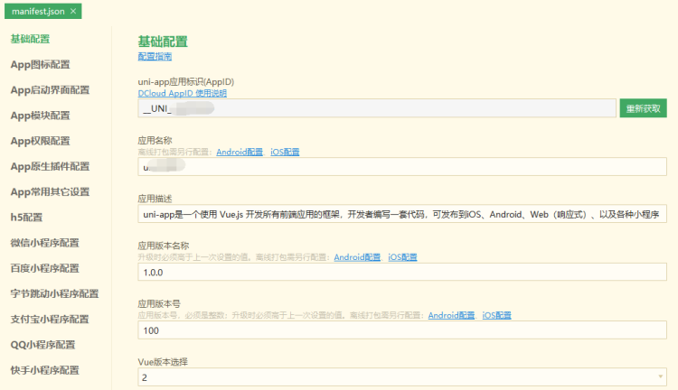
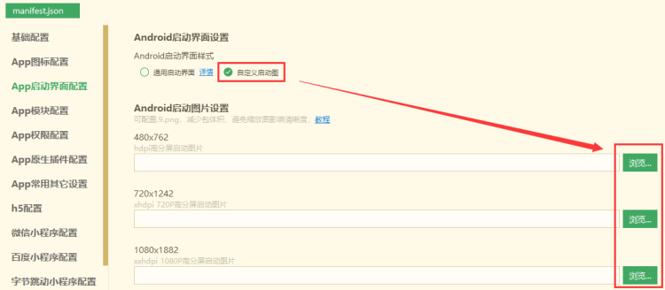
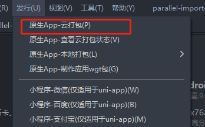
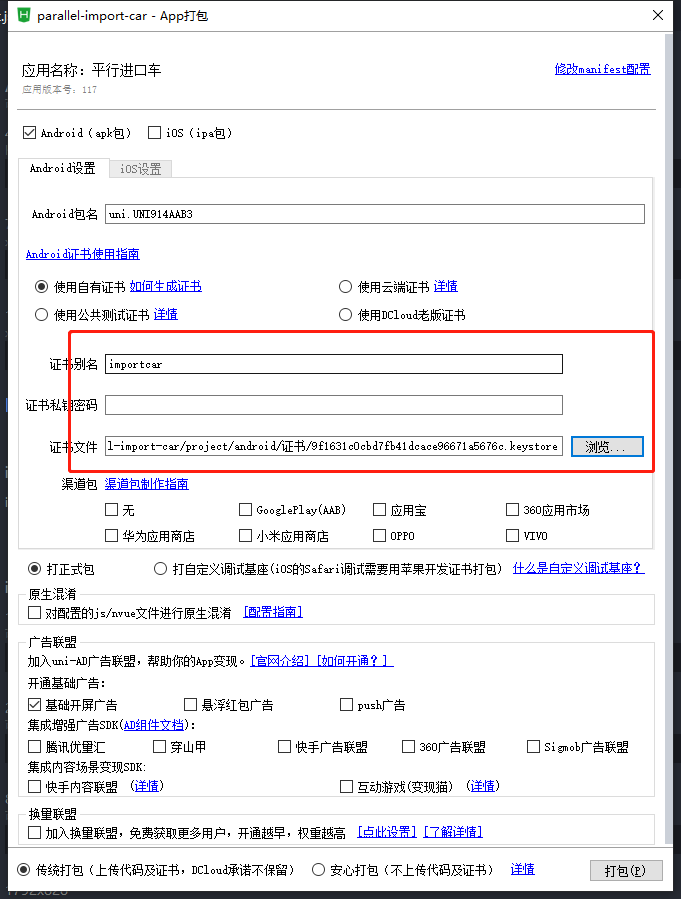
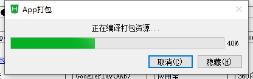
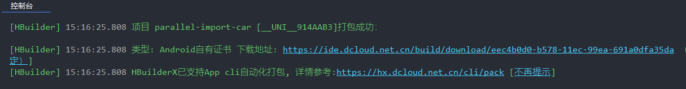

<!--
 * @CreateAuthor: 作者
 * @CreateDate: 创建时间
 * @LastEditors: 修改人
 * @LastEditTime: 2022-07-22 16:54:53
 * @Descripttion: 描述
-->
# uni-app

## uni-app介绍

uni-app 是一个使用 Vue.js(opens new window)开发所有前端应用的框架，开发者编写一套代码，可发布到iOS、Android、Web（响应式）、以及各种小程序（微信/支付宝/百度/头条/飞书/QQ/快手/钉钉/淘宝）、快应用等多个平台。

## uni-app选型
### 跨端开发框架对比
多端开发框架对比横评，参考：https://juejin.im/post/5e8e8d5a6fb9a03c6d3d9f42

总结：
跨端框架是一个重投入工作，在各框架的1年多的比拼中，很多框架因为投入不足而逐渐被开发者放弃，uni-app和taro依靠持续的大力度投入，成为了市场主流。

1. 如果你熟悉React，不懂Vue.js，推荐Taro；
2. 如果你熟悉Vue.js，则推荐 uni-app；
3. 如果你的业务涉及多端，更推荐 uni-app；
4. 如果你希望通过 serverless 方案快速上线业务，推荐 uni-app。

### App，flutter、react native等App跨平台框架对比
参考：https://ask.dcloud.net.cn/article/36083

**技术学习成本和难度**

* rn：要求开发者学习react，要求精通flex布局，要求原生开发协作。
* flutter：要求开发者学习dart，了解dart和flutter的API、要求精通flex布局，要求原生开发协作。
* weex：已经内嵌到uni-app中，就不单独提了。
* uni-app：要求开发者学习vue，了解小程序。
很明显uni-app的学习成本太低了，它没有附加专有技术，全部使用公共技术。

**总结**

总结flutter与uni-app的比较：

* flutter与uni-app的相对优势：
  >性能好一丢丢。比rn有优势，但比拥有bindingx和wxs的uni-app，在实际开发中没有很明显的差距。
* flutter与uni-app的相对劣势：
  >需要原生协作，维护3套代码，无法有效降低开发成本，提升开发效率

  >嵌套地狱，代码难看难维护

  >不支持热更新

  >目前质量和成熟度很低

  >原生可视控件融合不好，比如webview、video、map

  >ui库不适合国情

  >学习成本高
  
  >应用场景有限，dart未来扑朔迷离

总结rn和uni-app的比较
* rn与uni-app的相对优势：
  >rn的坑虽然比weex的少，但uni-app已经填了weex的很多坑。这方面差别不大。

  >rn的生态虽然比weex丰富。但uni-app是反过来的，uni-app的国内应用生态丰富度超过了rn。

  >rn是纯单页的，嵌入原生App比较灵活。而uni-app是应用整体的概念，如果要内嵌入其他原生应用的话，要求原生应用内嵌uni-app应用整体进来。即集成[uni小程序sdk](https://ask.dcloud.net.cn/docs/#https://ask.dcloud.net.cn/article/36941)
* rn与uni-app的相对劣势：
  >需要原生协作，维护3套代码，无法有效降低开发成本，提升开发效率

  >不支持小程序，发布到h5也无法直接发

  >性能不如uni-app

  >国内的插件生态不如uni-app丰富

  >ui库不适合国情，learn once，write anywhere

  >学习成本高，用人成本高，不利于开发商降低开发成本

  >rn是纯单页应用，如果一个应用的页面很多，用rn写会很崩溃，变量污染和干扰严重。而weex/uni-app支持多页面，页面之间上下文隔离，写页面较多的大型应用更合适
  
另外react在中国的市场占有率远不如vue。这也是中国与国外不同的特色情况。

## 快速创建并运行uni-app项目
uni-app支持通过 可视化界面、[vue-cli命令行(opens new window)](https://uniapp.dcloud.io/quickstart-cli.html)两种方式快速创建项目。本文档写关于hbuilder X如何创建项目也建议用可视化界面创建项目，命令行自行查看官方文档

### 创建uni-app
在点击工具栏里的文件 -> 新建 -> 项目：

选择uni-app类型，输入工程名，选择模板，点击创建，即可成功创建。

uni-app自带的模板有 Hello uni-app ，是官方的组件和API示例。还有一个重要模板是 uni ui项目模板，日常开发推荐使用该模板，已内置大量常用组件。


### 运行uni-app
浏览器运行：进入hello-uniapp项目，点击工具栏的运行 -> 运行到浏览器 -> 选择浏览器，即可在浏览器里面体验uni-app 的 H5 版。


运行App到手机或模拟器：连接手机，开启USB调试，进入hello-uniapp项目，点击工具栏的运行 -> 真机运行 -> 选择运行的设备，即可在该设备里面体验uni-app。

如手机无法识别，请点击菜单运行-运行到手机或模拟器-真机运行常见故障排查指南。 注意目前开发App也需要安装微信开发者工具。

在微信开发者工具里运行：进入hello-uniapp项目，点击工具栏的运行 -> 运行到小程序模拟器 -> 微信开发者工具，即可在微信开发者工具里面体验uni-app。


一次使用，需要先配置小程序ide的相关路径，才能运行成功。如下图，需在输入框输入微信开发者工具的安装路径。 若HBuilderX不能正常启动微信开发者工具，需要开发者手动启动，然后将uni-app生成小程序工程的路径拷贝到微信开发者工具里面，在HBuilderX里面开发，在微信开发者工具里面就可看到实时的效果。uni-app默认把项目编译到根目录的unpackage目录。


## 开发入门
### uni-app对比vue开发变化
#### 组件/标签的变化
* 以前是html标签，比如`<div>`，现在是小程序组件，比如`<view>`。
* 那么标签和组件有什么区别，不都是用尖括号包围起来一段英文吗？
* 其实标签是老的概念，标签属于浏览器内置的东西。但组件，是可以自由扩展的。
* 类似你可以把一段js封装成函数或模块，你也可以把一个ui控件封装成一个组件。
* uni-app参考小程序规范，提供了一批内置组件。
* 下为html标签和uni-app内置组件的映射表：
>div 改成 [view](https://uniapp.dcloud.io/component/view.html)

>span、font 改成 [text](https://uniapp.dcloud.io/component/text.html)

>a 改成 [navigator](https://uniapp.dcloud.io/component/navigator.html)

>img 改成 [image](https://uniapp.dcloud.io/component/image.html)

>[input](https://uniapp.dcloud.io/component/input) 仅仅是输入框。 原html规范中input不仅是输入框，还有radio、checkbox、时间、日期、文件选择功能。在uni-app和小程序规范中，input仅仅是输入框。其他功能uni-app有单独的组件或API：[radio组件](https://uniapp.dcloud.io/component/radio.html)、[checkbox组件](https://uniapp.dcloud.io/component/checkbox.html)、时间选择、日期选择、图片选择、视频选择、多媒体文件选择(含图片视频)、通用文件选择。

>form、button、label、textarea、canvas、video 这些还在。

>select 改成 picker

>iframe 改成 web-view

>ul、li没有了，都用view替代。做列表一般使用uList组件

>audio 不再推荐使用，改成api方式，背景音频api文档

>其实老的HTML标签也可以在uni-app里使用，uni-app编译器会在编译时把老标签转为新标签，比如把div编译成view。但不推荐这种用法，调试H5端时容易混乱。

除了改动外，新增了一批手机端常用的新组件
>scroll-view 可区域滚动视图容器

>swiper 可滑动区域视图容器

>icon 图标

>rich-text 富文本（不可执行js，但可渲染各种文字格式和图片）

>progress 进度条

>slider 滑块指示器

>switch 开关选择器

>camera 相机

>live-player 直播

>map 地图

>cover-view 可覆盖原生组件的视图容器 cover-view需要多强调几句，uni-app的非h5端的video、map、canvas、textarea是原生组件，层级高于其他组件。如需覆盖原生组件，则需要使用cover-view组件。详见层级介绍

#### js的变化
js的变化，分为运行环境变化、数据绑定模式变化、api变化3部分。

**运行环境从浏览器变成v8引擎**

标准js语法和api都支持，比如`if、for、settimeout、indexOf`等。

但浏览器专用的`window、document、navigator、location对象，包括cookie`等存储，只有在浏览器中才有，app和小程序都不支持。

可能有些人以为js等于浏览器里的js。其实js是ECMAScript组织管理的，浏览器中的js是w3c组织基于js规范补充了`window、document、navigator、location`等专用对象。

在uni-app的各个端中，除了h5端，其他端的js都运行在一个独立的v8引擎下，不是在浏览器中，所以浏览器的对象无法使用。

#### css的变化
标准的css基本都是支持的。

选择器有2个变化：*选择器不支持；元素选择器里没有body，改为了page。微信小程序即是如此。复制代码page{   }

单位方面，px无法动态适应不同宽度的屏幕，rem无法用于nvue/weex。如果想使用根据屏幕宽度自适应的单位，推荐使用rpx，全端支持。 尺寸单位文档

uni-app推荐使用flex布局，这个布局思路和传统流式布局有点区别。但flex的特色在于，不管是什么技术都支持这种排版，web、小程序/快应用、weex/rn、原生的iOS、Android开发，全都支持flex。它是通吃所有端的新一代布局方案。

uni-app的vue文件里支持所有web排版方式，不管是流式还是flex。但nvue里，只支持flex，因为它在app端是使用原生排版引擎渲染的。

注意css里背景图和字体文件，尽量不要大于40k，因为会影响性能。在小程序端，如果要大于40k，需放到服务器侧远程引用或base64后引入，不能放到本地作为独立文件引用。

#### 路由变化
在vue项目中需要单独引入vue-router来配置使用路由，而在uni-app中每个可显示的页面，都必须在 pages.json 中注册。

**路由注册**

pages节点的第一项为应用入口页（即首页）
```js
{
  "pages": [{
      "path": "pages/index/index",
      "style": {
        "navigationBarTitleText": "首页",//设置页面标题文字
        "enablePullDownRefresh":true//开启下拉刷新
      }
    },
    ...
  ]
}
```
**路由跳转**

uni-app 有两种页面路由跳转方式：使用[navigator](https://uniapp.dcloud.io/component/navigator.html)组件跳转、调用[API](https://uniapp.dcloud.io/api/router)跳转。

|  路由方式   | 页面栈表现  | 触发时机 |
|  ----  | :----  | ---- |
| 打开新页面  | 新页面入栈保留当前页面，跳转到应用内的某个页面，使用uni.navigateBack可以返回到原页面。 | 调用 API   [uni.navigateTo](https://uniapp.dcloud.io/api/router.html#navigateto)、使用组件[`<navigatoropen-type="navigate"/>`](https://uniapp.dcloud.io/component/navigator.html#navigator) |
| 页面重定向  | 当前页面出栈，新页面入栈关闭当前页面，跳转到应用内的某个页面。 | 调用 API   uni.redirectTo、使用组件  [`<navigator open-type="redirectTo"/>`](https://uniapp.dcloud.io/component/navigator.html#navigator) |
| 页面返回  | 页面不断出栈，直到目标返回页关闭当前页面，返回上一页面或多级页面。可通过 getCurrentPages() 获取当前的页面栈，决定需要返回几层。 | 调用 API  [uni.navigateBack](https://uniapp.dcloud.io/api/router.html#navigateback)、使用组件 [`<navigator open-type="navigateBack"/>`](https://uniapp.dcloud.io/component/navigator.html#navigator)、用户按左上角返回按钮、安卓用户点击物理back按键 |
| Tab 切换  | 页面全部出栈，只留下新的 Tab 页面跳转到 tabBar 页面，并关闭其他所有非 tabBar 页面。 | 调用 API  [uni.navigateBack](https://uniapp.dcloud.io/api/router.html#switchtab)、使用组件[ <`navigator open-type="navigateBack"/>`](https://uniapp.dcloud.io/component/navigator.html#navigator)、用户按左上角返回按钮、安卓用户点击物理back按键 |
| 重加载  | 页面全部出栈，只留下新的页面关闭所有页面，打开到应用内的某个页面 | 调用 API  [uni.reLaunch](https://uniapp.dcloud.io/api/router.html#relaunch)、使用组件  [`<navigator open-type="reLaunch"/>`](https://uniapp.dcloud.io/component/navigator.html#navigator) |

栗子
```js
//在起始页面跳转到test.vue页面并传递参数
uni.navigateTo({
	url: 'test?id=1&name=uniapp'
});
```

#### 生命周期变化
uni-app 页面常用生命周期函数对比vue生命周期函数

|  函数名  | 说明  | 类比vue生命周期 |
|  ----  | :----  | ---- |
| onLoad  | 监听页面加载，其参数为上个页面传递的数据，参数类型为 Object（用于页面传参），[参考示例](https://uniapp.dcloud.io/api/router.html#navigateto) | mounted |
| onShow | 监听页面显示。页面每次出现在屏幕上都触发，包括从下级页面点返回露出当前页面 |  |
| onReady | 监听页面初次渲染完成。注意如果渲染速度快，会在页面进入动画完成前触发 |  |
| onHide | 监听页面隐藏 |  |
| onUnload | 监听页面卸载 | destroyed |
| onResize | 监听窗口尺寸变化 |  |
| onPullDownRefresh | 监听用户下拉动作，一般用于下拉刷新，[参考示例](https://uniapp.dcloud.io/api/ui/pulldown.html) |  |
| onReachBottom | onReachBottom	页面滚动到底部的事件（不是scroll-view滚到底），常用于下拉下一页数据。具体见下方注意事项 |  |
| onPageScroll | 监听页面滚动，参数为Object |  |
**特殊：onLaunch为应用的生命周期，当uni-app 初始化完成时触发（全局只触发一次），应用生命周期仅可在App.vue中监听，在其它页面监听无效**

## 开发进阶
### 原生插件使用
[原生插件使用](https://nativesupport.dcloud.net.cn/NativePlugin/use/use?id=%E7%AC%AC%E4%B8%80%E6%AD%A5%EF%BC%9A%E8%B4%AD%E4%B9%B0%E6%88%96%E4%B8%8B%E8%BD%BDuni-app%E5%8E%9F%E7%94%9F%E6%8F%92%E4%BB%B6)
### 跨端注意
详见官网跨端注意：https://uniapp.dcloud.io/matter.html

#### 条件编译
条件编译是用特殊的注释作为标记，在编译时根据这些特殊的注释，将注释里面的代码编译到不同平台。
**写法：**以 `#ifdef` 或 `#ifndef` 加 `%PLATFORM%` 开头，以 `#endif` 结尾。
* #ifdef：if defined 仅在某平台存在
* #ifndef：if not defined 除了某平台均存在
* %PLATFORM%：平台名称

|  条件编译写法  | 说明 |
|  :----  | :---- |
| #ifdef APP-PLUS 需条件编译的代码 #endif  | 仅出现在 App平台下的代码 |
| #ifndef H5 需条件编译的代码 #endif | 除了 H5 平台，其它平台均存在的代码 |
| #ifdef H5 `||` MP-WEIXIN 需条件编译的代码 #endif | 在 H5 平台或微信小程序平台存在的代码（这里只有`||`，不可能出现`&&`，因为没有交集） |

%PLATFORM% 可取值如下：

|  值  | 生效条件 |
|  :----  | :---- |
| VUE3 | HBuilderX 3.2.0+ [详情(opens new window)](https://ask.dcloud.net.cn/article/37834) |
| APP-PLUS | APP-PLUS	App |
| APP-PLUS-NVUE或APP-NVUE | App nvue |
| H5 | H5	H5 |
| MP-WEIXIN | 微信小程序 |
| MP-ALIPAY | 支付宝小程序 |
| MP-BAIDU | 百度小程序 |
| MP-TOUTIAO | 字节跳动小程序 |
| MP-LARK | 飞书小程序 |
| MP-QQ | QQ小程序 |
| MP-KUAISHOU | 快手小程序 |
| MP-JD | 京东小程序 |
| MP-360 | 360小程序 |
| MP | 微信小程序/支付宝小程序/百度小程序/字节跳动小程序/飞书小程序/QQ小程序/360小程序 |
| QUICKAPP-WEBVIEW | 快应用通用(包含联盟、华为) |
| QUICKAPP-WEBVIEW-UNION | 快应用联盟 |
| QUICKAPP-WEBVIEW-HUAWEI | QUICKAPP-WEBVIEW-HUAWEI	快应用华为 |

**支持的文件**
* .vue
* .js
* .css
* pages.json
* 各预编译语言文件，如：.scss、.less、.stylus、.ts、.pug

## 打包上线
### 如何生成签名证书
#### Android平台签名证书(.keystore)生成指南
Android平台打包发布apk应用，需要使用数字证书（.keystore文件）进行签名，用于表明开发者身份。

Android证书的生成是自助和免费的，不需要审批或付费。

可以使用JRE环境中的keytool命令生成。以下是windows平台生成证书的方法：

#### 安装JRE环境（推荐使用JRE8环境，如已有可跳过）
可从Oracle官方下载jre安装包：https://www.oracle.com/technetwork/java/javase/downloads/index.html

下面以Windows平台，jre安装目录为“C:\Program Files\Java\jre1.8.0_201”为例，实际操作时请修改为自己安装目录

**建议将JRE安装路径添加到系统环境变量，已配置可跳过此章节**

打开命令行（cmd），输入以下命令：
```js
d:  
set PATH=%PATH%;"C:\Program Files\Java\jre1.8.0_201\bin"
```
* 第一行：切换工作目录到D:路径
* 第二行：将jre命令添加到临时环境变量中

#### 生成签名证书
使用keytool -genkey命令生成证书：
```js
keytool -genkey -alias testalias -keyalg RSA -keysize 2048 -validity 36500 -keystore test.keystore
```
* `testalias`是证书别名，可修改为自己想设置的字符，建议使用英文字母和数字
* `test.keystore`是证书文件名称，可修改为自己想设置的文件名称，也可以指定完整文件路径
* 36500是证书的有效期，表示100年有效期，单位天，建议时间设置长一点，避免证书过期
回车后会提示：

回车后会提示：
```js
Enter keystore password:  //输入证书文件密码，输入完成回车  
Re-enter new password:   //再次输入证书文件密码，输入完成回车  
What is your first and last name?  
  [Unknown]:  //输入名字和姓氏，输入完成回车  
What is the name of your organizational unit?  
  [Unknown]:  //输入组织单位名称，输入完成回车  
What is the name of your organization?  
  [Unknown]:  //输入组织名称，输入完成回车  
What is the name of your City or Locality?  
  [Unknown]:  //输入城市或区域名称，输入完成回车  
What is the name of your State or Province?  
  [Unknown]:  //输入省/市/自治区名称，输入完成回车  
What is the two-letter country code for this unit?  
  [Unknown]:  //输入国家/地区代号（两个字母），中国为CN，输入完成回车  
Is CN=XX, OU=XX, O=XX, L=XX, ST=XX, C=XX correct?  
  [no]:  //确认上面输入的内容是否正确，输入y，回车  

Enter key password for <testalias>  
        (RETURN if same as keystore password):  //确认证书密码与证书文件密码一样（HBuilder|HBuilderX要求这两个密码一致），直接回车就可以
```
以上命令运行完成后就会生成证书，路径为`“D:\test.keystore”`。

#### iOS证书(.p12)和描述文件(.mobileprovision)申请
iOS有两种证书和描述文件：
|  证书类型  | 使用场景 |
|  :----  | :---- |
| 开发(Development)证书和描述文件 | 用于开发测试，在 HBuilderX 中打包后可在真机环境通过[Safari调试](https://ask.dcloud.net.cn/article/143) |
| 发布(Distribution)证书和描述文件 | 用于提交 AppStore，在 HBuilderX 中提交云打包后提交到 AppStore 审核发布 |

详见 https://ask.dcloud.net.cn/article/152

### 打包配置
#### 基础配置
HBuilderX中打开项目的manifest.json文件，在“基础配置”中可以设置App的应用名称、版本号等信息：


#### 图标配置
HBuilderX中打开项目的manifest.json文件，在“App图标配置”中可以设置App的桌面图标，推荐使用“自动生成图标”功能： 


#### 启动界面
App启动时，系统加载应用渲染首页需要一定的时间，为了避免用户等待，手机操作系统提供了特殊的启动界面设计，让用户先看到一个简单的界面，等应用加载完成后正式进入应用首页。
这个界面，即被称为启动界面，也成称为 `splash` 或 `lauch screen`。

**Android平台自定义启动图**

打开项目的`manifest.json`文件，在“App启动界面配置”中的“`Android`启动界面设置”项下勾选“自定义启动图”：


**iOS平台自定义启动图**

> 提示：2020年6月30日起，苹果AppStore审核要求应用在启动时，不能使用启动图片，必须改为使用Storyboard来制作启动界面，如果需要提交AppStore请使用[通用启动界面](https://uniapp.dcloud.io/tutorial/app-splashscreen.html#common)或自定义[storyboard](https://uniapp.dcloud.io/tutorial/app-splashscreen.html#storyboard)启动界面。

打开项目的`manifest.json`文件，在“App启动界面配置”中的“iOS启动界面设置”项下勾选“自定义启动图”：


#### 功能模块
App端如用到以下相关模块，需要勾选相关模块的配置：
* [Geolocation(定位)](https://uniapp.dcloud.io/tutorial/app-geolocation.html)
* [Maps(地图)](https://uniapp.dcloud.io/tutorial/app-maps.html)
* [OAuth(登录鉴权)](https://uniapp.dcloud.io/tutorial/app-oauth.html)
* [Payment(支付)](https://uniapp.dcloud.io/tutorial/app-payment.html)
* Push(消息推送) 
* [Statistic(统计)](https://uniapp.dcloud.io/tutorial/app-statistic.html)

已定位功能为例，使用定位功能需在项目`manifest.json`的“App模块配置”中勾选“`Geolocation`(定位)”，并根据项目实际需求勾选使用的三方定位SDK： 


### 开始打包
点击工具栏的发行 -> 原生App-云打包

选择要打包的平台安卓或ios(可同时勾选打包)，输入证书别名和证书密码选择生成的相应平台证书，点击打包按钮开始打包。

经过几分钟的云打包后，在控制台点击地址下载相应的apk或ios包



### 上架应用市场
登录相应平台的开发者账号，上传apk提供相应资料和描述提交审核