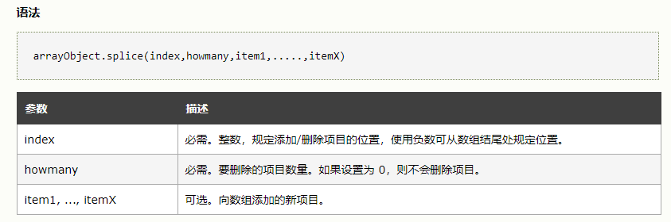

# 数组 :kissing_cat:

## 数组的创建

### 数组直接量创建

使用数组直接量是创建数组最简单的方法，在方括号中将数组元素用逗号隔开即可。
```js
var empty = [] // 没有元素的数组
var primes = [2，3， 5，7，11] // 有5个数值的数组
var misc = [ 1.1,true,"a", ] // 3个不同类型的元素和结尾的逗号
```
数组直接量中的值不一定要是常量，它们可以是任意的表达式:

```js
var base = 1024
var table = [base， base+1， base+2, base+3]
```
如果省略数组直接量中的某个值，省略的元素将被赋予undefined值:
```js
var count = [1,,3]  // 数组有3个元素，中间的那个元素值为undefined
var undefs =  [,,]  // 数组有2个元素，都是undefined
```
数组直接量的语法允许有可选的结尾的逗号，故[,,]只有两个元素而非三个。

### 构造函数创建数组
```js
var arr1 = new Array()  // 创建一个没有元素的数组
var arr2 = new Array(5)  // 创建一个数组，长度固定为5
var arr3 = new Array(5, 4, 3, 2, 1, "number")  // 创建一个数组[5, 4, 3, 2, 1, "number"]
```

## 数组元素的读和写

## 稀疏数组
稀疏数组就是包含从0开始的不连续索引的数组。通常，数组的length属性值代表数组中元素的个数。如果数组是稀疏的，length属性值大于元素的个数。可以用Array()构造函数或简单地指定数组的索引值大于当前的数组长度来创建稀疏数组。

## 数组长度
可以用object.defineProperty()让数组的length属性变成只读的
```js
var arr = [1, 2, 3, 5]
Object.defineProperty(arr, "length", {
	writable: false
})
arr.length = 2
console.log(arr.length) // 4 不能修改其数组长度
arr[4] = 6
arr.push('6')
console.log(arr)  // [1, 2, 3, 5] 不能向数组中添加新的数据了，因为添加新数据会影响数组长度.
arr[0] = 0 // [0, 2, 3, 5] 可以修改已有的数据
```

## 数组元素的添加与删除

1. splice()方法删除、添加

splice() 方法向/从数组中添加/删除项目，然后返回被删除的项目。


```js
var arr = [1, 2, 3, 5, 6, 7]
// 删除arr数组中第二项和第三项
arr.splice(1, 2) // 返回删除元素数组[2, 3]
console.log(arr)  // [1, 5, 6, 7]

// 向数组的第三项中添加数据项4, 3
arr.splice(2, 0, 4, 3)  // 返回数组[]
console.log(arr)  // [1, 5, 4, 3, 6, 7]

// 将数组中的第二项和第三项替换为2
arr.splice(1, 2, 2) // 返回删除数组元素数组[5, 4]
console.og(arr) //  [1, 2, 3, 6, 7]
```
* splice()方法实际上就是通过数组的索引（index）定位到数据项，然后删除需要操作的数据项，然后再删除的位置插入需要添加的数据项。

### 数组添加
1. 索引赋值
```js
var arr = []
arr[0] = "one"
arr[1] = "two"
```

2. push()方法向数组中添加元素
```js
var arr = []
arr.push("one") // 在末尾添加一个元素。arr = ["one"]
arr.push("two", "three") // 再添加两个元素。arr = ["one", "two"，"three"]
```

3. unshift()方法向数组中添加元素

unshift() 方法可向数组的开头添加一个或更多元素，并返回新的长度。
```js
var arr = [3, 4]
arr.unshift(1, 2)  // 返回4,即添加成功后数组的长度
arr // [1, 2, 3, 4]
```

### 数组删除

1. delete运算符删除数组元素
```js
var arr = [1, 2, 3, 5]
delete arr[0]
0 in arr   // false: 数组索引0并未在数组中定义
arr.length   // 4: delete操作并不影响数组长度
```
* 删除数组元素与为其赋undefined值是类似的（但有一些微妙的区别）。注意，对一个数组元素使用delete不会修改数组的length属性，也不会将元素从高索引处移下来填充已删除属性留下的空白。如果从数组中删除一个元素，它就变成稀疏数组。

2. pop()方法删除数组元素

pop() 方法用于删除并返回数组的最后一个元素。
```js
var arr = [1, 2, 3, 5]
arr.pop()  // 返回5
arr  // [1, 2, 3]
```

3. shift()方法删除数组元素

shift() 方法用于把数组的第一个元素从其中删除，并返回第一个元素的值。
```js
var arr = [1, 2, 3, 5]
arr.shift()  // 返回1
arr  // [2, 3, 5]
```

## 数组遍历

### forEach循环
[forEach]循环，遍历数组中的每一项，没有返回值，对原数组没有影响。
```js
let arr = ['第一项', '第二项', '第三项']
arr.forEach( (element, index) => {
    console.log(element) // 第一项，第二项，第三项
    console.log(index) // 0, 1, 2
})
```

### for循环
[for]循环，使用临时变量，将长度缓存起来，避免重复获取数组长度，当数组较大时优化效果才会比较明显。
```js
let arr = ['第一项', '第二项', '第三项']
for (let index = 0; index < arr.length; index++) {
    const element = arr[index]
    console.log(element)  // 第一项，第二项，第三项
}
```

### map循环
[map]循环，map的回调函数中支持return返回值；return的是啥，相当于把数组中的这一项变为啥（并不影响原来的数组，只是相当于把原数组克隆一份，把克隆的这一份的数组中的对应项改变了。
如果修改数组中的某一项是对象或者数组，则修改会改变原数组中的对象或者数组
```js
// 修改的数组中是基本数据类型
let arr = ['第一项', '第二项', '第三项']
let newArr = arr.map(element => {
    return element = '项'
})
console.log(newArr) // ['项', '项', '项']
console.log(arr) // ['第一项', '第二项', '第三项']

// 修改的数组中是引用类型
let arr = ['重庆', {name: '小白', age: 20}, ['九龙坡', '沙坪坝']]
arr.map(element => {
    // 修改对象
    element.name = '大白'
    element.age = 30
    // 修改数组
    element[0] = "渝中区"
    element[1] = "大渡口"
})
console.log(arr) // ['重庆', {name: '小白', age: 20}, ['渝中区', '大渡口']]
```

### for of循环

## 数组方法

### join()
Array.join()方法是String.split()方法的逆向操作，后者是将字符串分割成若干块来创建一个数组。

join()方法用于把数组中的所有元素放入一个字符串，并且可以用指定字符分割。
```js
let str1 = "abc"
let str2 = "def"
let arr = [str1, str2]
let str3 = arr.join(";")
console.log(str3) // "abc; def"
```

### reverse()
Array.reverse()方法将数组中的元素颠倒顺序，返回逆序的数组。它采取了替换，换句话说，它不通过重新排列的元素创建新的数组，而是在原先的数组中重新排列它们
```js
var arr = [1, 2, 3, 6, 7]
arr.reverse() // 返回[7, 6, 3, 2, 1]
arr // [7, 6, 3, 2, 1]
```

### sort()
Array.sort()方法将数组中的元素排序并返回排序后的数组。当不带参数调用sort()时，数组元素以字母表顺序排序（如有必要将临时转化为字符串进行比较):
```js
var arr = [5, 4, 8, 9, 1]
arr.sort() // 返回[1, 4, 5, 8, 9]
arr // [1, 4, 5, 8, 9]

var array = ["banana", "cherry", "apple"]
array.sort()  // 返回["apple", "banana", "cherry"]
array  // ["apple", "banana", "cherry"]
```

### concat()
Array.concat()方法创建并返回一个新数组，它的元素包括调用concat()的原始数组的元素和concat()的每个参数。如果这些参数中的任何一个自身是数组，则连接的是数组的元素，而非数组本身。但要注意，**concat()不会递归扁平化数组的数组。concat()也不会修改调用的数组**。
```js
var arr = [1, 2]
arr.concat(3, 4)  // [1, 2, 3, 4]
arr.concat([3, 4])  // [1, 2, 3, 4]
arr.concat([3, 4], [5, 6])  // [1, 2, 3, 4, 5, 6]
arr.concat([[3, 4]])  // [1, 2, [3, 4]]
arr  // [1, 2]
```

### slice()
Array.slice()方法返回指定数组的一个片段或子数组。它的两个参数分别指定了片段的开始和结束的位置。返回的数组包含第一个参数指定的位置和所有到但不含第二个参数指定的位置之间的所有数组元素。如果只指定一个参数，返回的数组将包含从开始位置到数组结尾的所有元素。如参数中出现负数，它表示相对于数组中最后一个元素的位置。例如，参数–1指定了最后一个元素，而-3指定了倒数第三个元素。**注意，slice()不会修改调用的数组**。
```js
var arr = [1,2,3,4,5]
arr.slice(0, 3)  // 返回[1, 2, 3]
arr.slice(3)  // 返回[4, 5]
arr.slice(1, -1)  // 返回[2, 3, 4]
arr.slice(-3, -2)  // 返回[3]
```

### splice()
同上

### push()和pop()
同上

### unshift()和shift()
同上

### toString()和toLocaleString()
数组和其他JavaScript对象-样拥有toString()方法。针对数组，该方法将其每个元素转化为字符串（如有必要将调用元素的toString()方法）并且输出用逗号分隔的字符串列表。注意，输出不包括方括号或其他任何形式的包裹数组值的分隔符。
```js
[1, 2, 3].toString()  // 生成'1,2,3'
["a", "b", "c"].toString()  // 生成'a,b,c'
[1, [2,'c']].toString()  // 生成'1,2,c'

```
toLocaleString()是toString()方法的本地化版本。它调用元素的toLocalestring()方法将每个数组元素转化为字符串，并且使用本地化（和自定义实现的）分隔符将这些字符串连接起来生成最终的字符串。

## 数组类型
给定一个未知的对象，判定它是否为数组通常非常有用。在ECMAScript 5中，可以使用Array.isArray()函数来判断
```js
Array.isArray([])   // true
Array.isArray({})   // false
var arr = [1, 2]
var obj = { name: '小白' }
Array.isArray(arr)   // true
Array.isArray(obj)   // false
```

## 作为数组的字符串
```js
var str = "test"
str.chart(0)   // "t"
str[0]  // "t"
```