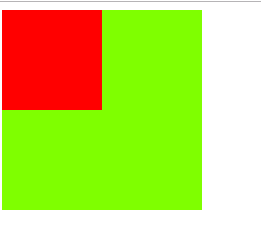
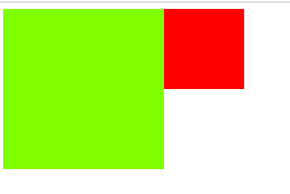

# 冒泡事件 :pray:

## 事例
当一个元素接收到事件的时候 会把他接收到的事件传给自己的父级，一直到window
```html
<div class="div1" @click="clickDiv1">
    <div class="div2" @click="clickDiv2">
    </div>
</div>
```

```css
.div1 {
    width: 200px;
    height: 200px;
    background: chartreuse;
}
.div2 {
    width: 100px;
    height: 100px;
    background: red;
}
```

```js
clickDiv1() {
    console.log('点击了div1')
},
clickDiv2() {
    console.log('点击了div2')
}
```
点击div2，这时div1也会触发（打印两次，div2和div1），即使使用绝对定位让两个div的位置不重叠也一样会触发两次




```css
.div1 {
    position: relative;
    width: 200px;
    height: 200px;
    background: chartreuse;
}
.div2 {
    position: absolute;
    left: 200px;
    width: 100px;
    height: 100px;
    background: red;
}
```

1. vue中解决冒泡事件可以通过方法中添加`.stop`来解决
```html
<div class="div1" @click="clickDiv1">
    <div class="div2" @click.stop="clickDiv2">
    </div>
</div>
```

2. javascript中解决冒泡事件可以通过`event`实例来解决
```js
function clickDiv1() {
    console.log('点击了div1')
},
function clickDiv2() {
    event.stopPropagation()
    console.log('点击了div2')
}
```
3. 如果`event.stopPropagation()`不能解决的话，可以通过event.target找到当前点击标签，如这里点击的是div2，来手动解决。

```vue
<template>
    <div>
        <RadioGroup v-model="checkGroup" v-for="(listData, id) in list" :key="id">
            <div @click="selectCompany(listData, id)">
                <Radio style="display: flex">
                    <p>
                        <span>{{listData.enterpriseName}}</span>
                        <span>基础价格:{{listData.priceTotal}}{{listData.curr}}</span>
                        <span>时长: {{listData.totalTime}}{{listData.totalTimeUnit}}</span>
                    </p>
                </Radio>
            </div>
        </RadioGroup>
    </div>
</template>

<script>
    export default {
        data () {
            return {
                checkGroup: '',
                list: [
                    {
                        enterpriseName: '重庆',
                        priceTotal: 100,
                        curr: '元',
                        totalTime: 10,
                        totalTimeUnit: '小时'
                    }
                ],
                num: 0
            }
        },
        methods: {
            selectCompany () {
                // 解决方式一：根据html元素控制方法只执行一次
                if (event.target.nodeName !== 'INPUT') return
                // 发生了冒泡事件
                console.log(`执行了${this.num + 1}次`)
                this.num = this.num + 1
            }
        },
    }
</script>
```