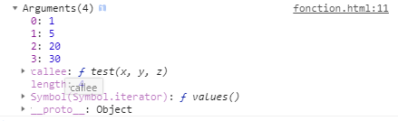

# 函数 :candle:

## 函数的定义
函数使用function关键字来定义

函数的组成部分:
* 函数名称标识符。函数名称是函数声明语句必需的部分。
* 一对圆括号，其中包含由O个或者多个用逗号隔开的标识符组成的列表。
* 一对花括号，其中包含0条或多条JavaScript语句。
```js
//计算两个笛卡尔坐标(x1,y1）和(x2,y2)之间的距离
function distance(x1, y1, x2, y2) {
    var dx = x2 - x1
    var dy = y2 - y1
    return Math.sqrt(dx*dx + dy*dy)
}
```

## 函数的命名
函数名称通常是动词或以动词为前缀的词组。通常函数名的第一个字符为小写，这是一种编程约定。当函数名包含多个单词时，一种约定是将单词以下划线分隔，就像like_this()。还有另外一种约定，就是除了第一个单词之外的单词首字母使用大写字母，就像likeThis()。有一些函数是用做内部函数或私有函数（不是作为公用API的一部分），这种函数名通常以一条下划线为前缀。

## 函数的形参和实参

形参：函数内部使用的参数

实参：函数调用时，传入函数内部的参数
```js
// 括号内的x,y就是形参
// 10对应x, 20对应y
function fnPass (x, y) {
    return x + y
}
// 10,20就是实参
fnPass(10, 20)
```

### 可变长的实参列表:实参对象
当调用函数的时候传入的实参个数超过函数定义时的形参个数时，没有办法直接获得未命名值的引用。参数对象解决了这个问题。在函数体内，标识符arguments是指向实参对象的引用，实参对象是一个类数组对象，这样可以通过数字下标就能访问传入函数的实参值，而不用非要通过名字来得到实参。
```js
function fn (x, y, z) {
    // 这里打印出来的argument是一个类数组对象
    console.log(arguments)
}
fn(1,5,20,30)
```


### 将对象作为实参
当一个函数包含超过三个形参时。最好通过名/值对的形式来传入参数，这样参数的顺序就无关紧要了。为了实现这种凤格的方法调用，定义函数的时候，传入的实参都写入一个单独的对象之中，在调用的时候传入一个对象，对象中的名/值对是真正需要的实参数据。下面的代码就展示了这种风格的函数调用，这种写法允许在函数中设置省略参数的默认值:
```js
var obj = {
    name: "小白",
    age: 20,
    sex: "男"
}
addAge(obj)
// 当传入对象name为小白时，让其age加5
function addAge (valData) {
    if (valData.name === "小白") {
        valData.age = valData.age + 5
    }
}
```

## 作为值的函数
可以将函数赋值给变量，存储在对象的属性或数组的元素中，作为参数传入另外一个函数。
```js
function tryFn(x) {
    return x*x
}
var s = tryFn  // 现在的s和tryFn指向的是同一个函数
tryFn(8)  // 64
s(8)  // 64
```

## 匿名函数
```js
(function () {
    return x + y
}(10, 20))
// 30 不用单独调用，匿名函数自己执行
```

## 闭包
**闭包就是能够读取其他函数内部变量的函数。**只有函数内部的子函数才能读取局部变量，所以闭包可以理解成“定义在一个函数内部的函数“。在本质上，闭包是将函数内部和函数外部连接起来的桥梁。

## Function()构造函数
不管是通过函数定义语句还是函数直接量表达式，函数的定义都要使用function关键字。但函数还可以通过Function()构造函数来定义，比如:
```js
var fn1 = new Function ("x", "y", "return x + y")
var fn2 = function (x,y) {
    return x + y
}
// f1与f2几乎等价。
```