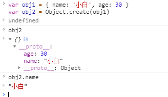

# 对象 :green_heart:

## 创建对象

### 对象直接量创建对象
1. 对象直接量是由若干名和值组成起来的映射表，名和值中间用“:”连接，两个相邻的名和值之间用“,”分隔开，整个映射表用花括号括起来。
2. 对象直接量是一个表达式，这个表达式每次运算都创建并初始化了一个新对象。每次计算对象直接量的时候，也会计算它每个属性的值。如果在一个重复调用的函数内使用对象直接量，它将会创建很多新对象，并且新对象中的属性值也有可能不同。
```js
var obj1 = {}  // 没有任何属性的对象
var obj2 = {}
obj1 === obj2 // false, 两个对象是完全独立的新对象
var obj3 = { name: '小米', age: 20 }  // 两个属性的对象
var obj4 = { name: obj3.name, age: obj3.age + 5 }
```
### new创建对象
new运算符创建并初始化一个新对象，关键字new后面跟一个函数调用，这里的函数就是构造函数（constructor）。
```js
var obj = new Object()  // 创建一个空对象，和{}一样
var arr = new Array()  // 创建一个空数组，和[]一样
var time = new Data()  // 创建一个当前时间的Data对象
var reg = new RegExp()  // 创建一个可以进行模式匹配的EegExp对象
```

### 原型
所有对象都是共用的同一个原型链
```js
var obj1 = {}
var obj2 = {}
obj1 === obj2  // false
obj1.__proto__ === obj2.__proto__  // true
// 向原型链中添加一个属性
obj1.__proto__.name = "小米"
obj1.__proto__ === obj2.__proto__  // true
obj1.__proto__.name  // “小米”
// 新创建一个对象
var obj3 = new Object()
obj1.__proto__ === obj3.__proto__  // true
obj3.__proto__.name  // “小米”
```

### Object.create()创建对象
Object.create()是一个静态函数，不是提供给某个对象调用方法，而是向他的方法中传入原型对象即可
```js
var obj1 = Object.create(null)  // obj1是一个没有原型的新对象，不继承任何属性和方法
var obj2 = Object.create(Object.prototype)  // 传入原型则obj2是一个有原型的新对象
var obj3 = Object.create({})  // obj3是一个有原型的新对象

```

## 对象属性的查询和设置
用'[]'运算符设置属性，如果设置的是Number类型，则会隐式转换为String类型。对象的属性一定是String类型。
```js
var obj = { name: '小白', age: 30 }
// 查询
obj.name  // '小白'
obj['name']  // '小白'
// 设置
obj.sex = '男'
obj.class = 'ES5' // es5以后放宽了‘.’对保留字作为属性
obj[8] = '可以设置'
console.log(obj)  // { name: '小白', age: 30, sex: '男', class: 'ES5', 8: '可以设置' }
```

### 继承
假设要查询对象o的属性x，如果o中不存在x，那么将会继续在o的原型对象中查询属性x。如果原型对象中也没有x，但这个原型对象也有原型，那么继续在这个原型对象的原型上执行查询，直到找到x或者查找到一个原型是null的对象为止。可以看到，对象的原型属性构成了-个“链”，通过这个“链”可以实现属性的继承。
1. Object.create()实现对象的继承
```js
// obj2属性继承于obj1
var obj1 = { name: '小白', age: 30 }
var obj2 = Object.create(obj1)
```


2. Object.setPrototypeOf()实现对象的继承
```js
// obj2属性继承于obj1
var obj1 = { name: '小白', age: 30 }
var obj2 = {}
Object.setPrototypeOf(obj2, obj1)
console.log(obj2) // 打印出来的obj2如上图
```

## 检测属性
判断某个属性是否在某个对象中，可以通过in运算符、hasOwnProperty()和propertyIsEnumerable()方法来判断

1. in运算符，左边是属性名（字符串），右边是对象名。如果左边属性是对象中自有属性或者继承属性中包含的属性则返回true。
```js
var obj = { name: '小白', age: 30 }
// in运算符检测属性
"name" in obj // true: "name"是obj的属性
"toString" in obj // true: "toString"是obj的继承属性
"try" in obj // false: "try"不是obj的属性
```

2. hasOwnProperty()方法用来检测给定的属性名是否是对象的自有属性。自有属性返回true，继承属性返回false。
```js
var obj = { name: '小白', age: 30 }
obj.hasOwnProperty("name") // true: "name"是obj的自有属性
obj.hasOwnProperty("toString") // false: "toString"是obj的继承属性
obj.hasOwnProperty("try") // false: "try"不是obj的属性
```

3. propertyIsEnumerable()是hasOwnProperty()的增强版，只有检测该属性是否为自有属性，且这个自有属性是否为可枚举性的，如果是则返回true
```js
var obj1 = { name: '小白', age: 30 }
var obj2 = Object.create(obj1)
obj2.sex = "男"
// 创建不可枚举的自有属性
Object.defineProperty(obj2, "enumerate", {
	value: "不可枚举属性"
})
// 检测属性
obj2.propertyIsEnumerable("sex") // true: "sex"属性是obj2的自有属性并且是可枚举的
obj2.propertyIsEnumerable("enumerate") // false: "enumerate"属性是obj2的自有属性并且是不可枚举的
obj2.propertyIsEnumerable("name") // false: "name"属性是obj2继承obj1的属性
obj2.propertyIsEnumerable("toString") // true: "toString"属性是obj2继承obj1的属性并且是不可枚举的
```

4. 使用“!==”判断一个属性是否的undefined，判断规则和“in”相同，但是不能区分属性值为“undefined”的情况。
```js
var obj = { name: '小白', age: 30, special: undefined }
// “!==”检测属性
obj.name !== undefined  // true: name是obj的属性
obj.try !== undefined  // false: try不是obj的属性
obj.toiString !== undefined  // true: toiString是obj的继承属性
obj.special !== undefined  // false: special是obj的属性,但是值为undefined
```

## 枚举属性
使用for/in遍历对象，能够遍历出来对象中所有可枚举属性（自有的属性和继承的属性）

## 属性getter和setter
```js
// set里面的变量ageValue没有定义就使用，使用了就是全局变量
var obj = { name: '小白' }
Object.defineProperty(obj, "age", {
	set: function (newvalue) {
		ageValue = newvalue * 5
	},
	get: function () {
		return ageValue + 1
	}
})
obj.age = 2
obj.age // 输出11
// set里面的变量同上试一试
Object.defineProperty(obj, "try", {
	set: function (newvalue) {
		ageValue = newvalue * 5
	},
	get: function () {
		return ageValue + 1
	}
})
console.log(obj)
// 对象里面的age属性和try属性值一样，这里还没有给try赋值但是里面有值了，就是因为ageValue这里是全局变量
```

## 属性的特性
数据属性的4个特性分别是它的值（value)、可写性（writable)、可枚举性(enumerable）和可配置性(configurable)。存取器属性不具有值（value）特性和可写性，它们的可写性是由setter方法存在与否决定的。因此存取器属性的4个特性是读取(get)写入(set)可枚举性和可配置性。
```js
var obj = { name: '小白' }
// 添加一个不可枚举属性age,值为20
Object.defineProperty(obj, "age", {
	value: 20,
	writable: true,
    enumerable: false,
	configurable: true
})
// 不可枚举
Object.Keys(obj)  // 输出 [name]
// 修改属性值，让其变成只读
obj.age = 30  // 可以修改，输出30
Object.defineProperty(obj, "age", {
	writable: false
})
obj.age = 40 // 不可修改，不报错，但是修改不会成功，在严格模式下会报抛出类型错误;
obj.age // 输出 30
// 属性值为只读，但是可以通过修改value来修改属性值;
Object.defineProperty(obj, "age", {
	value: 20
})
obj.age // 输出 20
```
## 对象的三个属性

每一个对象都有与之相关的原型（prototype)、类(class）和可扩展性(extensibleattribute)。

### 原型属性

```js
var obj1 = {name: '小白'}
var obj2 = Object.create(obj1)
obj1.isPrototypeOf(obj2)  // true，obj2继承于obj1
```

### 类属性

### 可扩展性


## 类数组对象

对象中属性的key是0,1,2,3..这种类似于数组下标的对象，称之为类数组对象
```js
// 类数组对象
var obj  = {
    "0": "小白",
    "1": "20",
    "2": "男"
    length: 3
}
```
### 类数组对象转数组
将类数组对象转换为数组的方式：有如下方式
* 方法一
通过循环对象，然后将值放进数组中
```js
var arr = []
for (let item in obj) {
	if (item !== 'length') {
		arr.push(obj[item])
	}
}
```
* 方法二
通过Array.from()方法
```js
var arr = Array.from(obj)
```

### 数组转类数组对象
将类数组对象转换为数组的方式：有如下方式

### 数组转为类数组对象

## 对象方法

### toString()方法

### toLocaleString()方法

### toJSON()方法

### valueOf()方法