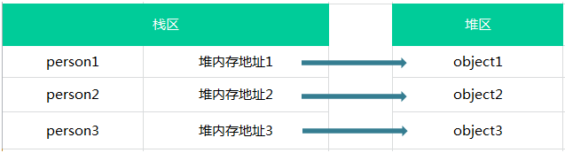

# 浅谈js中的内存 :radio:

## js中的堆和栈

### 堆
堆内存中的对象不会随方法的结束而销毁，即使方法结束后，这个对象还可能被另一个引用变量所引用(参数传递)。创建对象是为了反复利用，这个对象将被保存到运行时数据区。

### 栈
所有在方法中定义的变量都是放在栈内存中，随着方法的执行结束，这个方法的内存栈也自然销毁。
* 优点：存取速度比堆快，仅次于直接位于CPU中的寄存器，数据可以共享；;
* 缺点：存在栈中的数据大小与生存期必须是确定的，缺乏灵活性。

### 堆和栈的溢出
**堆**：循环创建对象，通俗点就是不断的new 一个对象。

**栈**：可以递归调用方法，这样随着栈深度的增加，JVM维持着一条长长的方法调用轨迹，知道内存不够分配，产生栈溢出。

## js中的数据类型
数据类型有8种是：`Number`、`String`、`Boolean`、`undefined`、`object`、`Null`、`Symbol`(ES6)、`bigInt`(谷歌67版本)。

### 基本类型
基本类型(单类型):字符串（String）、数值（Number）、布尔值（Boolean）、Undefined、Null  （这5种基本数据类型是按值访问的，因为可以操作保存在变量中的实际的值）

### 引用类型
引用类型：`object`。里面包含的 `function`、`Array`、`Data`。

### 基本类型和引用类型的区别
基本类型
1. 基本类型的值是不可变的
```js
// 任何方法都无法改变一个基本类型的值
var name = 'jozo'
name.toUpperCase() // 输出 'JOZO'
console.log(name) // 输出  'jozo'

// 不能给基本类型添加属性和方法，再次说明基本类型不可变
var person = 'jozo'
person.age = 22
person.method = function(){}

console.log(person.age) // undefined
console.log(person.method) // undefined
```
2. 基本类型的比较是值的比较
```js
var a = 1
var b = true
console.log(a == b)   //true
```
3. 基本类型的变量是存放在栈区的（栈区指内存里的栈内存）
```js
var name = 'jozo'
var city = 'guangzhou'
var age = 22
```
* 存储结构图


引用类型
1. 引用类型的值是可变的
```js
// 可为引用类型添加属性和方法，也可以删除其属性和方法
var person = {} //创建个控对象 --引用类型
person.name = 'jozo'
person.age = 22
person.sayName = function(){console.log(person.name)} 
person.sayName() // 'jozo'
 
delete person.name //删除person对象的name属性
person.sayName() // undefined
```
2. 引用类型的存储需要内存的栈区和堆区（堆区是指内存里的堆内存）共同完成，栈区内存保存变量标识符和指向堆内存中该对象的指针
```js
var person1 = {name:'jozo'}
var person2 = {name:'xiaom'}
var person3 = {name:'xiaoq'}
```
* 存储结构图


### 判断基本类型
```
eg: 
    var a = 2233
    typeof a
```

### 判断引用类型
```
eg: 
    var a = { 1, 2, 3 }
    a.constructor == ture
```