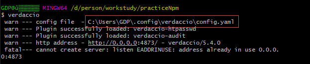

# npm私有库的创建及应用

## 使用verdaccio搭建npm私有库

1. 全局安装`npm install -g verdaccio`

2. 修改verdaccio配置文件

    config.yaml ——  在配置文件最后添加监听端口，`listen: 0.0.0.0:4873`

    作用：默认只能在本机访问，添加完成后就可以在外网访问。4873是对外暴露的端口

3. 启动verdaccio:



4. 查看npm库`http://192.168.1.10:4873/`

5. 创建需要维护的组件库/方法库


package.json配置，由于使用了view-design和less，使用时需要在入口文件里引入view-design和样式库
```js
{
  "name": "ytxd-component",
  "version": "1.0.0",
  "description": "远通信德公共组件库",
  "main": "index.js",
  "scripts": {
    "test": "echo \"Error: no test specified\" && exit 1"
  },
  "dependencies": {
    "view-design": "^4.1.3",
    "less": "^3.11.1",
    "less-loader": "^5.0.0"
  },
  "repository": {
    "type": "git",
    "url": "git+ssh://git@gitee.com:gpzrm/npm.git"
  },
  "keywords": [
    "远通信德",
    "components"
  ],
  "author": "hh",
  "license": "ISC",
  "bugs": {
    "url": "https://gitee.com/gpzrm/npm.git"
  },
  "homepage": "https://gitee.com/gpzrm/npm.git"
}
```

6. 添加一个放npm地址的源

7. 创建一个npm的账号(可以在官网进行注册)

8. 代码进行关联账号
    * npm adduser --registry http://your_ip:4873
    * // 后续需要填写自己的相关信息
    * // 填完回车就可以


9. 发布npm包
    * npm publish --registry http://your_ip:4873

10. 刷新页面就能看到你上传的npm包了


## 安装npm源管理工具

nrm(npm registry manager )是npm的镜像源管理工具，使用这个就可以快速地在 npm 源间切换。我们使用nrm切换npm其他源和我们的私有npm源。

    全局安装nrm: npm install -g nrm
    查看源：nrm ls
    添加源：nrm add <源的名称> <源的地址>    eg: nrm add giao http://39.103.234.148:4873/
    使用源：nrm use <源的名称>   eg: nrm use giao
    删除源：nrm del<源的名称>   eg: nrm del giao

安装好nrm后，我们需要添加一个npm私有库地址的源，方便我们在引用库的时候方便切换
```
nrm add project http://your_ip:4873
<!-- 切换npm源 -->
nrm use project
<!-- 这样我们现在就能使用库里组件/方法了 -->
yarn add ytxd-component
```

## node.js的守护进程管理器
pm2 是一个守护进程管理器，它将帮助您管理和保持您的应用程序在线。我们使用pm2来保存verdaccio应用在线。

	全局安装pm2: npm install -g pm2
	启动verdaccio: pm2 start verdaccio
	停止verdaccio: pm2 stop verdaccio


# npm镜像

## 查看当前镜像

npm get registry 

yarn config get registry

## 设置淘宝镜像

npm config set registry https://registry.npm.taobao.org/

yarn config set registry https://registry.npm.taobao.org/

