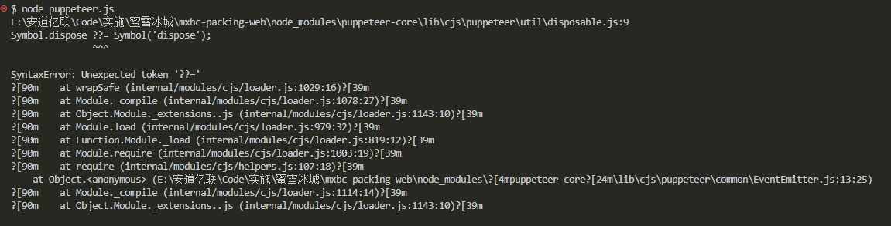
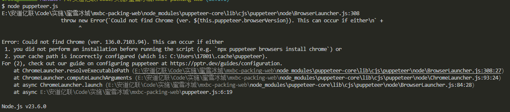

# js常用的各种插件 :goat:

## html2canvas HTML转Canvas/图片工具

`html2canvas.js`是一款优秀的插件，它可以轻松地帮你将`HTML`代码转换成`Canvas`，进而生成可保存分享的图片。

**注意：该插件有一个问题，每执行一次`htmlhtml2canvas`时，会重新加载一遍系统的静态资源，导致生成图片很慢及浏览器内存占用严重，所以在截图很多遍的时候需要换一个插件`domtoimage`**
```html
<!DOCTYPE html>
<html lang="zh-CN">
    <head>
        <script src="https://cdnjs.cloudflare.com/ajax/libs/html2canvas/1.4.1/html2canvas.min.js"></script>
    </head>
    <body>
        <div id="qianduanwz">
            <p>截图内容</p>
        </div>

        <script>
            // 使用立即执行异步函数，以便使用 await
            (async function() {
                try {
                    const targetElement = document.getElementById('qianduanwz')
                    if (!targetElement) {
                        return
                    }
                    const canvas = await html2canvas(targetElement, {
                        // 允许跨域资源
                        useCORS: true, 
                        // 关闭日志记录，减少性能开销
                        logging: false, 
                        // 降低 dpi 和 scale，减少资源需求
                        dpi: window.devicePixelRatio, 
                        scale: 2,
                    })
                    let oImg = new Image()
                    oImg.src = canvas.toDataURL('image/jpeg', 0.7) 
                    oImg.onload = function() {
                        document.body.appendChild(oImg)
                    }
                    oImg.onerror = function() {
                        console.error('图片创建失败')
                    }
                } catch (error) {
                    console.error('截图失败:', error) 
                }
            })()
        </script>
    </body>
</html>
```

## domtoimage 图片生成工具
`domtoimage.js`是一款轻量级的插件，它可以轻松地帮你将`DOM`元素转换成图片。
```html
<!DOCTYPE html>
<html lang="zh-CN">
    <head>
        <script src="https://unpkg.com/dom-to-image/dist/dom-to-image.min.js"></script>
    </head>
    <body>
        <div id="qianduanwz" style="background: white;">
            <p style="padding: 20px;">截图内容</p>
        </div>

        <script>
            // 使用立即执行异步函数，以便使用 await
            (async function() {
                try {
                    const targetElement = document.getElementById('qianduanwz')
                    if (!targetElement) {
                        return
                    }
                    const imgData = await domtoimage.toJpeg(targetElement, {
                        quality: 0.7, // 图像质量，对应 html2canvas 中 toDataURL 的第二个参数
                    });
                    let oImg = new Image()
                    oImg.src = imgData
                    oImg.onload = function() {
                        document.body.appendChild(oImg)
                    }
                    oImg.onerror = function() {
                        console.error('图片创建失败')
                    }
                } catch (error) {
                    console.error('截图失败:', error) 
                }
            })()
        </script>
    </body>
</html>
```

## puppeteer 无头浏览器
`puppeteer`是一款基于`Chrome`的无头浏览器，它可以让你在`Node.js`环境中控制`Chrome`浏览器，实现自动化操作。

### 什么是无头浏览器
无头浏览器是一种没有界面的浏览器，通常用于自动化测试、爬虫等场景。

### puppeteer的使用
`puppeteer`的使用非常简单，只需要安装`puppeteer`包，然后使用`puppeteer.launch()`方法启动浏览器，再使用`page.goto()`方法跳转到指定页面，最后使用`page.screenshot()`方法截图。
#### puppeteer的安装
`puppeteer`不能通过地址直接引用，需要先安装`puppeteer`包，然后再引用。
```bash
npm install puppeteer
# 或者使用yarn
yarn add puppeteer
```
#### 创建脚本
创建一个新的`JavaScript`文件，例如`puppeteer.js`，然后输入以下代码：
```js
const puppeteer = require('puppeteer')

(async () => {
    // 启动浏览器实例
    const browser = await puppeteer.launch() // 默认情况下，Puppeteer以无头模式启动Chrome
    const page = await browser.newPage()

    // 访问指定网址
    await page.goto('https://example.com', {waitUntil: 'networkidle2'})

    // 设置视窗大小
    await page.setViewport({
        width: 1920,
        height: 1080,
    })

    // 截图并保存到当前目录
    await page.screenshot({path: 'example.png', fullPage: true})

    console.log('截图已保存为 example.png')

    // 关闭浏览器
    await browser.close()
})()
```
#### 运行脚本
在终端中运行以下命令：
```bash
node puppeteer.js
```
如果一切正常，你应该会在当前目录中看到一个名为`example.png`的文件，它是`URL_ADDRESS如果一切正常，你应该会在当前目录中看到一个名为`example.png`的文件，它是`https://example.com`页面的截图。

#### 注意事项

* `puppeteer`使用时node版本需要大于等于18不然会出现以下报错


* `puppeteer`使用时如果找不到出现以下报错，则说明`puppeteer`在安装时没有下载`chromium`，需要重新安装`puppeteer.js`


### puppeteer-core的使用场景
如果你想安装一个更轻量级的版本，只包含基本的浏览器功能而不包括默认的`Chromium`浏览器（适用于你计划使用自己的` Chrome/Chromium `实例的情况），你可以安装` puppeteer-core`：

安装/使用方式和`puppeteer`一样，只需要将`puppeteer`替换为`puppeteer-core`即可。
```js
const puppeteer = require('puppeteer-core');
const path = require('path');
const os = require('os');
const fs = require('fs');

function getChromePath() {
    const platform = os.platform();
    switch (platform) {
        case 'win32':
            const possiblePaths = [
                'C:\\Program Files\\Google\\Chrome\\Application\\chrome.exe',
                'C:\\Program Files (x86)\\Google\\Chrome\\Application\\chrome.exe',
            ]
            for (const possiblePath of possiblePaths) {
                if (fs.existsSync(possiblePath)) {
                    return possiblePath
                }
            }
            break;
        case 'darwin':
            const macPath = '/Applications/Google Chrome.app/Contents/MacOS/Google Chrome';
            if (fs.existsSync(macPath)) {
                return macPath
            }
            break;
        case 'linux':
            const linuxPaths = [
                '/usr/bin/google-chrome',
                '/usr/bin/chromium-browser',
                '/usr/local/bin/chromium',
            ]
            for (const linuxPath of linuxPaths) {
                if (fs.existsSync(linuxPath)) {
                    return linuxPath
                }
            }
            break;
        default:
            break;
    }
    return null
}

(async () => {
    const chromePath = getChromePath()
    if (!chromePath) {
        console.error('未找到 Chrome 安装路径，无法继续执行。');
        return
    }
    const browser = await puppeteer.launch({
        executablePath: chromePath,
    });
    const page = await browser.newPage()
    await page.goto('https://example.com')
    const desktopPath = os.homedir() + '/Desktop'
    const screenshotPath = path.join(desktopPath, 'example.png')
    await page.screenshot({ path: screenshotPath })

    await browser.close()
})()
```


## jspdf转pdf工具
`jspdf.js`工具普遍的使用场景为，纯前端将页面上的元素导出为`pdf`,当遇到这种场景时，我们可以搭配着`html2canvas.js`一起使用。

* 1.将html元素通过html2canvas.js转换为canvas
* 2.将canvas通过jspdf.js转换为pdf
* 3.下载到本地
```vue
<template>
    <div class="bill-entry" id="genpdf">
    </div>
</template>

<script>
import html2Canvas from "html2canvas";
import JsPDF from "jspdf";
export default {
  data() {
      return {}
  },
  methods: {
    // 下载生成pdf
    // 校验报价单是否有填写
    async downloadPdf() {
      html2Canvas(document.querySelector("#genpdf"), {
        allowTaint: false,
        useCORS: true, // allowTaint、useCORS只能够出现一个
        imageTimeout: 0,
        dpi: 500, // 像素
        scale: 4, // 图片大小
        }).then(function (canvas) {
        // 用于将canvas对象转换为base64位编码
        let pageData = canvas.toDataURL("image/jpeg", 1.0),
            canvasWidth = canvas.width,
            canvasHeight = canvas.height,
            concentWidth = 500,
            concentHeight = Math.round((concentWidth / canvasWidth) * canvasHeight),
            position = 72,
            pageHeight = 892,
            height = concentHeight;
        // 新建一个new JsPDF，A3的像素大小 842*1191，A4的像素大小 592*841。这个px像素不准确，不清楚他们的像素大小来源如何
        let PDF = new JsPDF("p", "px", "a3");
        if (height <= pageHeight) {
            // 添加图片
            PDF.addImage(
                pageData,
                "JPEG",
                68,
                position,
                concentWidth,
                concentHeight
            );
        } else {
          while (height > 0) {
              PDF.addImage(
                  pageData,
                  "JPEG",
                  68,
                  position,
                  concentWidth,
                  concentHeight
              );
              height -= pageHeight;
              position -= pageHeight;
              if (height > 0) {
                  PDF.addPage();
              }
            }
          }
        // 保存 pdf 文档
        PDF.save(`${"测试"}.pdf`)
      })
    },
  }
}
</script> 
```

## html2pdf 实现预览、下载、打印
`vue-html2pdf`的适用场景为，在弹窗中先预览内容，并且支持下载、打印功能。

<details>
<summary><b>vue-html2pdf的使用方法</b></summary>

使用属性

<!-- | <div style="width: 100px;">属性</div> | <div style="width: 100px;">值</div> | <div style="width: 200px;">描述</div> | <div style="width: 200px;">建议</div> | -->
| 属性 | 值 | 描述 | 建议 |
| :---: | :---: | :------: | :------: |
| show-layout |   true/false   |   是否显示要转为 PDF 的元素   | 调式要转出的元素的布局时 true，平时 false |
| float-layout | true/false | 如果道具设置为 false 道具 show-layout 将被覆盖。布局不会浮动，并且布局将始终显示。 | 我一直使用的 true，因为做的时候做了两份，一个是在后台显示的，一个是导出为 PDF 的，布局不一样 |
| enable-download| true/false | 是否弹出转 PDF 后的预览模板，为 true 时调用上面的下载方法默认弹出预览模板 | 调试时开启，完工后关闭 |
| preview-modal | true/false | 是否弹出转 PDF 后的预览模板，为 true 时调用上面的下载方法默认弹出预览模板 | 调试时开启，完工后关闭 |
| paginate-elements-by-height | 任何数字 | 输入的数字将用于对元素进行分页，数字仅以 px 为单位。 | 官方默认 1400，没动过 |
| filename | 任何字符串	| 导出后的默认 PDF 文件名 | 自定义 |
| pdf-quality | 0 - 2（可以有小数） | 2 是最高质量，0.1 是最低质量，0 将使 PDF 消失。 | 官方虽然说是 0~2，但是我调 5 也是更高清了 |
| manual-pagination | true/false | 为 true 时不会自动对元素进行分页。为 false 时分页将依赖于具有“html2pdf__page-break”类的元素来知道在哪里分页，也就是下面所写的	 | 我一直使用的 false，看需求 |
| pdf-format | a0, a1, a2, a3, a4, letter, legal, a5, a6, a7, a8, a9, a10 | 这是 PDF 格式（纸张尺寸） | 一般都用的a4，所以 a4 |
| pdf-orientation | portrait, landscape | PDF 方向，landscape 是横向，portrait 是纵向 | 看需求 |
| pdf-content-width | 任何 css 尺寸（例如“800px”、“65vw”、“70%”） | PDF 内容宽度 | 800px 应该是 a4 最大的尺寸，具体边距我使用的 padding |

**手动分页**
* 需要分页的内容用div包裹起来并给`html2pdf__page-break`属性名


```vue
<template>
    <div>
        <Button @click="preview">预览</Button>
        <div style="height: 0; overflow: hidden;">
            <html2pdf
                :show-layout="false"
                :float-layout="false"
                :enable-download="false"
                :preview-modal="true"
                :paginate-elements-by-height="3000"
                :pdf-quality="2"
                :manual-pagination="false"
                pdf-format="a4"
                pdf-orientation="portrait"
                pdf-content-width="100%"
                ref="html2Pdf">
                <section slot="pdf-content">
                    <div class="html2pdf__page-break page-one">
                        <h1>项目经理责任书1</h1>
                        <p class="row-one">项目经理: {{ '小明' }}</p>
                        <p class="row-two">{{ `在公司规定的实施成本2000000元（包含风险保障金200000'元、运维计划成本300000元）内，使用公司认可的技术路线、实施方法，按期完成合同规定的项目交付工作，实施成本盈余部分由项目经理全权负责分配。` }}</p>
                        <p class="row-three">参考资料:《xxx项目经理包干制管理制度》《xxx项目经理包干制实施模板》</p>
                        <p class="row-four">项目经理:</p>
                        <p class="row-five">项目管理办公室:</p>
                        <p class="row-six">财务办公室:</p>
                        <p class="row-seven">签订日期:</p>
                    </div>
                    <div class="html2pdf__page-break page-one">
                        <h1>项目经理责任书2</h1>
                        <p class="row-one">项目经理: {{ '小明' }}</p>
                        <p class="row-two">{{ `在公司规定的实施成本2000000元（包含风险保障金200000元、运维计划成本300000元）内，使用公司认可的技术路线、实施方法，按期完成合同规定的项目交付工作，实施成本盈余部分由项目经理全权负责分配。` }}</p>
                        <p class="row-three">参考资料:《xxx项目经理包干制管理制度》《xxx项目经理包干制实施模板》</p>
                        <p class="row-four">项目经理:</p>
                        <p class="row-five">项目管理办公室:</p>
                        <p class="row-six">财务办公室:</p>
                        <p class="row-seven">签订日期:</p>
                    </div>
                </section>
            </html2pdf>
        </div>
    </div>
</template>

<script>
import html2pdf from 'vue-html2pdf'
export default {
    data() {
        return {}
    },
    methods : {
        // 预览
        preview() {
            this.$refs.html2Pdf.generatePdf()
        },
    }
}
</script>

<style scoped lang="less">
    .page-one {
        padding: 20% 15% 0 15%;
        letter-spacing: 2px;

        h1 {
            text-align: center;
            margin-bottom: 30px;
        }
        p {
            font-size: 20px;
            padding: 5px 0;
        }
        .row-one {}
        .row-two {
            text-indent: 4ch;
        }
        .row-three {
            text-indent: 4ch;
            margin-bottom: 50px;
        }
        .row-four {
            text-indent: 20ch;
        }
        .row-five {
            text-indent: 20ch;
        }
        .row-six {
            text-indent: 20ch;
        }
        .row-seven {
            text-indent: 20ch;
        }
    }
</style>

```

</details>

## pdfjs-dist 实现pdf预览

`pdfjs-dist`可以将文件服务器或者本地的pdf，展示在项目中，需要根据项目情况使用。
<details>
<summary><b>pdfjs-dist的使用方法</b></summary>
引入pdfjs-dist:

1. 在线引入：`<script src="https://cdn.jsdelivr.net/npm/pdfjs-dist@2.14.305/build/pdf.min.js"></script>`
2. npm: npm install pdfjs-dist
3. yarn: yarn add pdfjs-dist

```vue
<template>
    <div>
        <div id="pdf-preview-container">
            <canvas v-for="(page, index) in pdfPages" :key="index" :id="'pdf-page-' + index"></canvas>
        </div>
    </div>
</template>
<script>
    import pdfjsLib from 'pdfjs-dist'
    export default {
        data () {
            return {
                // 查看文件
                fileviewUrl: process.env.VUE_APP_API_FILE,
                filePath: false,
                fileType: '',
                pdfPages: [],
                currentPage: 1,
                totalPages: 0,
                itemData: {
                    url: '/8107aee9-d307-4621-adeb-3ae5c65a7202.pdf',
                    name: '测试.pdf'
                },
            }
        },
        mounted () {
            this.downloadFile(this.itemData)
        },
        methods: {
            async downloadFile(item) {
                this.filePath = item.url
                this.fileType = item.name.split('.').pop().toLowerCase()
                if (this.fileType === 'pdf') {
                    this.$nextTick(async() => {
                        const loadingTask = pdfjsLib.getDocument(`${this.fileviewUrl}${this.filePath}`)
                        const pdf = await loadingTask.promise
                        this.totalPages = pdf.numPages
                        this.pdfPages = Array.from({ length: this.totalPages }, (_, index) => index + 1)

                        // 使用循环渲染所有页面
                        while (this.currentPage <= this.totalPages) {
                            await this.renderPage(this.currentPage)
                            this.currentPage++
                        }
                        // 渲染完成后，将当前页重置为第一页
                        this.currentPage = 1
                        this.renderPage(this.currentPage)

                    })
                } else {
                    this.$Message.info('暂不支持该文件类型')
                }
            },
            async renderPage(pageNumber, first) {
                const loadingTask = pdfjsLib.getDocument(`${this.fileviewUrl}${this.filePath}`)
                const pdf = await loadingTask.promise
                const page = await pdf.getPage(pageNumber)

                const canvas = document.getElementById(`pdf-page-${pageNumber - 1}`)
                const ctx = canvas.getContext('2d')
                // scale越大，图片越清晰，但是图片越大，加载时间越长
                const viewport = page.getViewport({ scale: 4.0 })
                canvas.height = viewport.height
                canvas.width = viewport.width

                const renderContext = {
                    canvasContext: ctx,
                    viewport: viewport
                }
                await page.render(renderContext).promise
            }
        },
    }
</script>
<style lang="scss" scoped>
#pdf-preview-container {
    canvas {
        max-width: 100%;
        max-height: 100%;
    }
}
</style>
```
</details>

## xlsx 实现线上xlsx预览
xlsx可以将文件服务器或者本地的excel，展示在项目中，需要根据项目情况使用。

**注意该方案不适用于excel中有图片和多sheet页情况，如果需要预览上述内容可以采用iframe嵌套Microsoft Office Online Viewer、Google Docs Viewer等**
<details>
<summary><b>xlsx的使用方法</b></summary>
引入xlsx:

1. 在线引入：`<script src="https://cdnjs.cloudflare.com/ajax/libs/xlsx/0.18.5/xlsx.full.min.js"></script>`
2. npm: npm install xlsx
3. yarn: yarn add xlsx

```vue
<template>
    <div>
        <div id="excel-preview" class="excel-preview"></div>
    </div>
</template>
<script>
    import XLSX from 'xlsx'
    export default {
        data () {
            return {
                // 查看文件
                fileviewUrl: process.env.VUE_APP_API_FILE,
                filePath: false,
                fileType: '',
                itemData: {
                    url: '/8107aee9-d307-4621-adeb-3ae5c65a7202.xls',
                    name: '测试.xls'
                },
            }
        },
        mounted () {
            this.downloadFile(this.itemData)
        },
        methods: {
            async downloadFile(item) {
                this.filePath = item
                this.fileType = item.split('.').pop().toLowerCase()
                if (this.fileType === 'xls' || this.fileType === 'xlsx') {
                    // 读取 Excel 文件并渲染到页面
                    const response = await fetch(`${this.fileviewUrl}/${this.filePath}`)
                    const arrayBuffer = await response.arrayBuffer()
                    const data = new Uint8Array(arrayBuffer)
                    const workbook = XLSX.read(data, { type: 'array' })
                    const excelPreview = document.getElementById('excel-preview')
                    excelPreview.innerHTML = ''
                    // 遍历所有工作表
                    workbook.SheetNames.forEach((sheetName, index) => {
                        const worksheet = workbook.Sheets[sheetName]
                        const html = XLSX.utils.sheet_to_html(worksheet)

                        // 创建一个新的 div 来包含每个工作表
                        const sheetDiv = document.createElement('div')
                        sheetDiv.innerHTML = html
                        sheetDiv.classList.add('excel-sheet')

                        // 为每个工作表添加标题
                        const title = document.createElement('h3')
                        title.textContent = `工作表 ${index + 1}: ${sheetName}`
                        sheetDiv.prepend(title)

                        excelPreview.appendChild(sheetDiv)
                    })

                    // 手动添加类名
                    const tables = excelPreview.querySelectorAll('table')
                    // 手动添加样式，因为xlsx生成的table是默认样式，在样式上做调整可能不会生效，直接js添加样式
                    tables.forEach(table => {
                        table.classList.add('excel-table')
                        console.log(table, 'table')
                        // 给 table 添加样式
                        table.style.borderCollapse = 'collapse'
                        table.style.width = '100%'
                        table.style.backgroundColor = 'white'
                        // 调整高度以撑满弹窗
                        table.style.height = 'calc(100vh - 4rem - 30px)'
                        // 添加垂直滚动条
                        table.style.overflow = 'auto'
                        // table.style.fontSize = '0.6rem'
                        // 给 table 内所有的 tr、td 添加样式
                        const cells = table.querySelectorAll('tr, td')
                        cells.forEach(cell => {
                            cell.style.border = '1px solid #ccc'
                            cell.style.padding = '0.5rem'
                            cell.style.textAlign = 'center'
                            cell.style.fontSize = '0.6rem'
                            // 文字不换行
                            cell.style.whiteSpace = 'nowrap'
                            cell.style.overflow = 'hidden'
                            cell.style.textOverflow = 'ellipsis'
                        })
                    })
                }
            },
        },
    }
</script>
<style lang="scss" scoped>
</style>
```
```vue
<!-- Microsoft Office Online Viewer的使用方法： -->
<!-- 注意：这种方式只适用于文件存放在能使用https访问通的服务器上，不然会出现跨域问题，导致文件无法显示 -->
<template>
    <iframe
        :src="`https://view.officeapps.live.com/op/embed.aspx?src=${fileUrl}`" 
        style="width:100%; height: calc(100vh - 4rem - 30px);" 
        frameborder="0"
    >
    </iframe>
</template>
<script>
    data() {
        return {
            fileUrl: 'https://baidu.com/8107aee9-d307-4621-adeb-3ae5c65a7202.xls'
        } 
    }
</script>
```
</details>


## ssh2 + archiver 实现代码自动打包上传

`ssh2`是连接远程服务器的，配置一些基本的服务器配置

`archiver`是压缩工具压缩为zip文件，减少上传数量

这种方式属于一键发布，比较便捷，只需要运行命令`node ade.js dev`，即可自动发布代码到对应的环境，`adp.js`为下面js文件名，`dev`为想要上传的服务器

<details>
<summary><b>adp.js文件代码</b></summary>

```js
/* eslint-disable space-before-function-paren */
/* eslint-disable prefer-promise-reject-errors */
// 开发环境
const envObject = {
    dev: {
        host: '192.155.1.120', // 服务器ip地址或域名
        catalog: '/home/web_app/uload', // 前端文件压缩目录
        port: 22, // 服务器ssh连接端口号
        username: 'root', // ssh登录用户
        password: '123456', // 密码
        privateKey: null // 私钥，私钥与密码二选一
    },
    // 线上环境
    prod: {
        host: '130.56.78.251', // 服务器ip地址或域名
        catalog: '/home/web_app/uload', // 前端文件压缩目录
        port: 22, // 服务器ssh连接端口号
        username: 'root', // ssh登录用户
        password: '123456', // 密码
        privateKey: null // 私钥，私钥与密码二选一
    },
}

const pushList = Object.keys(envObject)
const publishEnv = [] // 打包的数组列表
let buildCommand = ''
process.argv.forEach(str => {
    // 由于配置的命令 只能打包一个
    if (pushList.includes(str) && publishEnv.length === 0) {
        buildCommand = 'npm run build:' + str
        publishEnv.push(envObject[str])
    }
})

// 全局配置
const Config = {
    // publishEnv: pro,
    // publishEnv: [dev, dev2, ys, xs], // 发布环境，可填写多个，也可只填写一个
    publishEnv, // 发布环境，可填写多个，也可只填写一个
    buildDist: 'dist', // 前端文件打包之后的目录，默认dist
    // buildCommand: 'npm run build', // 打包前端文件的命令
    buildCommand, // 打包前端文件的命令
    readyTimeout: 20000, // ssh连接超时时间
    deleteFile: true // 是否删除线上上传的dist压缩包
}

const { exec } = require('child_process')
const path = require('path')
const archiver = require('archiver')
const fs = require('fs')
const Client = require('ssh2').Client

// 前端打包文件的目录
// const dir = path.resolve(__dirname, Config.buildDist)

/**
 * ssh连接
 */
class SSH {
    constructor({ host, port, username, password, privateKey, agent }) {
        this.server = {
            host,
            port,
            username,
            password,
            privateKey
        }

        this.hasAgent = agent && agent.host && agent.port && agent.username
        if (this.hasAgent) {
            this.connAgent = new Client() // 连接跳板机
            this.conn = new Client() // 连接目标机
            this.agent = agent
        } else {
            this.conn = new Client()
        }
    }

    // 连接服务器
    connectServer() {
        return new Promise((resolve, reject) => {
            let conn = this.conn
            if (this.hasAgent) {
                conn = this.connAgent
            }
            conn.on('ready', () => {
                if (this.hasAgent) {
                    // Alternatively, you could use netcat or socat with exec() instead of
                    // forwardOut()

                    console.log('----连接跳板机成功----')
                    conn.forwardOut('127.0.0.1', 12345, this.agent.host, this.agent.port, (err, stream) => {
                        if (err) {
                            conn.end()
                            reject({
                                success: false,
                                error: err
                            })
                        }
                        // 连接目标机
                        this.conn
                            .on('ready', () => {
                                console.log('----连接目标机成功----')
                                resolve({
                                    success: true
                                })
                            })
                            .on('error', err => {
                                reject({
                                    success: false,
                                    error: err
                                })
                            })
                            .on('end', () => {
                                console.log('target ssh connect end!')
                            })
                            .on('close', () => {
                                console.log('target ssh connect close')
                            })
                            .connect({
                                sock: stream,
                                username: this.agent.username,
                                password: this.agent.password
                            })
                    })
                } else {
                    resolve({
                        success: true
                    })
                }
            }).on('error', err => {
                reject({
                    success: false,
                    error: err
                })
            }).on('end', () => {
                console.log('----SSH连接已结束----')
            }).on('close', () => {
                console.log('----SSH连接已关闭----')
            }).connect(this.server)
        })
    }

    // 上传文件
    uploadFile({ localPath, remotePath }) {
        return new Promise((resolve, reject) => {
            return this.conn.sftp((err, sftp) => {
                if (err) {
                    reject({
                        success: false,
                        error: err
                    })
                } else {
                    sftp.fastPut(localPath, remotePath, (err, result) => {
                        if (err) {
                            reject({
                                success: false,
                                error: err
                            })
                        }
                        resolve({
                            success: true,
                            result
                        })
                    })
                }
            })
        })
    }

    // 执行ssh命令
    execSsh(command) {
        return new Promise((resolve, reject) => {
            return this.conn.exec(command, (err, stream) => {
                if (err || !stream) {
                    reject({
                        success: false,
                        error: err
                    })
                } else {
                    stream
                        .on('close', (code, signal) => {
                            resolve({
                                success: true
                            })
                        })
                        .on('data', function(data) {
                            console.log(data.toString())
                        })
                        .stderr.on('data', function(data) {
                            resolve({
                                success: false,
                                error: data.toString()
                            })
                        })
                }
            })
        })
    }

    // 结束连接
    endConn() {
        this.conn.end()
        if (this.connAgent) {
            this.connAgent.end()
        }
    }
}

/*
 * 本地操作
 * */
class File {
    constructor(fileName) {
        this.fileName = fileName
    }

    // 删除本地文件
    deleteLocalFile() {
        return new Promise((resolve, reject) => {
            fs.unlink(this.fileName, function(error) {
                if (error) {
                    reject({
                        success: false,
                        error
                    })
                } else {
                    resolve({
                        success: true
                    })
                }
            })
        })
    }

    // 压缩文件夹下的所有文件
    // eslint-disable-next-line space-before-function-paren
    zipFile(filePath) {
        return new Promise((resolve, reject) => {
            // 创建文件输出流
            // eslint-disable-next-line no-path-concat
            const output = fs.createWriteStream(__dirname + '/' + this.fileName)
            const archive = archiver('zip', {
                zlib: { level: 9 } // 设置压缩级别
            })

            // 文件输出流结束
            output.on('close', function() {
                console.log(`----压缩文件总共 ${archive.pointer()} 字节----`)
                console.log('----压缩文件夹完毕----')
                resolve({
                    success: true
                })
            })

            // 数据源是否耗尽
            output.on('end', function() {
                console.error('----压缩失败，数据源已耗尽----')
                reject()
            })

            // 存档警告
            archive.on('warning', function(err) {
                if (err.code === 'ENOENT') {
                    console.error('----stat故障和其他非阻塞错误----')
                } else {
                    console.error('----压缩失败----')
                }
                reject(err)
            })

            // 存档出错
            archive.on('error', function(err) {
                console.error('----存档错误，压缩失败----')
                console.error(err)
                reject(err)
            })

            // 通过管道方法将输出流存档到文件
            archive.pipe(output)

            // 打包dist里面的所有文件和目录
            archive.directory(filePath, false)

            // archive.directory(`../${Config.buildDist}/`, false);

            // 完成归档
            archive.finalize()
        })
    }

    // 打包本地前端文件
    buildProject() {
        console.log('----开始编译打包文件，请耐心等待----', buildCommand)
        return new Promise((resolve, reject) => {
            exec(Config.buildCommand, async(error, stdout, stderr) => {
                if (error) {
                    console.error(error)

                    // eslint-disable-next-line prefer-promise-reject-errors
                    reject({ error, success: false })
                } else if (stdout) {
                    resolve({
                        stdout,
                        success: true
                    })
                } else {
                    console.error(stderr)

                    // eslint-disable-next-line prefer-promise-reject-errors
                    reject({
                        error: stderr,
                        success: false
                    })
                }
            })
        })
    }

    // 停止程序之前需删除本地压缩包文件
    stopProgress() {
        this.deleteLocalFile()
            .catch(e => {
                console.error('----删除本地文件失败，请手动删除----')
                console.error(e)
            })
            .then(() => {
                console.log('----已删除本地压缩包文件----')
            })
    }
}

// SSH连接，上传，解压，删除等相关操作
// eslint-disable-next-line space-before-function-paren
async function sshUpload(sshConfig, fileName) {
    const sshCon = new SSH(sshConfig)
    const sshRes = await sshCon.connectServer().catch(e => {
        console.error(e)
    })
    if (!sshRes || !sshRes.success) {
        console.error('----连接服务器失败，请检查用户名密码是否正确以及服务器是否已开启远程连接----')
        return false
    }

    console.log('----连接服务器成功，开始上传文件----')

    const uploadRes = await sshCon
        .uploadFile({
            localPath: path.resolve(__dirname, fileName),
            remotePath: sshConfig.catalog + '/' + fileName
        })
        .catch(e => {
            console.error(e)
        })

    if (!uploadRes || !uploadRes.success) {
        console.error('----上传文件失败，请重新上传----')
        return false
    }
    console.log('----上传文件成功，开始解压文件----')

    const zipRes = await sshCon.execSsh(`unzip -o ${sshConfig.catalog + '/' + fileName} -d ${sshConfig.catalog}`).catch(e => {})
    if (!zipRes || !zipRes.success) {
        console.error('----解压文件失败，请手动解压zip文件----')
        console.error(`----错误原因：${zipRes.error}----`)
    }
    if (Config.deleteFile) {
        console.log('----解压文件成功，开始删除上传的压缩包----')

        // 注意：rm -rf为危险操作，请勿对此段代码做其他非必须更改
        const deleteZipRes = await sshCon.execSsh(`rm -rf ${sshConfig.catalog + '/' + fileName}`).catch(e => {})
        if (!deleteZipRes || !deleteZipRes.success) {
            console.error('----删除文件失败，请手动删除zip文件----')
            console.error(`----错误原因：${deleteZipRes.error}----`)
        }
    }
    // 结束ssh连接
    sshCon.endConn()
}

// 执行前端部署
;
(async() => {
    // 压缩包的名字
    const date = new Date()
    const year = date.getFullYear()
    const month = date.getMonth() + 1
    const day = date.getDate()
    const timeStr = `${year}_${month}_${day}`
    const fileName =
        `${Config.buildDist}-` +
        timeStr +
        '-' +
        Math.random().toString(16).slice(2) + '.zip'

    const file = new File(fileName)

    // 打包文件
    const buildRes = await file.buildProject().catch(e => {
        console.error(e)
    })
    if (!buildRes || !buildRes.success) {
        console.error('----编译打包文件出错----')
        return false
    }
    console.log(buildRes.stdout)
    console.log('----编译打包文件完成----')

    // 压缩文件

    const res = await file.zipFile(`${Config.buildDist}/`).catch(() => {})
    if (!res || !res.success) return false
    console.log('----开始进行SSH连接----')

    if (Config.publishEnv instanceof Array && Config.publishEnv.length) {
        for (let i = 0; i < Config.publishEnv.length; i++) {
            await sshUpload(Config.publishEnv[i], fileName)
        }
    } else {
        await sshUpload(Config.publishEnv, fileName)
    }

    console.log('----部署成功，正在为您删除本地压缩包----')
    file.stopProgress()
})()

```
</details>

## cbl-deploy-tools 实现代码自动打包上传
使用`cbl-deploy-tools`插件进行直接发版，在`package.json`中配置`"push": "cbl-dt",`就可以直接运行命令`yarn push`或者`npm run push`进行发版操作，注意在发版的过程中会让你选择发版的环境，和是否需要备份。
<details>
<summary><b>cbl-dt-config.json文件代码及上传步骤</b></summary>

```js
[
    {
        "name": "test",
        "host": "192.155.1.120",
        "port": "22",
        "username": "root",
        "password": "123456",
        "build": "npm run build:test",
        "localDist": "./dist",
        "targetDist": "/home/docker/nginx/plp-saas",
        "auto": "01"
    },
    {
        "name": "prod",
        "host": "192.155.1.120",
        "port": "22",
        "username": "root",
        "password": "123456",
        "build": "npm run build:prod",
        "localDist": "./dist",
        "targetDist": "/home/docker/nginx/plp-saas",
        "auto": "01"
    }
]
```
选择上传环境

是否备份

上传成功


</details>
