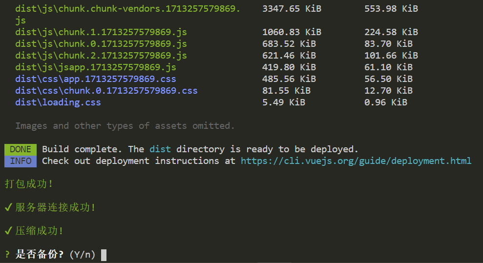

# js常用的各种插件 :goat:

## html2canvas HTML转Canvas/图片工具

html2canvas.js是一款优秀的插件，它可以轻松地帮你将HTML代码转换成Canvas，进而生成可保存分享的图片。
```html
<div id="qianduanwz">
  
  <p>内容</p>
</div>
```
```js
<script src="./scripts/html2canvas.js"></script>
<script>
  new html2canvas(document.getElementById('qianduanwz')).then(canvas => {
    // canvas为转换后的Canvas对象
    let oImg = new Image();
    oImg.src = canvas.toDataURL();  // 导出图片
    document.body.appendChild(oImg);  // 将生成的图片添加到body
  });
</script>
```

## jspdf转pdf工具
`jspdf.js`工具普遍的使用场景为，纯前端将页面上的元素导出为`pdf`,当遇到这种场景时，我们可以搭配着`html2canvas.js`一起使用。

* 1.将html元素通过html2canvas.js转换为canvas
* 2.将canvas通过jspdf.js转换为pdf
* 3.下载到本地
```vue
<template>
    <div class="bill-entry" id="genpdf">
    </div>
</template>

<script>
import html2Canvas from "html2canvas";
import JsPDF from "jspdf";
export default {
  data() {
      return {}
  },
  methods: {
    // 下载生成pdf
    // 校验报价单是否有填写
    async downloadPdf() {
      html2Canvas(document.querySelector("#genpdf"), {
        allowTaint: false,
        useCORS: true, // allowTaint、useCORS只能够出现一个
        imageTimeout: 0,
        dpi: 500, // 像素
        scale: 4, // 图片大小
        }).then(function (canvas) {
        // 用于将canvas对象转换为base64位编码
        let pageData = canvas.toDataURL("image/jpeg", 1.0),
            canvasWidth = canvas.width,
            canvasHeight = canvas.height,
            concentWidth = 500,
            concentHeight = Math.round((concentWidth / canvasWidth) * canvasHeight),
            position = 72,
            pageHeight = 892,
            height = concentHeight;
        // 新建一个new JsPDF，A3的像素大小 842*1191，A4的像素大小 592*841。这个px像素不准确，不清楚他们的像素大小来源如何
        let PDF = new JsPDF("p", "px", "a3");
        if (height <= pageHeight) {
            // 添加图片
            PDF.addImage(
                pageData,
                "JPEG",
                68,
                position,
                concentWidth,
                concentHeight
            );
        } else {
          while (height > 0) {
              PDF.addImage(
                  pageData,
                  "JPEG",
                  68,
                  position,
                  concentWidth,
                  concentHeight
              );
              height -= pageHeight;
              position -= pageHeight;
              if (height > 0) {
                  PDF.addPage();
              }
            }
          }
        // 保存 pdf 文档
        PDF.save(`${"测试"}.pdf`)
      })
    },
  }
}
</script> 
```

## html2pdf 实现预览、下载、打印
`vue-html2pdf`的适用场景为，在弹窗中先预览内容，并且支持下载、打印功能。

<details>
<summary><b>vue-html2pdf的使用方法</b></summary>

使用属性

<!-- | <div style="width: 100px;">属性</div> | <div style="width: 100px;">值</div> | <div style="width: 200px;">描述</div> | <div style="width: 200px;">建议</div> | -->
| 属性 | 值 | 描述 | 建议 |
| :---: | :---: | :------: | :------: |
| show-layout |   true/false   |   是否显示要转为 PDF 的元素   | 调式要转出的元素的布局时 true，平时 false |
| float-layout | true/false | 如果道具设置为 false 道具 show-layout 将被覆盖。布局不会浮动，并且布局将始终显示。 | 我一直使用的 true，因为做的时候做了两份，一个是在后台显示的，一个是导出为 PDF 的，布局不一样 |
| enable-download| true/false | 是否弹出转 PDF 后的预览模板，为 true 时调用上面的下载方法默认弹出预览模板 | 调试时开启，完工后关闭 |
| preview-modal | true/false | 是否弹出转 PDF 后的预览模板，为 true 时调用上面的下载方法默认弹出预览模板 | 调试时开启，完工后关闭 |
| paginate-elements-by-height | 任何数字 | 输入的数字将用于对元素进行分页，数字仅以 px 为单位。 | 官方默认 1400，没动过 |
| filename | 任何字符串	| 导出后的默认 PDF 文件名 | 自定义 |
| pdf-quality | 0 - 2（可以有小数） | 2 是最高质量，0.1 是最低质量，0 将使 PDF 消失。 | 官方虽然说是 0~2，但是我调 5 也是更高清了 |
| manual-pagination | true/false | 为 true 时不会自动对元素进行分页。为 false 时分页将依赖于具有“html2pdf__page-break”类的元素来知道在哪里分页，也就是下面所写的	 | 我一直使用的 false，看需求 |
| pdf-format | a0, a1, a2, a3, a4, letter, legal, a5, a6, a7, a8, a9, a10 | 这是 PDF 格式（纸张尺寸） | 一般都用的a4，所以 a4 |
| pdf-orientation | portrait, landscape | PDF 方向，landscape 是横向，portrait 是纵向 | 看需求 |
| pdf-content-width | 任何 css 尺寸（例如“800px”、“65vw”、“70%”） | PDF 内容宽度 | 800px 应该是 a4 最大的尺寸，具体边距我使用的 padding |

**手动分页**
* 需要分页的内容用div包裹起来并给`html2pdf__page-break`属性名


```vue
<template>
    <div>
        <Button @click="preview">预览</Button>
        <div style="height: 0; overflow: hidden;">
            <html2pdf
                :show-layout="false"
                :float-layout="false"
                :enable-download="false"
                :preview-modal="true"
                :paginate-elements-by-height="3000"
                :pdf-quality="2"
                :manual-pagination="false"
                pdf-format="a4"
                pdf-orientation="portrait"
                pdf-content-width="100%"
                ref="html2Pdf">
                <section slot="pdf-content">
                    <div class="html2pdf__page-break page-one">
                        <h1>项目经理责任书1</h1>
                        <p class="row-one">项目经理: {{ '小明' }}</p>
                        <p class="row-two">{{ `在公司规定的实施成本2000000元（包含风险保障金200000'元、运维计划成本300000元）内，使用公司认可的技术路线、实施方法，按期完成合同规定的项目交付工作，实施成本盈余部分由项目经理全权负责分配。` }}</p>
                        <p class="row-three">参考资料:《xxx项目经理包干制管理制度》《xxx项目经理包干制实施模板》</p>
                        <p class="row-four">项目经理:</p>
                        <p class="row-five">项目管理办公室:</p>
                        <p class="row-six">财务办公室:</p>
                        <p class="row-seven">签订日期:</p>
                    </div>
                    <div class="html2pdf__page-break page-one">
                        <h1>项目经理责任书2</h1>
                        <p class="row-one">项目经理: {{ '小明' }}</p>
                        <p class="row-two">{{ `在公司规定的实施成本2000000元（包含风险保障金200000元、运维计划成本300000元）内，使用公司认可的技术路线、实施方法，按期完成合同规定的项目交付工作，实施成本盈余部分由项目经理全权负责分配。` }}</p>
                        <p class="row-three">参考资料:《xxx项目经理包干制管理制度》《xxx项目经理包干制实施模板》</p>
                        <p class="row-four">项目经理:</p>
                        <p class="row-five">项目管理办公室:</p>
                        <p class="row-six">财务办公室:</p>
                        <p class="row-seven">签订日期:</p>
                    </div>
                </section>
            </html2pdf>
        </div>
    </div>
</template>

<script>
import html2pdf from 'vue-html2pdf'
export default {
    data() {
        return {}
    },
    methods : {
        // 预览
        preview() {
            this.$refs.html2Pdf.generatePdf()
        },
    }
}
</script>

<style scoped lang="less">
    .page-one {
        padding: 20% 15% 0 15%;
        letter-spacing: 2px;

        h1 {
            text-align: center;
            margin-bottom: 30px;
        }
        p {
            font-size: 20px;
            padding: 5px 0;
        }
        .row-one {}
        .row-two {
            text-indent: 4ch;
        }
        .row-three {
            text-indent: 4ch;
            margin-bottom: 50px;
        }
        .row-four {
            text-indent: 20ch;
        }
        .row-five {
            text-indent: 20ch;
        }
        .row-six {
            text-indent: 20ch;
        }
        .row-seven {
            text-indent: 20ch;
        }
    }
</style>

```

</details>


## ssh2 + archiver 实现代码自动打包上传

`ssh2`是连接远程服务器的，配置一些基本的服务器配置

`archiver`是压缩工具压缩为zip文件，减少上传数量

这种方式属于一键发布，比较便捷，只需要运行命令`node ade.js dev`，即可自动发布代码到对应的环境，`adp.js`为下面js文件名，`dev`为想要上传的服务器

<details>
<summary><b>adp.js文件代码</b></summary>

```js
/* eslint-disable space-before-function-paren */
/* eslint-disable prefer-promise-reject-errors */
// 开发环境
const envObject = {
    dev: {
        host: '192.155.1.120', // 服务器ip地址或域名
        catalog: '/home/web_app/uload', // 前端文件压缩目录
        port: 22, // 服务器ssh连接端口号
        username: 'root', // ssh登录用户
        password: '123456', // 密码
        privateKey: null // 私钥，私钥与密码二选一
    },
    // 线上环境
    prod: {
        host: '130.56.78.251', // 服务器ip地址或域名
        catalog: '/home/web_app/uload', // 前端文件压缩目录
        port: 22, // 服务器ssh连接端口号
        username: 'root', // ssh登录用户
        password: '123456', // 密码
        privateKey: null // 私钥，私钥与密码二选一
    },
}

const pushList = Object.keys(envObject)
const publishEnv = [] // 打包的数组列表
let buildCommand = ''
process.argv.forEach(str => {
    // 由于配置的命令 只能打包一个
    if (pushList.includes(str) && publishEnv.length === 0) {
        buildCommand = 'npm run build:' + str
        publishEnv.push(envObject[str])
    }
})

// 全局配置
const Config = {
    // publishEnv: pro,
    // publishEnv: [dev, dev2, ys, xs], // 发布环境，可填写多个，也可只填写一个
    publishEnv, // 发布环境，可填写多个，也可只填写一个
    buildDist: 'dist', // 前端文件打包之后的目录，默认dist
    // buildCommand: 'npm run build', // 打包前端文件的命令
    buildCommand, // 打包前端文件的命令
    readyTimeout: 20000, // ssh连接超时时间
    deleteFile: true // 是否删除线上上传的dist压缩包
}

const { exec } = require('child_process')
const path = require('path')
const archiver = require('archiver')
const fs = require('fs')
const Client = require('ssh2').Client

// 前端打包文件的目录
// const dir = path.resolve(__dirname, Config.buildDist)

/**
 * ssh连接
 */
class SSH {
    constructor({ host, port, username, password, privateKey, agent }) {
        this.server = {
            host,
            port,
            username,
            password,
            privateKey
        }

        this.hasAgent = agent && agent.host && agent.port && agent.username
        if (this.hasAgent) {
            this.connAgent = new Client() // 连接跳板机
            this.conn = new Client() // 连接目标机
            this.agent = agent
        } else {
            this.conn = new Client()
        }
    }

    // 连接服务器
    connectServer() {
        return new Promise((resolve, reject) => {
            let conn = this.conn
            if (this.hasAgent) {
                conn = this.connAgent
            }
            conn.on('ready', () => {
                if (this.hasAgent) {
                    // Alternatively, you could use netcat or socat with exec() instead of
                    // forwardOut()

                    console.log('----连接跳板机成功----')
                    conn.forwardOut('127.0.0.1', 12345, this.agent.host, this.agent.port, (err, stream) => {
                        if (err) {
                            conn.end()
                            reject({
                                success: false,
                                error: err
                            })
                        }
                        // 连接目标机
                        this.conn
                            .on('ready', () => {
                                console.log('----连接目标机成功----')
                                resolve({
                                    success: true
                                })
                            })
                            .on('error', err => {
                                reject({
                                    success: false,
                                    error: err
                                })
                            })
                            .on('end', () => {
                                console.log('target ssh connect end!')
                            })
                            .on('close', () => {
                                console.log('target ssh connect close')
                            })
                            .connect({
                                sock: stream,
                                username: this.agent.username,
                                password: this.agent.password
                            })
                    })
                } else {
                    resolve({
                        success: true
                    })
                }
            }).on('error', err => {
                reject({
                    success: false,
                    error: err
                })
            }).on('end', () => {
                console.log('----SSH连接已结束----')
            }).on('close', () => {
                console.log('----SSH连接已关闭----')
            }).connect(this.server)
        })
    }

    // 上传文件
    uploadFile({ localPath, remotePath }) {
        return new Promise((resolve, reject) => {
            return this.conn.sftp((err, sftp) => {
                if (err) {
                    reject({
                        success: false,
                        error: err
                    })
                } else {
                    sftp.fastPut(localPath, remotePath, (err, result) => {
                        if (err) {
                            reject({
                                success: false,
                                error: err
                            })
                        }
                        resolve({
                            success: true,
                            result
                        })
                    })
                }
            })
        })
    }

    // 执行ssh命令
    execSsh(command) {
        return new Promise((resolve, reject) => {
            return this.conn.exec(command, (err, stream) => {
                if (err || !stream) {
                    reject({
                        success: false,
                        error: err
                    })
                } else {
                    stream
                        .on('close', (code, signal) => {
                            resolve({
                                success: true
                            })
                        })
                        .on('data', function(data) {
                            console.log(data.toString())
                        })
                        .stderr.on('data', function(data) {
                            resolve({
                                success: false,
                                error: data.toString()
                            })
                        })
                }
            })
        })
    }

    // 结束连接
    endConn() {
        this.conn.end()
        if (this.connAgent) {
            this.connAgent.end()
        }
    }
}

/*
 * 本地操作
 * */
class File {
    constructor(fileName) {
        this.fileName = fileName
    }

    // 删除本地文件
    deleteLocalFile() {
        return new Promise((resolve, reject) => {
            fs.unlink(this.fileName, function(error) {
                if (error) {
                    reject({
                        success: false,
                        error
                    })
                } else {
                    resolve({
                        success: true
                    })
                }
            })
        })
    }

    // 压缩文件夹下的所有文件
    // eslint-disable-next-line space-before-function-paren
    zipFile(filePath) {
        return new Promise((resolve, reject) => {
            // 创建文件输出流
            // eslint-disable-next-line no-path-concat
            const output = fs.createWriteStream(__dirname + '/' + this.fileName)
            const archive = archiver('zip', {
                zlib: { level: 9 } // 设置压缩级别
            })

            // 文件输出流结束
            output.on('close', function() {
                console.log(`----压缩文件总共 ${archive.pointer()} 字节----`)
                console.log('----压缩文件夹完毕----')
                resolve({
                    success: true
                })
            })

            // 数据源是否耗尽
            output.on('end', function() {
                console.error('----压缩失败，数据源已耗尽----')
                reject()
            })

            // 存档警告
            archive.on('warning', function(err) {
                if (err.code === 'ENOENT') {
                    console.error('----stat故障和其他非阻塞错误----')
                } else {
                    console.error('----压缩失败----')
                }
                reject(err)
            })

            // 存档出错
            archive.on('error', function(err) {
                console.error('----存档错误，压缩失败----')
                console.error(err)
                reject(err)
            })

            // 通过管道方法将输出流存档到文件
            archive.pipe(output)

            // 打包dist里面的所有文件和目录
            archive.directory(filePath, false)

            // archive.directory(`../${Config.buildDist}/`, false);

            // 完成归档
            archive.finalize()
        })
    }

    // 打包本地前端文件
    buildProject() {
        console.log('----开始编译打包文件，请耐心等待----', buildCommand)
        return new Promise((resolve, reject) => {
            exec(Config.buildCommand, async(error, stdout, stderr) => {
                if (error) {
                    console.error(error)

                    // eslint-disable-next-line prefer-promise-reject-errors
                    reject({ error, success: false })
                } else if (stdout) {
                    resolve({
                        stdout,
                        success: true
                    })
                } else {
                    console.error(stderr)

                    // eslint-disable-next-line prefer-promise-reject-errors
                    reject({
                        error: stderr,
                        success: false
                    })
                }
            })
        })
    }

    // 停止程序之前需删除本地压缩包文件
    stopProgress() {
        this.deleteLocalFile()
            .catch(e => {
                console.error('----删除本地文件失败，请手动删除----')
                console.error(e)
            })
            .then(() => {
                console.log('----已删除本地压缩包文件----')
            })
    }
}

// SSH连接，上传，解压，删除等相关操作
// eslint-disable-next-line space-before-function-paren
async function sshUpload(sshConfig, fileName) {
    const sshCon = new SSH(sshConfig)
    const sshRes = await sshCon.connectServer().catch(e => {
        console.error(e)
    })
    if (!sshRes || !sshRes.success) {
        console.error('----连接服务器失败，请检查用户名密码是否正确以及服务器是否已开启远程连接----')
        return false
    }

    console.log('----连接服务器成功，开始上传文件----')

    const uploadRes = await sshCon
        .uploadFile({
            localPath: path.resolve(__dirname, fileName),
            remotePath: sshConfig.catalog + '/' + fileName
        })
        .catch(e => {
            console.error(e)
        })

    if (!uploadRes || !uploadRes.success) {
        console.error('----上传文件失败，请重新上传----')
        return false
    }
    console.log('----上传文件成功，开始解压文件----')

    const zipRes = await sshCon.execSsh(`unzip -o ${sshConfig.catalog + '/' + fileName} -d ${sshConfig.catalog}`).catch(e => {})
    if (!zipRes || !zipRes.success) {
        console.error('----解压文件失败，请手动解压zip文件----')
        console.error(`----错误原因：${zipRes.error}----`)
    }
    if (Config.deleteFile) {
        console.log('----解压文件成功，开始删除上传的压缩包----')

        // 注意：rm -rf为危险操作，请勿对此段代码做其他非必须更改
        const deleteZipRes = await sshCon.execSsh(`rm -rf ${sshConfig.catalog + '/' + fileName}`).catch(e => {})
        if (!deleteZipRes || !deleteZipRes.success) {
            console.error('----删除文件失败，请手动删除zip文件----')
            console.error(`----错误原因：${deleteZipRes.error}----`)
        }
    }
    // 结束ssh连接
    sshCon.endConn()
}

// 执行前端部署
;
(async() => {
    // 压缩包的名字
    const date = new Date()
    const year = date.getFullYear()
    const month = date.getMonth() + 1
    const day = date.getDate()
    const timeStr = `${year}_${month}_${day}`
    const fileName =
        `${Config.buildDist}-` +
        timeStr +
        '-' +
        Math.random().toString(16).slice(2) + '.zip'

    const file = new File(fileName)

    // 打包文件
    const buildRes = await file.buildProject().catch(e => {
        console.error(e)
    })
    if (!buildRes || !buildRes.success) {
        console.error('----编译打包文件出错----')
        return false
    }
    console.log(buildRes.stdout)
    console.log('----编译打包文件完成----')

    // 压缩文件

    const res = await file.zipFile(`${Config.buildDist}/`).catch(() => {})
    if (!res || !res.success) return false
    console.log('----开始进行SSH连接----')

    if (Config.publishEnv instanceof Array && Config.publishEnv.length) {
        for (let i = 0; i < Config.publishEnv.length; i++) {
            await sshUpload(Config.publishEnv[i], fileName)
        }
    } else {
        await sshUpload(Config.publishEnv, fileName)
    }

    console.log('----部署成功，正在为您删除本地压缩包----')
    file.stopProgress()
})()

```
</details>

## cbl-deploy-tools 实现代码自动打包上传
使用`cbl-deploy-tools`插件进行直接发版，在`package.json`中配置`"push": "cbl-dt",`就可以直接运行命令`yarn push`或者`npm run push`进行发版操作，注意在发版的过程中会让你选择发版的环境，和是否需要备份。
<details>
<summary><b>cbl-dt-config.json文件代码及上传步骤</b></summary>

```js
[
    {
        "name": "test",
        "host": "192.155.1.120",
        "port": "22",
        "username": "root",
        "password": "123456",
        "build": "npm run build:test",
        "localDist": "./dist",
        "targetDist": "/home/docker/nginx/plp-saas",
        "auto": "01"
    },
    {
        "name": "prod",
        "host": "192.155.1.120",
        "port": "22",
        "username": "root",
        "password": "123456",
        "build": "npm run build:prod",
        "localDist": "./dist",
        "targetDist": "/home/docker/nginx/plp-saas",
        "auto": "01"
    }
]
```
选择上传环境

是否备份

上传成功


</details>
