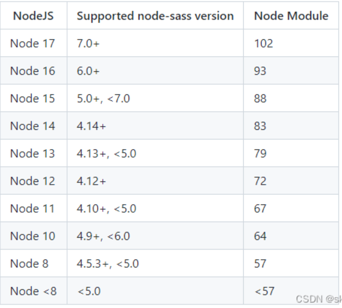
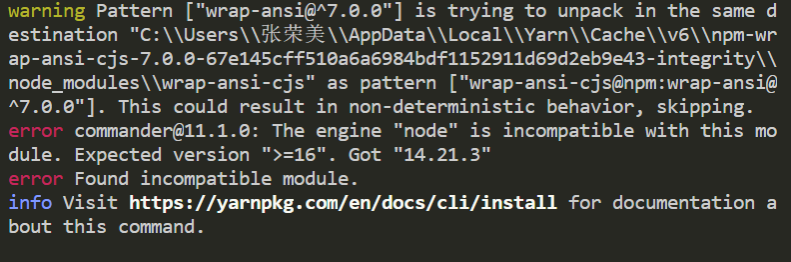
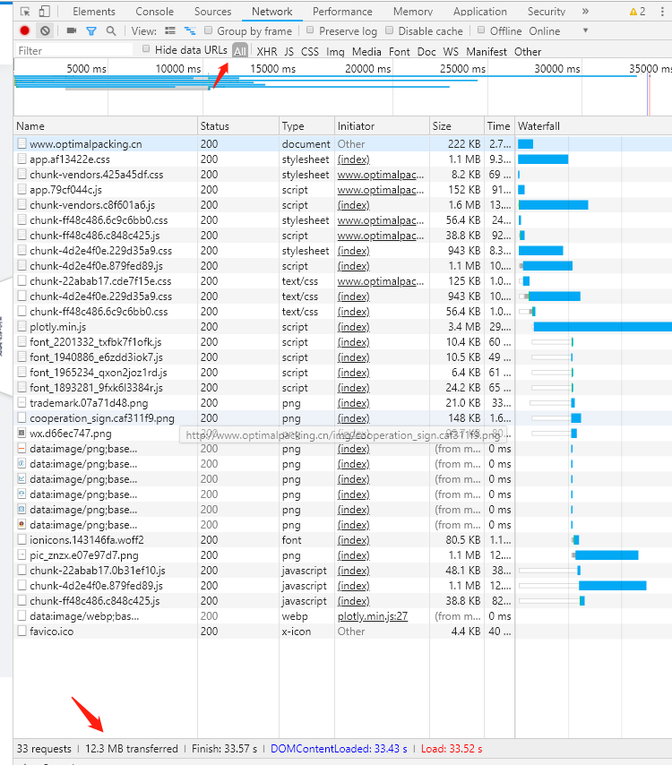
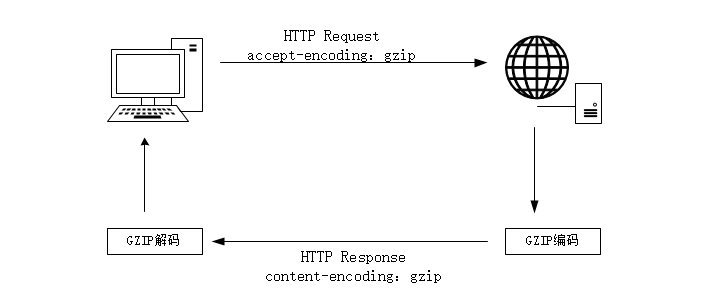
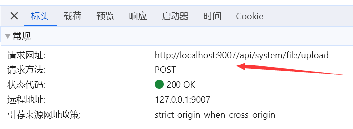
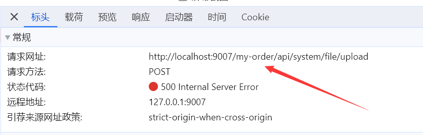

# 项目上的问题

## node版本与node-sass版本兼容
在接手老项目，运行项目时，或者安装node-sass时报如下错误，就是版本兼容问题
```
Syntax Error: Error: Node Sass does not yet support your current environment: Windows 64-bit with Unsupported runtime (93)
For more information on which environments are supported please see:     
https://github.com/sass/node-sass/releases/tag/v4.14.1
```
以下为node版本与sass版本对应关系图

**解决方案:** 安装对应版本的node或者node-sass

## 热更新太慢
vue项目在修改代码后热更新太慢解决方案可以从以下两点试试

1. 改变路由懒加载方式
```js
component: resolve => require (['@/pages/back-stage/payment/Index.vue'], resolve)
// 改为下面这种方式
component: () => import ('@/pages/back-stage/payment/Index.vue')
```

2. 安装babel-plugin-dynamic-import-node插件
* 先安装插件 `yarn add babel-plugin-dynamic-import-node`
* 在`babel.config.js`中添加插件
```js
"env": {
      "development": {
        "plugins": ["dynamic-import-node"]
      }
}
```
* 或者在`.babelrc`文件中添加 `(官方推荐)`
```js
{
  "plugins": ["dynamic-import-node"]
}
```
* 可选项`noInterop`

```js
// 如果为true 则不会互换 require 调用。 有用的是避免使用require（'module'）。默认在 commonjs 模块上。开发环境通过 babel 将异步 import() 转化为同步 require() 来增加热更新速度，生产环境继续使用 webpack 的import 机制。
"plugins": [
    ["dynamic-import-node", { "noInterop": true }]
]

```

## 内存溢出
在热更新的时候可能会碰到内存突然溢出的问题，原因是因为在编译大型项目 webpack 占用内存如果超出了V8引擎对Node默认的内存限制大小时，(64位系统：1.4 GB，32位系统：0.7 GB)，就会产生内存溢出的错误。
```js
<--- Last few GCs --->
 
[13872:000001BAF69758E0]   606058 ms: Mark-sweep 1227.9 (1294.4) -> 1225.3 (1292.1) MB, 387.1 / 0.1 ms  (average mu = 0.936, current mu = 0.000) last resort GC in old space requested
[13872:000001BAF69758E0]   606389 ms: Mark-sweep 1225.3 (1292.1) -> 1225.3 (1291.6) MB, 330.6 / 0.0 ms  (average mu = 0.881, current mu = 0.000) last resort GC in old space requested
 
 
<--- JS stacktrace --->
 
==== JS stack trace =========================================
 
    0: ExitFrame [pc: 0000011C9175C5C1]
Security context: 0x01546879e6e9 <JSObject>
    1: byteLength(aka byteLength) [00000079857F9241] [buffer.js:531] [bytecode=00000160110414F1 offset=204](this=0x02bf2c6826f1 <undefined>,string=0x032765d66511 <Very long string[84025566]>,encoding=0x0154687be2e1 <String[4]: utf8>)
    2: arguments adaptor frame: 3->2
    3: fromString(aka fromString) [0000018FF1D13251] [buffer.js:342] [bytecode=00000160...
 
FATAL ERROR: CALL_AND_RETRY_LAST Allocation failed - JavaScript heap out of memory
 1: 00007FF7B0E1C6AA v8::internal::GCIdleTimeHandler::GCIdleTimeHandler+4506
 2: 00007FF7B0DF7416 node::MakeCallback+4534
 3: 00007FF7B0DF7D90 node_module_register+2032
 4: 00007FF7B111189E v8::internal::FatalProcessOutOfMemory+846
 5: 00007FF7B11117CF v8::internal::FatalProcessOutOfMemory+639
 6: 00007FF7B12F7F94 v8::internal::Heap::MaxHeapGrowingFactor+9620
 7: 00007FF7B12F645B v8::internal::Heap::MaxHeapGrowingFactor+2651
 8: 00007FF7B14202BB v8::internal::Factory::AllocateRawWithImmortalMap+59
 9: 00007FF7B1422D6D v8::internal::Factory::NewRawTwoByteString+77
10: 00007FF7B116DDA8 v8::internal::Smi::SmiPrint+536
11: 00007FF7B1104EAB v8::internal::StringHasher::UpdateIndex+219
12: 00007FF7B112A2C6 v8::String::Utf8Length+22
13: 00007FF7B0DE07AC node::Buffer::New+4332
14: 00007FF7B1324382 std::vector<v8::internal::compiler::MoveOperands * __ptr64,v8::internal::ZoneAllocator<v8::internal::compiler::MoveOperands * __ptr64> >::_Umove+79442
15: 00007FF7B132580D std::vector<v8::internal::compiler::MoveOperands * __ptr64,v8::internal::ZoneAllocator<v8::internal::compiler::MoveOperands * __ptr64> >::_Umove+84701
16: 00007FF7B1324866 std::vector<v8::internal::compiler::MoveOperands * __ptr64,v8::internal::ZoneAllocator<v8::internal::compiler::MoveOperands * __ptr64> >::_Umove+80694
17: 00007FF7B132474B std::vector<v8::internal::compiler::MoveOperands * __ptr64,v8::internal::ZoneAllocator<v8::internal::compiler::MoveOperands * __ptr64> >::_Umove+80411
18: 0000011C9175C5C1

```
在代码热更新出现上述问题时，可以使用一个解除限制内存的插件 `increase-memory-limit`

* 安装插件：`yarn add increase-memory-limit`
* 配置运行语句，在`package.json`添加一个`script`指令：`npm run adjust-mermory-limit`

## 项目安装依赖时候常见问题以及解决思路

### 环境问题
**由于国内外环境因素，导致npm包下载不完整或者出错中断**

可以通过修改npm包的镜像源的方式，加速依赖包下载的速度，来避免这种问题

**npm设置源**

* 查看源 npm get registry
* 设置淘宝源 npm config set registry http://registry.npm.taobao.org/
* 切换默认源 npm config set registry https://registry.npmjs.org/

**yarn设置源**
* 查看源 yarn config get registry
* 设置淘宝源 yarn config set registry http://registry.npm.taobao.org/
* 切换默认源 yarn config set registry https://registry.yarnpkg.com

### 版本问题
**由于node版本和node.sass版本不匹配导致出错中断**

对照上文中`node版本与node-sass版本兼容`解决

### 其他问题
**项目其他人安装依赖都正常，到你安装依赖时出错**

其他人安装依赖都没啥问题，就你安装出错，检查node版本也没啥问题，这个时候你就开始有点莫名其妙了，到这里了先不要慌，三种方案帮你解决。

**方案一.删除node modules文件**

删除node modules的两种方式
> 直接手动删除项目下的node_modules文件夹（缺点：依赖包多时删除很慢）

> 安装rimraf插件删除
```
# 全局安装命令
npm install -g rimraf

# 执行删除依赖包的命令(删除时需要在node_modules目录下运行命令)
rimraf node_modules
```
**方案二.清除npm缓存caches文件**

清除缓存的两种方式
> 直接手动删除缓存文件，删除C:\Users\用户名.npmrc 这个文件。

> 命令删除 
```
npm命令: npm cache clean --force 
yarn命令: yarn cache clean --force
```

**方案三.修改配置**

将`yarn`配置中的`strict-ssl设置为flase`  , 在`info yarn config`信息中，`strict- ssl`为`true`,表示需要验证`HTTPS`证书。我们可以将`strict-ssl设置为false`,跳过`HTTPS`证书验证。
```
yarn config set "strict-ssl" false -g
```

### 如下报错
**error commander@11.1.0: The engine "node" is incompatible with this module**

完整的报错情况如下：


1. 到这里我们可以根据提示选择安装并切换`>=16版本的node`来解决这个问题。

2. 由于我这个项目的`"node-sass": "4.14.1"`必须匹配14版本的node,（先再16+版本忽略node-sass,安装成功后，再切换智14+版本安装node-sass的方式已经尝试过，报相同的错），到这里，我们可以通过以下命令来忽略错误
```
yarn config set ignore-engines true
```
错误忽略成功后，再`yarn install`安装依赖就可以了

## 系统首页加载缓慢

### 资源与配置不匹配
场景：有一天销售小姐姐突然跑过来跟我反馈，我们系统的首页加载好慢好慢，要十秒左右才能加载完成。

问题排查：第一步查看首页资源请求，是那个资源响应时间需要这么长时间（之前都是好好的，不可能无缘无故突然就变慢了），然后不看不知道一看吓一跳，居然是前几天更新的内容`three.js`包卡卡住了，

1. 如果是测试环境是内网，加载稍微快一点是正常的，可以尽量压缩系统引入的图片和首页不需要的资源。
2. F12调开控制台，查看页面请求总资源是否和nginx内配置的client `max body size 50m;`页面请求最大总资源匹配，如果不匹配需要修改。



### Gzip压缩
web上使用gzip编码格式传输有几个要点：
* 1. 浏览器和服务器都需要支持gzip编码（所有浏览器都支持）
* 2. 采用 LZ77 算法与 Huffman 编码来压缩文件，是一种无损压缩算法
* 3. 压缩比率在3-10倍左右（纯文本），可以大大节省服务器的网络带宽

#### 使用注意事项
* 1. html、js、css使用gzip压缩
* 2. 图片资源不需要Gzip压缩
原因：gzip使用的`Deflate`算法，因为它使用了`LZ77`算法与`Huffman`编码来压缩文件，重复度越高的文件可压缩的空间就越大，但是图片的重复度是很低的，甚至压缩后页面的体积会变大，得不偿失

#### Gzip的压缩原理


* 1. 浏览器请求url，并在请求头中设置属性accept-encoding: gzip。这表明该浏览器是支持gzip，该参数浏览器在请求资源时会自动带上。
* 2. 服务器在接收到浏览器发送的请求之后，服务器会返回压缩后的文件，并在响应头重包含content-encoding: gzip。若是没有gzip文件，会返回为压缩的文件。
* 3. 浏览器接收到服务器的响应之后，根据content-encoding: gzip响应头使用gzip策略解压压缩后的资源，通过content-type内容类型决定怎么编码读取该文件内容。

#### 开启Gzip压缩的方案
##### 第一步：前端预生成gz文件
前端工程项目可以在打包的时候，前端使用webpack或vite打包工作，生成gz文件。这样的目的是减少在服务器在线生成gzip的步骤。

使用webpackg构建代码如下：
```js
const CompressionWebpackPlugin = require('compression-webpack-plugin');

module.exports = {
  // ...其他配置
  plugins: [
    // 压缩文件
    new CompressionWebpackPlugin({
      test: /\.js$|\.html$|\.css$/,
      // 超过4kb压缩
      threshold: 4096
    }),
  ],
};
```

使用vite构建代码如下：
```js
import compressPlugin from 'vite-plugin-compression';

export default defineConfig({
  plugins: [
    compressPlugin({
      ext: '.gz',
      algorithm: 'gzip',
      deleteOriginFile: false,
    }),
  ],
})
```

#### 第二步：服务器在线Gzip压缩（nginx）
nginx配置来阐述流程，以下是nginx的配置属性

nginx配置代码如下：

1. 静态加载本地的gz文件
```js
// 静态加载本地的gz文件，需要在nginx上安装http_gzip_static_module模块
gzip_static on;

```

2. 两种方式结合的配置

有gz文件的时候使用静态资源，不存在gz文件的时候进行在线压缩而不是加载源文件，需要在nginx上把两种配置都写上。
```
  # 开启gzip
  gzip on;

  # 启用gzip压缩的最小文件；小于设置值的文件将不会被压缩
  gzip_min_length 1k;

  # gzip 压缩级别 1-10
  gzip_comp_level 2;

  # 进行压缩的文件类型。

  gzip_types text/plain application/javascript application/x-javascript text/css application/xml text/javascript application/x-httpd-php;

  # 是否在http header中添加Vary: Accept-Encoding，建议开启
  gzip_vary on;
```

gzip_static的优先级高，会先加载静态gz文件，当同目录下不存在此文件的时候，会执行在线压缩命令。

#### 查看gzip开启状态
开启前：


开启后：

Etag中只有简单字符表示静态资源加载，而前面带 W/ 表示启动了在线压缩。


## 研发中node_modules依赖包越来越大
之前没有感觉，直到一次，我的磁盘突然变红了，我很奇怪，这个工作盘都没多少东西啊，怎么突然就慢了，结果一分析，项目中的依赖包居然达到了`20+G`让我很吃惊，这是怎么回事呢？不懂咱就百度传送门：[https://zhuanlan.zhihu.com/p/646026688]，发现前端项目在每次启动的时候，都会去执行在`node_modules`中累计`.cache`

找到问题了，咱就看怎么解决吧，
### 方案一：修改配置-让cache不做累计
在项目中修改加载器的配置`compression-webpack-plugin`,设置`cache`的属性值为`false`(`cache`的属性值默认为`true`)
```js
const CompressionWebpackPlugin = require('compression-webpack-plugin')

module.exports = {
  configureWebpack: {
      plugins: [
          // 压缩文件
          new CompressionWebpackPlugin({
              cache: false
          })
      ]
  }
}
```

### 方案二：修改配置-启动项目时删除cache
在项目每次允许时先删`.cache`
```js
// 在vue.config.js文件
const rm = require('rimraf')  // 全局安装rimraf  yarn add rimraf -g -D

rm(path.join(_dirname, 'node_modules/cache'), err => {
  if (err) {}
})
```

### 方案三：切换管理工具
大致了解了一下，现目前推荐的有两种`yarn3和pnmp`,首推`yarn3`

## https访问http资源出错
话不多说，咱们直接上解决方法

### 1.通过nginx代理
在通过配置nginx，将代理转发的地址改为http

### 2.将访问出错的资源，放在本地。

## 接口访问带上路由
正常运行的项目，在实现文件上传时，发现调用接口中有路由地址，如图

**正常情况**
* 代码
```js
// 上传接口地址
action: `/api//file-view/file/upload`,
```
* 图片



**异常情况**
* 代码
```js
// 上传接口地址
action: `api//file-view/file/upload`,
```


在做图片上传或者下载，做内联接口时一定要注意`<Upload :action="action" :max-size="2048" :format="['jpg','jpeg','png','pdf']" />`

## AES加密解密
AES加密:是一种使用密钥加密的算法，叫做对称加密方式

先引入`CryptoJS`插件
```
yarn add crypto-js
```
使用方法如下，密钥一定得事先和后端核对清楚，密钥对不上解不开密码。
```js
  let userName = '小明'
  let passWord = '123456'
  // 账号加密
  let userNameEncrypt = this.aesEncryp(userName)
  let passWordEncrypt = this.aesEncrypt(passWord)
  // 账号解密
  let userNameDecrypt = this.aesDecrypt(userNameEncrypt)
  let passWordDecrypt = this.aesDecrypt(passWordEncrypt)

  // AES加密
  aesEncrypt(str) {
      // 密钥
      let key = CryptoJS.enc.Utf8.parse("1093fd28138912a4176cd513ed1be114") // 密钥：一个常量，前后端协定后一个字符串即可
      let iv = CryptoJS.enc.Utf8.parse("0543456789NVCDMN") // 偏移量：一个常量，前后端协定后一个字符串，前后端一致即可
      // 加密
      let srcs = CryptoJS.enc.Utf8.parse(str) // 需要加密的明文
      let encrypted = CryptoJS.AES.encrypt(srcs, key, {
          iv: iv,
          mode: CryptoJS.mode.CBC, // mode 与后台一致。有多个模式可选 CBC/ECB
          padding: CryptoJS.pad.Pkcs7, //
      })
      // 需要返回base64格式的加密结果，使用此句
      // return CryptoJS.enc.Base64.stringify(encrypted.ciphertext)

      // 需要返回hex格式的加密结果，使用此句
      return encrypted.ciphertext.toString().toUpperCase()
  },

  // AES解密
  aesDecrypt(str) {
      // 密钥
      let key = CryptoJS.enc.Utf8.parse("1093fd28138912a4176cd513ed1be114") // 密钥：一个常量，前后端协定后一个字符串即可
      let iv = CryptoJS.enc.Utf8.parse("0543456789NVCDMN") // 偏移量：一个常量，前后端协定后一个字符串，前后端一致即可
      // 解密
      // 需要返回base64格式的加密结果，使用此句
      // let encryptedHexStr = CryptoJS.enc.Base64.parse(str)

      // 需要返回hex格式的加密结果，使用此句
      let encryptedHexStr = CryptoJS.enc.Hex.parse(str)
      let srcs = CryptoJS.enc.Base64.stringify(encryptedHexStr)
      let encrypted = CryptoJS.AES.decrypt(srcs, key, {
          iv: iv,
          mode: CryptoJS.mode.CBC, // mode 与后台一致。有多个模式可选 CBC/ECB
          padding: CryptoJS.pad.Pkcs7, //
      })
      return encrypted.toString(CryptoJS.enc.Utf8).toString()
  }
```

## sm加密
sm加密又叫国密加密，前端可以通过插件`sm-crypto`去实现，分为sm2、sm3、sm4，今天我们主要说一下sm3

sm3不可解密加密

### 插件安装
```
// yarn安装
yarn add sm-crypto
// npm安装
npm install --save sm-crypto
```

### 插件引用
```js
// 插件引用
import { SM3 } from 'sm-crypto'; // 这样使用可能在代码中使用SM3报undefined

// 转换时直接使用，这样可以避免上面的问题
const SM3 = require('sm-crypto').sm3
let passWord = SM3('zheshimima123')
```

## 前端发布代码后需要强刷浏览器
### 场景
前端在发布代码后，不强刷页面或者清理缓存刷新页面，无法获取最新的代码页面。

### 原因
这个和浏览器的缓存机制有关系了，浏览器缓存是为了节约网络的资源加速浏览，浏览器在用户磁盘上对最近请求过的文档进行存储，当访问者再次请求这个页面时，浏览器就可以从本地磁盘显示文档，这样就可以加速页面的阅览。

### 解决方案
#### 方案一：添加动态版本号
使用 Vue 脚手架的情况下：vue.config.js，在打包时给css文件和js文件后加上时间戳。
```js
const timeStamp = new Date().getTime()
module.exports = {
  filenameHashing: false, // 打包的时候不使用 hash 值，因为后面自行添加时间戳或者版本号了
  configureWebpack: {
    output: {
      // 打包编译后的js文件名称,添加时间戳.
      filename: `js/js[name].${timeStamp}.js`,
      chunkFilename: `js/chunk.[id].${timeStamp}.js`
    },
  },
  css: {
    extract: { // 打包后css文件名称添加时间戳
      filename: `css/[name].${timeStamp}.css`,
      chunkFilename: `css/chunk.[id].${timeStamp}.css`
    }
  }
}
```

#### 方案二：在 index.html 页面加 meta 标签
program、cache-control 和 expires 都是前端缓存的关键字段，优先级是 pragma > cache-control > expires，pragma 是旧产物，已经逐步抛弃，有些网站为了向下兼容还保留了这个字段。
```html
<meta http-equiv="pragram" content="no-cache">
<meta http-equiv="cache-control" content="no-cache, no-store, must-revalidate">
<meta http-equiv="expires" content="0">
```

#### 方案三：后端 nginx 配置，让 index.html 不缓存
vue 默认配置，打包后 css 和 js 的名字后面都加了哈希值，不会有缓存问题，但是 index.html 在服务器端可能是有缓存的，需要在服务器配置不让缓存 index.html。

no-cache, no-store可以只设置一个，也可以两个都设置
* no-cache浏览器会缓存，但刷新页面或者重新打开时 会请求服务器，服务器可以响应304，如果文件有改动就会响应200
* no-store浏览器不缓存，刷新页面需要重新下载页面
```
location = /index.html {
  add_header Cache-Control "no-cache, no-store";
}
```

## 接口数据压缩
### 场景
做悠闲装箱项目的时候，需要生成集装箱和货物的3D模型，有的时候货物会有上万条数据，这种情况下接口的响应时间会很长，通过数据压缩可以解决一部分问题。

### pako插件
Pako 是一个高性能的 JavaScript 库，用于在浏览器和 Node.js 环境中进行数据压缩和解压缩。它是 zlib 库的 JavaScript 移植版本，能够提供几乎与 C 语言实现相同的压缩速度。Pako 的主要特点包括：
* 高性能：在现代 JavaScript 引擎中，Pako 的压缩和解压缩速度接近 C 语言实现的 zlib。
* 跨平台：支持在浏览器和 Node.js 环境中运行。
* 兼容性：生成的压缩数据与 zlib 兼容，可以直接在其他支持 zlib 的环境中使用。
```js
// npm安装
npm install pako

// yarn安装
yarn add npm pako
```

### 实现
接收到后端返回的压缩文件(正常的接口接收)，调用公共方法解压缩就可以直接使用了。公共方法如下：
```js
/**
 * strData: 后端返回的数据
 * 解压后端返回的gzip压缩数据
 * */
export function unzip(strData) {
    let charData = strData.split('').map(function(x) { return x.charCodeAt(0) })
    let binData = new Uint8Array(charData)
    let data = pako.inflate(binData, { to: 'string' })
    let unzipData = JSON.parse(data)
    return unzipData
}
```
