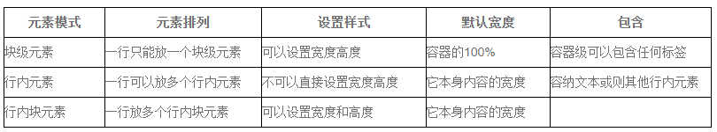
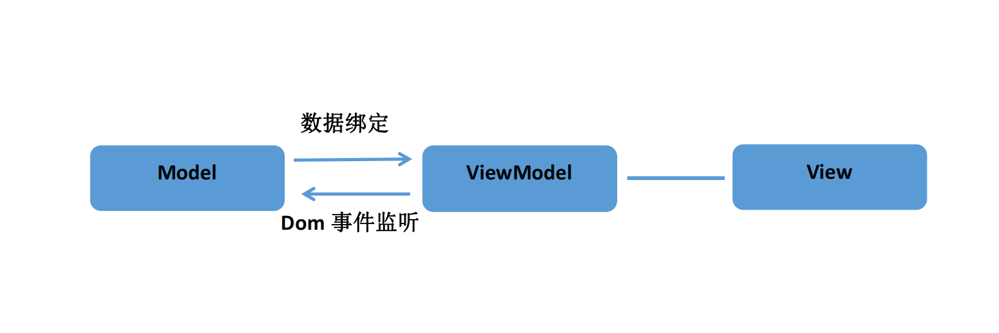
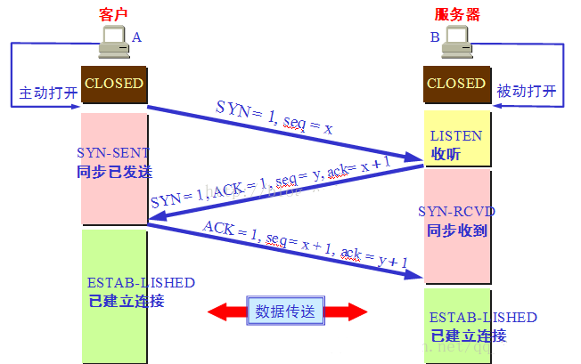
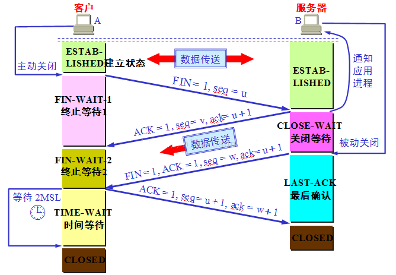

# 前端问题分类总结 :fire:

## Html部分

### Canvas和SVG的区别

**svg**
* SVG 是一种使用 XML 描述 2D 图形的语言。
* SVG 基于 XML，这意味着 SVG DOM 中的每个元素都是可用的。您可以为某个元素附加 JavaScript 事件处理器。
* 在 SVG 中，每个被绘制的图形均被视为对象。如果 SVG 对象的属性发生变化，那么浏览器能够自动重现图形。

**特点**
* 不依赖分辨率
* 支持事件处理器
* 最适合带有大型渲染区域的应用程序（比如谷歌地图）
* 复杂度高会减慢渲染速度（任何过度使用 DOM 的应用都不快）
* 不适合游戏应用

**Canvas**
* Canvas 通过 JavaScript 来绘制 2D 图形。
* Canvas 是逐像素进行渲染的。
* 在 canvas 中，一旦图形被绘制完成，它就不会继续得到浏览器的关注。如果其位置发生变化，那么整个场景也需要重新绘制，包括任何或许已被图形覆盖的对象。

**特点**
* 依赖分辨率
* 不支持事件处理器
* 弱的文本渲染能力
* 能够以 .png 或 .jpg 格式保存结果图像
* 最适合图像密集型的游戏，其中的许多对象会被频繁重绘

### 用一个 div 模拟 textarea 的实现

## Css部分

###	让div垂直居中的几种方式
```css
/* 方法一 盒子模型 */
.big{
    width: 1000px;
    height: 600px;
    background-color: #00FFFF;
    display: flex;
    align-items: center;
    justify-content: center;
}
.small{
    width: 200px;
    height: 100px;
    background-color: red;
}
/* 方法二 盒子模型 */
.big{
    width: 1000px;
    height: 600px;
    background-color: #00FFFF;
    display: flex;
}
.small{
    margin: auto;
    width: 200px;
    height: 100px;
    background-color: red;
}

/* 方法三 绝对定位 */
.big{
    width: 1000px;
    height: 600px;
    background-color: #00FFFF;
    position: relative;
}
.small{
    width: 200px;
    height: 100px;
    background-color: red;
    position: absolute;
    top: 250px;
    left: 400px;
}

/* 方法四 绝对定位+transfrom */
.big{
    width: 1000px;
    height: 600px;
    background-color: #00FFFF;
    position: relative;
}
.small{
    padding: 100px;
    background-color: red;
    position: absolute;
    top: 50%;
    left: 50%;
    transform: translate(-50%, -50%);
}

/* 方法五 绝对定位 marginL: auto */
.big{
    width: 1000px;
    height: 600px;
    background-color: #00FFFF;
    position: relative;
}
.small{
    width: 200px;
    height: 100px;
    background-color: red;
    position: absolute;
    top: 0;
    bottom: 0;
    left: 0;
    right: 0;
    margin: auto;
}

/* 方法六 table-cell法 */
.big{
    width: 1000px;
    height: 600px;
    background-color: #00FFFF;
    display: table-cell;
    vertical-align: middle;
}
.small{
    width: 200px;
    height: 100px;
    background-color: red;
    margin: auto;
} 
```

### css五大选择器

1. 类选择器(类选择器在class中引用)
```css
<div class="comment">

.comment{
    background-color: #0bbb15;
    color: white;
    margin: 20px;
    padding: 20px;
}
```

2. ID选择器(id选择器，在id中应用)
```css
<div id="comment">

.comment{
    background-color: #0bbb15;
    color: white;
    margin: 20px;
    padding: 20px;
}
```

3. 派生选择器(根据上下文关系来确定某个标签的样式叫派生选择器)
```css
<li><strong>我是斜体字。这是因为 strong 元素位于 li 元素内。</strong></li>

li strong {
    font-style: italic;
    font-weight: normal;
}
```

4. 元素选择器(指定元素的样式)
```css
<p>111</p>
 
<h2>222</h2>

后面中所有p和h2的元素都使用上面定义的样式

p {font-size: 30px; backgroud-color: gray;}
 
h2 {background-color: red;}
```

5. 属性选择器(属性选择器在css2中引入，使我们可以根据元素的属性及属性值来选择元素)
```css
/* 荔枝：对拥有title的属性设置统一样式： */
<h title="hello">hello</h>
[title]
{
    color:red;
}
```

### px,em,rem,vw,vh区别
`px`: px就是pixel的缩写，意为像素。px就是一张图片最小的一个点，一张位图就是千千万万的这样的点构成的。

`em`: 参考物是父元素的font-size，具有继承的特点。如果自身定义了font-size按自身来计算（浏览器默认字体是16px），整个页面内1em不是一个固定的值。

`rem`: css3新单位，相对于根元素html（网页）的font-size，不会像em那样，依赖于父元素的字体大小，而造成混乱。

`vw`: css3新单位，viewpoint width的缩写，视窗宽度，1vw等于视窗宽度的1%。
* 举个例子：浏览器宽度1200px, 1 vw = 1200px/100 = 12 px。

`vh`: css3新单位，viewpoint height的缩写，视窗高度，1vh等于视窗高度的1%。
* 举个例子：浏览器高度900px, 1 vh = 900px/100 = 9 px。

### 盒子模型
CSS盒模型本质上是一个盒子，封装周围的HTML元素，它包括：外边距（margin）、边框（border）、内边距（padding）、实际内容（content）四个属性。
### 标准盒模型
标准模式下的盒模型

盒子实际内容（content）的width/height=我们设置的width/height

盒子总宽度/高度=width/height+padding+border+margin。
### 怪异盒模型
IE盒子模型(怪异盒模型)

盒子的（content）宽度+内边距padding+边框border宽度=我们设置的width(height也是如此)

盒子总宽度/高度=width/height + margin = 内容区宽度/高度 + padding + border + margin。

### 两种模式下如何解决样式的兼容性问题
不要给元素添加具有指定宽度的内边距，而是尝试将内边距或外边距添加到元素的父元素和子元素。

### 块级元素、行内元素、块级行内元素。



* 块转行内：display:inline;
* 行内转块：display:block;
* 块、行内元素转换为行内块：display: inline-block;

### BFC

## Javascript部分

### 基本数据类型

### 遍历数组的方式
引用：[https://blog.csdn.net/mwl1711883743/article/details/81805573]

### 遍历对象的方式
引用：[https://blog.csdn.net/qq_53225741/article/details/127073295]

### 深浅拷贝

### 事件循环机制

### 防抖、节流
#### 防抖
防抖函数可以将多次高频率触发的函数执行合并成一次，并在指定的时间间隔后执行一次。通常在处理输入框、滚动等事件时使用，避免频繁触发事件导致页面卡顿等问题。

**函数在 n 秒后再执行，如果 n 秒内被触发，重新计时，保证最后一次触发事件 n 秒后才执行。**
```js
function debounce(fn, wait, immediate = false) {
    let timer = null

    return function () {
        // 存在定时器 清空
        if (timer) {
            clearInterval(timer)
            timer = null
        }
        // 立即执行
        if (immediate) {
            // 判断是否执行过  如果执行过 timer 不为空
            const flag = !timer

            // 执行函数
            flag && fn.apply(this, arguments)

            // n 秒后清空定时器
            timer = setTimeout(() => {
                timer = null
            }, wait)
            } else {
            timer = setTimeout(() => {
                fn.apply(this, arguments)
            }, wait)
        }
    }
}
```
#### 节流
节流是一种常用的性能优化技术，它可以限制函数的执行频率，避免过多的重复操作，提升页面的响应速度。

**函数在 n 秒内只执行一次，如果多次触发，则忽略执行。**
```js
function throttle(fn, wait) {
    let startTime = Date.now()

    return function () {
        const nowTime = Date.now()

        // 计算两次执行的间隔时间 是否大于 wait 时间
        if (nowTime - startTime >= wait) {
            startTime = nowTime
            return fn.apply(this, arguments)
        }
    }
}

```
### mvvm和mvc
#### mvvm
MVVM（Model–View–Viewmodel）是一种软件架构模式，是MVC的改进版，MVVM 将其中的View 的状态和行为抽象化，让我们将视图 UI 和业务逻辑分开。它由微软架构师Ken Cooper和Ted Peters开发，通过利用WPF（微软.NET图形系统）和Silverlight（WPF的互联网应用派生品）的特性来简化用户界面的事件驱动程序设计。



* 【model 模型】指的是后端传递的数据。
* 【view 视图】指的是所看到的页面，亦可以理解为将数据以某种方式呈现给用户
* 【Viewmodel 视图模型】mvvm模式的核心，它是连接view和model的桥梁

从上图可以看到，它大致有两个方向

1. 模型 -> 视图
> 解析：将后端数据转化为前端页面 实现方式：数据绑定

2. 视图 -> 模型
> 解析：将前端页面转化为后端数据 实现方式：DOM事件监听

存在两个方向都实现的情况，叫做数据的双向绑定


### Cookie和Localstorage、Sessionstorage的优缺点
1. Cookie

    cookie限制大小，约4k左右，不适合存储业务数据，尤其是数据量较大的值；

    cookie会每次随http请求一起发送，浪费宽带。

2. Localstorage

    **特点：**

        可以长期储存数据；需要手动删除数据
        在同一域下且同一个浏览器不同窗口页面，操作的是同一个localStorage

    **优点：**

        可以大量保存浏览器中数据。
        不会随http请求一起发送

    **缺点：**

        不同窗口下数据；
        不能独立，相互干扰。例如：删除或添加一个数据，其它的窗口也会同步删除或者添加该 数据
        不能被爬虫读取
        在浏览器的隐私模式下不能读取
        写入数据量大的话会卡（FF是将localstorage写入内存中的）
        
3. Sessionstorage

    **优点：**

    可以大量保存浏览器中数据。
    不同窗口下的sessionStorage，存储相互独立；互不干扰

## ES6

### async awit
用同步的方式执行异步操作

荔枝：使用async awit封装请求
```js
const handleLogin = async () => {
  const res = await request('/basic/login', {
    usename: 'zhanghao',
    password: '123456'
  })
  const info = await request('/basic/getuserinfo', {
    id: res.id
  })
  this.userInfo = info
}
```
这里没有错误抛出，如果说接口请求报错应该怎么办呢？

**async awit捕获错误**

有一个库`await-to-js`已经帮我们做了这件事，它的源码只有短短十几行，
```js
/**
 * @param { Promise } 传进去的请求函数
 * @param { Object= } errorExt - 拓展错误对象
 * @return { Promise } 返回一个Promise
 */
export function to(
  promise,
  errorExt
) {
  return promise
    .then(data => [null, data])
    .catch(err => {
      if (errorExt) {
        const parsedError = Object.assign({}, err, errorExt)
        return [parsedError, undefined]
      }

      return [err, undefined]
    })
}

export default to
```
**源码总结**：to函数返回一个Promise且值是一个数组，数组之中有两个元素，如果索引为0的元素不为空值，说明该请求报错，如果索引0的元素为空值说明该请求没有报错，也就是成功。

**使用`await-to-js`**
```js
const handleLogin = async () => {
  const [resErr, res] = await to(request('/basic/login', {
    usename: 'sunshine',
    password: '123456'
  }))
  if (resErr) {
    console.login('抛出错误')
    return
  }
  const [userErr, info] = await to(request('/basic/getuserinfo', {
    id: res.id
  }))
  if (userErr) {
    console.login('抛出错误')
    return
  }
  this.userInfo = info
}

```

### Promise的使用
promise对象代表一个异步操作，有三种状态：`pending`（进行中）、`fulfilled`（已成功）和`rejected`（已失败）

```js
//使用promise 按照789, 456, 123的顺序打印出来
//方法: 先将setTimeout（异步）操作通过Promise封装起来,然后再调用他们
function fn1() {
    return new Promise((resolve, reject) => {
        setTimeout(function() {
            console.log(123)
            resolve();
        }, 100);
    })
}
function fn2() {
    return new Promise((resolve, reject) => {
        setTimeout(function() {
            console.log(456)
            resolve();
        }, 200);
    })
}
function fn3() {
    return new Promise((resolve, reject) => {
        setTimeout(function() {
            console.log(789)
            resolve();
        }, 300);
    })
}

fn3().then(res => {
    console.log('第一步完成')
    fn2().then(res => {
        console.log('第二步完成')
        fn1().then(res => {
            console.log('第三步完成')
        })
    })
})
```

### Clas的使用
### var、let、const的区别
1. var

    var声明变量可以重复声明，而let不可以重复声明

    var是不受限于块级的，而let是受限于块级

    var会与window相映射（会挂一个属性），而let不与window相映射

    var可以在声明的上面访问变量，而let有暂存死区，在声明的上面访问变量会报错

2. let

    let声明的变量可以改变，值和类型都可以改变，没有限制。

3. const

    const声明之后必须赋值，否则会报错

    const定义不可变的量，改变了就会报错

    const和let一样不会与window相映射、支持块级作用域、在声明的上面访问变量会报错

### Set、map


## Vue部分

### 生命周期

#### vue3的生命周期主要有4个阶段9个钩子分别是:

**4个阶段**
* 创建 ——在组件创建时执行
* 挂载——DOM被挂载时执行
* 更新——当响应式数据被修改时执行
* 销毁——在元素销毁之前执行

**9个钩子函数**
* beforeCreate—— 初始化事件以及生命周期，此时data和dom都为创建无法问题
* created——创建后，此时已经初始化完毕，data已经可以访问，但是dom元素依然不行
* onBeforeMount ——在挂载开始之前调用,此时dom元素已经生成，但是未挂载到页面上，可以进行异步操作
* onMounted—— 组件挂载时调用，此时可以访问dom元素，可以进行异步操作
* onBeforeUpdate ——数据更新前调用，这里可以访问更新前的dom，通常用来移除事件监听
* onUpdated—— 由于数据改变更新dom之后调用，这里可以访问更细后的dom
* onBeforeUnmount——卸载组件之前调用，通常用于清除计时，以及事件监听
* onUnMounted—— 组件卸载之后调用，可以用于清除一些资源占用

#### vue2的生命周期
* beforeCreate: 创建前，初始化事件以及生命周期，此时data和dom都为创建无法问题
* created: 创建后，此时已经初始化完毕，data已经可以访问，但是dom元素依然不行
* beforeMounted： 挂载前，此时dom元素、data、计算属性等已经生成，但还dom未挂载到页面上面，可以进行异步操作
* mounted: 挂载后，此时dom元素已经挂载完毕，可以访问dom，可以进行异步操作
* beforeUpdate: 更新前，此时可以获取到更新前的dom元素，可以对更新前的状态进行保存
* update: 更新后，此时页面已经更新完毕，可以访问更新后的dom元素
* beforeDestoy： 销毁前，组件销毁之前调用，通常用来清除计时器、事件监听、
* destroyed: 销毁后，此时dom元素已经卸载，可以释放组件用过的资源等操作

### vue2对比vue3做了哪些改进
1. 性能的优化 vue3采用Proxy替代Object.definedPropety实现响应式，并且使用的静态提升技术，提高渲染的性能，但是对于proxy有一个缺点对ie11不支持

性能方面Proxy的性能优于Object.definePropety

拦截对象不同，proxy可以对整个对象进行控制，Object.definePorpety只能对象单个属性控制，这也是为什么Vue2要使用Vue.$set去设置属性的原因

Object.definePropety是对原始的对象进行操作，而Proxy会在原始对象上面创建一个代理层，Object.definePropety操作原始对象就可以触发拦截器，而Proxy则要操作代理对象

兼容性的区别Object.definePropety兼容性相对较好，Proxy无法兼容IE11

2. 组合式api可以更好的复用组件逻辑

3. TypeScript支持，vue3已经完全支持Typescript

4. 新的自定义渲染Api,Vue3对于生命周期组件事件等都需要进行自定义以及控制

### Proxy和Object.defineProperty的区别
1. 性能方面Proxy的性能优于Object.definePropety

2. 拦截对象不同，proxy可以对整个对象进行控制，Object.definePorpety只能对象单个属性控制，这也是为什么Vue2要使用Vue.$set去设置属性的原因

3. Object.definePropety是对原始的对象进行操作，而Proxy会在原始对象上面创建一个代理层，Object.definePropety操作原始对象就可以触发拦截器，而Proxy则要操作代理对象

4. 兼容性的区别Object.definePropety兼容性相对较好，Proxy无法兼容IE11


### 路由守卫

### 封装axios

### $nextTick
Vue 实现响应式并不是数据发生变化之后 DOM 立即变化，而是按一定的策略进行 DOM 的更新。$nextTick 是在下次 DOM 更新循环结束之后执行延迟回调，在修改数据之后使用 $nextTick，则可以在回调中获取更新后的 DOM。

荔枝展示：
```vue
<template>
    <div class="app">
        <div ref="msgDiv">{{msg}}</div>
        <div v-if="msg1">内容展示: {{msg1}}</div>
        <div v-if="msg2">内容展示: {{msg2}}</div>
        <div v-if="msg3">内容展示: {{msg3}}</div>
        <button @click="changeMsg">点击它</button>
    </div>
</template>

<script>
export default {
    data() {
        return {
            msg: '更改前',
            msg1: '',
            msg2: '',
            msg3: ''
        }
    },
    methods: {
        changeMsg() {
            this.msg = "更改后"
            this.msg1 = this.$refs.msgDiv.innerHTML
            this.$nextTick(() => {
                this.msg2 = this.$refs.msgDiv.innerHTML
            })
            this.msg3 = this.$refs.msgDiv.innerHTML
        }
    },
}
</script>
```
页面上显示的分别是`更改后   更改前   更改后   更改前`

### vue双向绑定的原理

vue的双向绑定是由数据劫持结合发布者－订阅者模式实现的
1. 数据劫持

v2是通过`Object.defineProperty()`来劫持各个数据的`setter`和`getter`来实现数据劫持

v3通过`Proxy`构造函数来实现数据劫持

2. 发布-订阅者模式

每个组件都对应一个`Watcher`订阅者，当组件渲染函数执行时，会将本组件的`Watcher`加入到所依赖的响应式数据的订阅者列表中。相当于完成了一次订阅，这个过程叫做“依赖收集”。

当响应式数据发生变化时，会出`setter`，`setter`负责通知数据的订阅者列表中的`Watcher`，`Watcher`触发组件重新渲染来更新视图。视图层相当于消息的订阅者。

### Vue中key的作用和工作原理
1. 作用
* 主要用在 Vue 的虚拟 DOM 算法，在新旧 nodes 对比时辨识 VNodes，相当于唯一标识ID。
* Vue 会尽可能高效地渲染元素，通常会复用已有元素而不是从头开始渲染， 因此使用key值可以提高渲染效率，同理，改变某一元素的key值会使该元素重新被渲染。
2. 工作原理
* 
 
### Vue组件之间通信方式
1. 子传父
		This.$emit
2. 父传子
		props
3. 兄弟组件之间通信+
		EventBus
		Vuex
### 组件中的data为什么是一个函数?
一个组件被复用多次的话，也就会创建多个实例。本质上，这些实例用的都是同一个构造函数。如果data是对象的话，对象属于引用类型，会影响到所有的实例。所以为了保证组件不同的实例之间data不冲突，data必须是一个函数。

### style标签中scoped 是怎样实现样式隔离
当一个style标签拥有scoped属性时，它的CSS样式就只能作用于当前的组件，也就是说，该样式只能适用于当前组件元素。通过该属性，可以使得组件之间的样式不互相污染。如果一个项目中的所有style标签全部加上了scoped，相当于实现了样式的模块化。

**scoped的实现原理**

vue中的scoped属性的效果主要通过PostCSS转译实现
```html
/* 转译前 */
<style scoped>
    .font-color {
        color: red;
    }
</style>
<template>
    <p class = "font-color">试一试</p>
</template>

/* 转译后 */
<style scoped>
    .font-color[data-v-5558831a] {
        color: red;
    }
</style>
<template>
    <p class = "font-color" data-v-5558831a>试一试</p>
</template>
```

### computed和watch的区别
#### computed计算属性
##### 概念
computed就是依据现有的数据，计算出新的属性来。所依赖的数据变化了，会自动重新计算。
##### 语法
1.声明在 computed 配置项中，一个计算属性对应一个函数

2.使用起来和普通属性一样使用 {{ 计算属性名}}
```js
computed: {
    totalPrice: {
        get() {
            let price = 0
            // 手动添加表格数据条数，并且支持新增表格内容填写
            this.billTable.map(item => {
                price = price + item.price
            })
            return price || null
        },
        set() {}
    },
},
```
##### 注意
* 1.computed配置项和data配置项是同级的
* 2.computed中的计算属性虽然是函数的写法，但他依然是个属性
* 3.computed中的计算属性不能和data中的属性同名
* 4.使用computed中的计算属性和使用data中的属性是一样的用法
* 5.computed中计算属性内部的this依然指向的是Vue实例

#### watch监控器
```js
watch: {
    // 普通写法
    isDrawerShow(newValue, oldValue) {
    }
    // 带深度监听（deep）、进入页面就立即监听（immediate）
    passList: {
        handler (newValue, oldValue) {
        },
        deep: true,
        immediate: true
    }
},
```
**我们应该从功能的互补上看待methods,watch和computed的关系**

比如，在一个表格录入，每手动添加一行，都需要填写并实时显示计算结果。

## 浏览器
### 垃圾回收机制

#### 概述
JS的垃圾回收机制是为了以防内存泄漏，内存泄漏的含义就是当已经不需要某块内存时这块内存还存在着，垃圾回收机制就是间歇的不定期的寻找到不再使用的变量，并释放掉它们所指向的内存。

#### 变量的回收
当一个变量的生命周期结束之后它所指向的内存就应该被释放。
* JS有两种变量，全局变量和在函数中产生的局部变量。局部变量的生命周期在函数执行过后就结束了，此时便可将它引用的内存释放（即垃圾回收），但全局变量生命周期会持续到浏览器关闭页面。

#### 回收方式
两种方式：标记清除（mark and sweep）、引用计数(reference counting)。

**标记清除**

大部分浏览器以此方式进行垃圾回收，当变量进入执行环境（函数中声明变量）的时候，垃圾回收器将其标记为“进入环境”，当变量离开环境的时候（函数执行结束）将其标记为“离开环境”，在离开环境之后还有的变量则是需要被删除的变量。标记方式不定，可以是某个特殊位的反转或维护一个列表等。

垃圾收集器给内存中的所有变量都加上标记，然后去掉环境中的变量以及被环境中的变量引用的变量的标记。在此之后再被加上的标记的变量即为需要回收的变量，因为环境中的变量已经无法访问到这些变量。

**引用计数**

这种方式常常会引起内存泄漏，低版本的IE使用这种方式。机制就是跟踪一个值的引用次数，当声明一个变量并将一个引用类型赋值给该变量时该值引用次数加1，当这个变量指向其他一个时该值的引用次数便减一。当该值引用次数为0时就会被回收。

该方式会引起内存泄漏的原因是它不能解决循环引用的问题：
```js
function sample(){
    var a={};
    var b={};
    a.prop = b;
    b.prop = a;
}
```
这种情况下每次调用sample()函数，a和b的引用计数都是2，会使这部分内存永远不会被释放，即内存泄漏。

### 三次握手与四次挥手

**三次握手**



第一次握手：建立连接时，客户端发送syn包（syn=x）到服务器，并进入SYN_SENT状态，等待服务器确认；SYN：同步序列编号（Synchronize Sequence Numbers）。

第二次握手：服务器收到syn包，必须确认客户的SYN（ack=x+1），同时自己也发送一个SYN包（syn=y），即SYN+ACK包，此时服务器进入SYN_RECV状态；

第三次握手：客户端收到服务器的SYN+ACK包，向服务器发送确认包ACK(ack=y+1），此包发送完毕，客户端和服务器进入ESTABLISHED（TCP连接成功）状态，完成三次握手。

**四次挥手**



第一次挥手：客户端发出释放FIN=1，自己序列号seq=u，进入FIN-WAIT-1状态

第二次挥手：服务器收到客户端的后，发出ACK=1确认标志和客户端的确认号ack=u+1，自己的序列号seq=v，进入CLOSE-WAIT状态

第三次挥手：客户端收到服务器确认结果后，进入FIN-WAIT-2状态。此时服务器发送释放FIN=1信号，确认标志ACK=1，确认序号ack=u+1，自己序号seq=w，服务器进入LAST-ACK（最后确认态）

第四次挥手：客户端收到回复后，发送确认ACK=1，ack=w+1，自己的seq=u+1，客户端进入TIME-WAIT（时间等待）。客户端经过2个最长报文段寿命后，客户端CLOSE；服务器收到确认后，立刻进入CLOSE状态。

### 浏览器从输入到渲染的过程
1. DNS查询服务器IP

2. TCP三次握手

3. TLS协商

4. 发送GET请求HTML文件

5. 将HTML内容构建DOM树

6. 将CSS内容构建CSSOM树

7. 将DOM树和CSSOM树合成渲染树

8. 根据渲染树进行页面元素的布局

9. 绘制到页面上

### 通讯的几种方式
参考内容: [通讯的三种方式](https://juejin.cn/post/7325730345840066612)

#### 轮询
轮询本质上还是通过客户端向服务端发起一个单项传输的请求

1. 每一个请求都需要经过http建立连接的流程（比如三次握手，四次挥手）。

2. 客户端需要从页面被打开的那一刻开始就一直处理请求。

3. 浏览器请求并发是有限制的。比如`Chrome`最大并发请求数目6,超过这一限制的后续请求将会被阻塞。

### websocket
`websocket`是一个双向通讯的协议，他的优点是，可以同时支持客户端和服务端彼此相互进行通讯。功能上很强大。
* `websocket`是一个新的协议，`ws/wss`。

### sse
sse是一个单向通讯的协议也是一个长链接，它只能支持服务端主动向客户端推送数据，但是无法让客户端向服务端推送消息。
* `sse`使用的是`http`协议


## 性能优化
### 一. HTML方面
1. 语义化标签的使用
2. 页面嵌套不要太深(减少DOM数量，减轻浏览器渲染计算负担。)
3. 页面太大可以根据窗口实现懒加载

### 二.CSS方面
1. 减少CSS选择器的复杂程度，复杂度与太高浏览器解析时间越长。
2. 尽量和并和压缩css和js文件。（将css文件和并为一个。将js合并为一个）
3. 尽量所使用的字体图标或者SVG图标来代替传统png图
　　因为字体图标或者SVG是矢量图，代码编写出来的，方大不会变形，而且渲染速度快
4. 使用雪碧图或者是说图片精灵
　　把所有相对较小的资源图片，绘制在一张大图上，只需要将大图下载下来，然后利用
　　图片定位来讲小图展现在页面中（background-position:百分比，数值）
5. 能用css做的效果，不要用js做，能用原生js做的，不要轻易去使用第三方插件。
　　避免引入第三方大量的库。而自己却只是用里面的一个小功能

### 三.JS方面
1.	在js中尽量减少闭包的使用
　　原因：使用闭包后，闭包所在的上下文不会被释放
2.	减少对DOM操作，主要是减少DOM的重绘与回流（重排）
　　关于重排（回流）的分离读写：如果需要设置多个样式，把设置样式全放在一起设置，不要一条一条的设置。使用文档碎片或者字符串拼接做数据绑定（DOM的动态创建）
3.	在js中避免嵌套循环和"死循环"(一旦遇到死循环，浏览器就会直接卡掉)
4.	在js封装过程中，尽量做到低耦合高内聚。减少页面的冗余代码
5.	减少对cookie的使用（最主要的就是减少本地cookie存储内容的大小），因为客户端操作cookie的时候，这些信息总是在客户端和服务端传递。如果上设置不当，每次发送一个请求将会携带cookie
6.	前端与后端协商，合理使用keep-alive

### 四.vue方面
1. 合理使用watch和computed，数据变化就会执行，避免使用太多，减少不必要的开销。
2. 使用路由懒加载，在需要的时候才会进行加载，避免一次性加载太多路由，导致页面阻塞
3. 合理使用mixins，抽离公共代码封装成模块，避免重复代码。
4. 合理使用v-if 、v-show。
5. v-for 不要和v-if一起使用，v-for的优先级会比v-if高。
6. v-for中不要用index做key，要保证key的唯一性。
7. 使用`<template v-for>`： 使用`<template>` 标签进行`v-for`循环，以避免在渲染过程中创建额外的DOM元素。
8. 使用异步组件，避免一次性加载太多组件
9. 避免使用v-html，存在安全问风险和性能问题，可以使用v-text。

### 五.Webpack优化
1. 压缩文件，减小代码体积。
2. 开启gzip压缩。
3. 静态资源使用CDN加载，减少服务器压力。
4. 使用Tree Shaking 删除未被引用的代码。
5. 按需加载代码，在使用使用的时候加载代码。
6. 代码切割，使用code splitting将代码进行分割，避免将所有代码打包到一个文件，减少响应体积。

### 六．其他优化
1. 页面中出现音视频标签，我们不让页面加载的时候去加载这些资源（否则第一次加载会很慢）

　　解决方法：只需要将音视频的preload=none即可。

　　目的：为了等待页面加载完成时，并且音视频要播放的时候去加兹安音视频资源
