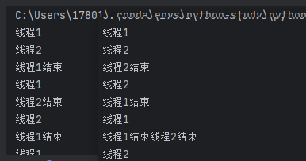

# 语法规则

## 获取接口调用数据
```python
from request import requestsData
print(requestsData, 'requestsData')
```

## 异常处理
### 抛出异常
```python
# 抛出异常
raise Exception('这是一个异常')
```

### 捕获异常
```python
try:
    print(1 / 0)
except Exception as e:
    print(e)
```

### 捕获多个异常
```python
try:
    print(1 / 0)
except (Exception, ZeroDivisionError) as e:
    print(e)
```

### 捕获异常并处理
```python
try:
    print(1 / 0)
except (Exception, ZeroDivisionError) as e:
    print(e)
else:
    print('没有异常')
finally:
    print('finally')
```

## 模块
### 内置模块
直接导入就可以使用，不需要安装
```python
import math

print(math.pi, 'math.pi')
```

### 自定义模块
自己定义的模块，需要注意命名时不要冲突
```python
import my_module

print(my_module.my_function(), 'my_module.my_function()')
```

### 第三方模块
需要通过`pip`安装才能使用的模块，需要在命令行中安装
```python
# 例如：
pip install requests
```

```python
import requests

print(requests.__version__, 'requests.__version__')
```

## 内置全局变量__name__
### 语法
```python
if __name__ == '__main__':
    print('这是主程序')
else:
    print('这是模块')
```
### 作用
当模块被直接运行时，`__name__` 为 `__main__`，当模块被导入时，`__name__` 为模块名
### 应用
当模块被直接运行时，执行一些初始化操作，当模块被导入时，不执行这些初始化操作
```python
def my_function():
    print('这是一个函数')

if __name__ == '__main__':
    print('这是主程序')
else:
    print('这是模块')
```
自己运行的结果或者主程导入运行的结果
```python
# 这是一个函数
# 这是主程序
```

其他模块导入运行结果

```python
import my_module

print(my_module.my_function(), 'my_module.my_function()')
# 运行结果
# 这是一个函数
# 这是模块
```

## 包
### 定义
包是一个包含多个模块的目录，目录下必须有一个`__init__.py`文件，这个文件可以为空，也可以包含一些初始化代码
### 作用
将相关的模块组织在一起，方便管理和使用
### 应用
当模块数量很多时，将模块组织成包可以方便管理和使用
### 示例
```python
# 包的目录结构
my_package/
    __init__.py
    module1.py
    module2.py
```
```python
# __init__.py，不建议在 __init__.py 中写代大量代码
from module1 import *
from module2 import *
```
```python
# module1.py
def function1():
    print('这是 module1 中的函数')
```
```python
# module2.py
def function2():
    print('这是 module2 中的函数')
```
```python
# 导入包，首先执行的是 __init__.py 文件
import my_package
# 调用包中的函数
print(my_package.function1(), 'my_package.function1()')
print(my_package.function2(), 'my_package.function2()')
```

## 递归
### 定义
递归是指在函数内部调用函数本身
### 作用
递归可以将一个复杂的问题分解成多个简单的问题，从而简化代码
### 应用
递归可以用于解决一些需要重复执行的问题，例如计算阶乘、斐波那契数列等
### 示例
```python
# 计算阶乘
def factorial(n):
    if n == 1:
        return 1
    else:
        return n * factorial(n - 1)

# 斐波那契数列
def fibonacci(n):
    if n == 1:
        return 1
    elif n == 2:
        return 1
    else:
        return fibonacci(n - 1) + fibonacci(n - 2)

# 调用递归
print(factorial(5), 'factorial(5)')
print(fibonacci(5), 'fibonacci(5)')

```

## 闭包
### 定义
1. 一个函数内部定义另一个函数
2. 内部函数可以访问外部函数的变量
3. 外部函数返回内部函数
### 作用
闭包可以将外部函数的变量保存在内存中，避免重复计算
### 应用
闭包可以用于实现装饰器、生成器等功能
### 示例
```python
def outer_function(x):
    def inner_function(y):
        return x + y
    return inner_function

# 调用闭包
# 调用外部函数
closure = outer_function(10)
# 第一次调用
print(closure(5), 'closure(5)') # 10 + 5 = 15
# 第二次调用
print(closure(6), 'closure(6)') # 10 + 6 = 16
# 第三次调用
print(closure(7), 'closure(7)') # 10 + 7 = 17
```
**使用闭包的过程中，外部函数的变量会被保存在内存中，不会被销毁**

## 装饰器
### 作用
1. 装饰器可以在不改变原函数的情况下，添加新的功能
2. 装饰器可以在不改变原函数的调用方式，添加新的功能
### 应用
装饰器可以用于实现日志记录、性能分析、权限验证等功能
### 示例
闭包实现装饰器

```python
def decorator(func):
    def wrapper(*args, **kwargs):
        print('这是装饰器')
        return func(*args, **kwargs)
    return wrapper

@decorator
def my_function():
    print('这是原函数')

# 调用函数
my_function()
```

## 对象
## 实例化对象__init__
1. 实例化对象会自动调用类的`__init__`方法
2. `__init__`方法的第一个参数必须是`self`，表示实例化对象本身
3. `__init__`方法可以有多个参数，用于初始化对象的属性
```python
class MyClass:
    def __init__(self, x):
        self.x = x
```
```python
# 实例化对象
my_object = MyClass(10)
```

## 析构函数__del__
1. 析构函数会在对象被销毁时自动调用
2. 析构函数的第一个参数必须是`self`，表示实例化对象本身
3. 析构函数可以有多个参数，用于初始化对象的属性
```python
class MyClass:
    def __init__(self, x):
        self.x = x
    def __del__(self):
        print('这是析构函数')
```
```python
# 实例化对象
my_object = MyClass(10)
# 销毁对象
del my_object
```
除了手动调用`del`方法，对象也会在程序结束时也会自动调用析构函数

## 封装
1. 封装是指将数据和方法封装在一个类中
2. 封装可以隐藏对象的实现细节，只暴露必要的接口
3. 封装可以提高代码的安全性和可维护性

**封装示例**
```python
class MyClass:
    def __init__(self, x):
        self.x = x
    def get_x(self):
        return self.x
    def set_x(self, x):
        self.x = x
```
```python
# 实例化对象
my_object = MyClass(10)
# 调用方法
print(my_object.get_x(), 'my_object.get_x()')
# 调用方法
my_object.set_x(20)
# 调用方法
print(my_object.get_x(), 'my_object.get_x()')
```

### 隐藏属性
1. 隐藏属性是指将属性的名称前加上双下划线`__`，这样属性就变成了私有的，只能在类的内部访问
2. 在命名方式在python中输入魔法方法或者属性，都是具有特殊含义的，自己不建议定义。
```python
class MyClass:
    __name = '雷子'
    def __init__(self, x):
        self.x = x
```
```python
# 实例化对象
my_object = MyClass(10)
# 访问隐藏属性
my_object.__name # 访问报错，提示属性不存在
# 可以通过以下特殊方式访问
print(my_object._MyClass__name, 'my_object._MyClass__name')
```

### 私有属性
1. 私有属性是指属性的名称前加上单下划线`_`，这样属性就变成了私有的，可以在类的外部访问，但是不能再其他的`py`文件通过，导入使用。
2. 这种定义方式一般是为了区分关键字使用的
```python
class MyClass:
    __name = '雷子'
    _age = 18
    def __init__(self, x):
        self.__x = x
```
```python
# 实例化对象
my_object = MyClass(10)
# 访问私有属性
print(my_object._age, 'my_object._age') # 18
```


## 继承
1. 继承是指一个类可以继承另一个类的属性和方法
2. 继承可以提高代码的复用性和可维护性
3. 继承可以实现多态，即子类可以重写父类的方法，实现不同的功能
4. 继承可以实现代码的扩展，即子类可以添加新的属性和方法，或者重写父类的方法
5. 继承可以实现代码的复用，即子类可以使用父类的属性和方法，避免重复编写代码

### 单继承
子类可以继承父类的属性和方法，也可以重写属性和方法，但是不会对父类造成影响
```python
class Father:
    def __init__(self, name, age):
        self.name = name
        self.age = age
    def say(self):
        print('这是父类的方法')
    def say_hello(self):
        print('这是父类的方法')


class Son(Father):
    def __init__(self, name, age):
        super().__init__(name, age) # super()，方法重写
    def say(self):
        print('这是子类的方法')

son = Son('雷子', 18)
print(son.name, 'son.name')
print(son.age, 'son.age')
son.say() # 这是子类的方法
son.say_hello() # 这是父类的方法
```

### 多重继承
子类可以继承多个父类的属性和方法，但是会出现属性和方法的冲突问题，需要注意解决。

**注意：有多个父类的属性和方法，如果多个父类有相同的属性和方法，子类会就近调用(即括号内第一个父类的方法)**
```python
class Father:
    def __init__(self, name, age):
        self.name = name
        self.age = age
    def say(self):
        print('这是父类1的方法')
    def say_hello(self):
        print('这是父类1的方法')

class Mother:
    def __init__(self, name, age):
        self.name = name
        self.age = age
    def say(self):
        print('这是父类2的方法')
    def say_hello(self):
        print('这是父类2的方法')

class Son(Father, Mother):
    def __init__(self, name, age):
        super().__init__(name, age)
    def say(self):
        print('这是子类的方法')

son = Son('雷子', 18)
print(son.name, 'son.name')
print(son.age, 'son.age')
son.say() # 这是子类的方法
son.say_hello() # 这是父类1的方法

```
使用`Son.__mro__`可以类的执行顺序。


## 静态方法
使用`@staticmethod`进行修饰，静态方法没有`self、cls`参数限制
```python
class MyClass:
    name = '雷子'
    age = 18
    def __init__(self, x):
        self.__x = x

    @staticmethod
    def add_sex(sex):
        print(sex, 'add_sex')

# 调用静态方法
MyClass.add_sex('男')
```

## 类方法
使用`@classmethod`进行修饰，类方法有`cls`参数限制，不能使用`self`参数
```python
class MyClass:
    name = '雷子'
    age = 18
    def __init__(self, x):
        self.__x = x

    @classmethod
    def add_sex(cls, sex): # cls相当于类本身
        print(sex, 'add_sex')

# 调用类方法
MyClass.add_sex('男')
```
 
## 单例模式
1. 单例模式是指一个类只有一个实例，所有的对象都使用这个实例
2. 单例模式可以避免创建多个对象，节省内存空间
3. 单例模式可以实现全局访问，方便对象的共享
4. 单例模式可以在类的外部创建对象，但是不能在类的内部创建对象

### 设计流程
1. 定义一个类属性，用于存储类的实例
2. 定义一个`__new__`方法，用于创建类的实例
3. 在`__new__`方法中判断类属性是否为空，如果为空，则创建一个实例，否则返回类属性的实例
4. 定义一个`__init__`方法，用于初始化实例的属性
5. 定义一个`__str__`方法，用于返回实例的字符串表示
```python

class MyClass:
    __instance = None
    def __new__(cls, *args, **kwargs):
        # if cls.__instance is None:
        if cls.__instance == None:
            cls.__instance = super().__new__(cls)
        return cls.__instance
    def __init__(self, name, age):
        self.name = name
        self.age = age
        self.sex = sex

    def __str__(self):
        return f'姓名：{self.name}，年龄：{self.age}，性别：{self.sex}'

# 调用
obj1 = MyClass('雷子', 18)
obj2 = MyClass('张三', 19)
print(obj1) # 姓名：雷子，年龄：18，性别：None
print(obj2) # 姓名：张三，年龄：19，性别：None
print(obj1 is obj2) # True
print(obj1.name, 'obj1.name') # 雷子
print(obj2.name, 'obj2.name') # 张三
print(obj1.age, 'obj1.age') # 18
print(obj2.age, 'obj2.age') # 19
print(obj1.sex, 'obj1.sex') # None
print(obj2.sex, 'obj2.sex') # None
```
### 单例模式的应用场景
1. 数据库连接池
2. 线程池
3. 缓存
4. 配置文件
5. 日志

## 魔术方法
魔术方法是指在类中定义的特殊方法，用于实现类的特殊功能

### 常用的魔术方法
1. `__init__`：初始化方法，用于创建对象时初始化对象的属性
2. `__new__`：创建方法，用于创建对象时调用
3. `__str__`：字符串方法，用于返回对象的字符串表示
4. `__repr__`：表示方法，用于返回对象的字符串表示
5. `__len__`：长度方法，用于返回对象的长度
6. `__getitem__`：获取方法，用于获取对象的属性
7. `__setitem__`：设置方法，用于设置对象的属性
8. `__delitem__`：删除方法，用于删除对象的属性
9. `__contains__`：包含方法，用于判断对象是否包含某个属性
10. `__call__`：调用方法，用于调用对象
11. `__enter__`：进入方法，用于进入上下文管理器
12. `__exit__`：退出方法，用于退出上下文管理器
13. `__iter__`：迭代方法，用于返回对象的迭代器
14. `__next__`：迭代方法，用于返回对象的下一个元素
15. `__hash__`：哈希方法，用于返回对象的哈希值
16. `__eq__`：等于方法，用于判断对象是否相等
17. `__ne__`：不等于方法，用于判断对象是否不相等
18. `__lt__`：小于方法，用于判断对象是否小于另一个对象
19. `__le__`：小于等于方法，用于判断对象是否小于等于另一个对象
20. `__gt__`：大于方法，用于判断对象是否大于另一个对象
21. `__ge__`：大于等于方法，用于判断对象是否大于等于另一个对象


## 文件
### 打开文件open
```python
# 打开文件
file = open('test.txt', 'w')
```

### 关闭文件close
```python
# 关闭文件
file.close()
```

### 读取文件read
`read(n)`:n代表从文件中读取数据的长度，没有传n值或者传到负值，则表示默认读取文件全部内容
```python
# 读取文件
file = open('test.txt', 'r')
content = file.read()
print(content)
file.close()

# 读取文件路径
file = open(r'F:/blog/gitHubBlog/docs/article/Python/test.txt', 'r')
print(file.name) # F:/blog/gitHubBlog/docs/article/Python/test.txt
file.close()
```

### 读取文件readlines
`readlines()`:读取文件所有内容，返回一个列表，每个元素是文件的一行
```python
# 读取文件
file = open('test.txt', 'r')
content = file.readlines()
print(content)
file.close()
```

### 读取文件readline
`readline()`:读取文件一行内容，返回一个字符串
```python
# 读取文件
file = open('test.txt', 'r')
content = file.readline()
print(content)
file.close()
```

### 文件定位
`tell()`:返回文件指针的当前位置
```python
# 读取文件
file = open('test.txt', 'r')
content = file.read()
print(content)
print(file.tell()) # 13
file.close()
```

`seek(offset, whence)`:移动文件指针的位置
* offset:偏移量
* whence:基准位置
  * 0：文件开头
  * 1：当前位置
  * 2：文件末尾
```python
# 读取文件
file = open('test.txt', 'r')
content = file.read()
print(content)
print(file.tell()) # 13
file.seek(0, 0) # 移动文件指针到文件开头
print(file.tell()) # 0
file.close()
```

### 写入文件write
写入文件时默认是`GBK`编码，所以写入中文会报错,写入中文时需要指定编码方式为`UTF-8`

`write()`:写入文件内容
```python
# 写入文件
file = open('test.txt', 'w')
file.write('hello world')
file.close()

# 写入中文
file = open('test.txt', 'w', encoding='utf-8')
file.write('你好，世界')
file.close()
```

### 写入文件writelines
`writelines()`:写入文件内容，参数是一个列表，每个元素是文件的一行
```python
# 写入文件
file = open('test.txt', 'w')
file.writelines(['hello world', 'hello world'])
file.close()

# 写入中文
file = open('test.txt', 'w', encoding='utf-8')
file.writelines(['你好，世界', '你好，世界'])
file.close()
```


## 访问模式
1. `r`：只读模式，文件不存在时会报错
2. `w`：写入模式，文件不存在时会创建文件，文件存在时会清空文件内容
3. `a`：追加模式，文件不存在时会创建文件，文件存在时会在文件末尾追加内容
4. `rb`：二进制只读模式，文件不存在时会报错
5. `wb`：二进制写入模式，文件不存在时会创建文件，文件存在时会清空文件内容
6. `ab`：二进制追加模式，文件不存在时会创建文件，文件存在时会在文件末尾追加内容

* **使用+号会影响读写效率**

7. `r+`：读写模式，文件不存在时会报错
8. `w+`：读写模式，文件不存在时会创建文件，文件存在时会清空文件内容（先写后读）
9. `a+`：读写模式，文件不存在时会创建文件，文件存在时会在文件末尾追加内容

例子：
```python
# 只读模式
file = open('test.txt', 'r')
content = file.read()
print(content)
file.close()

# 写入模式
file = open('test.txt', 'w')
file.write('hello world')
file.close()

# 追加模式
file = open('test.txt', 'a')
file.write('hello world')
file.close()

# 二进制只读模式
# 比如图片、视频、音频等文件
# 下面两种引入方式都可以
file = open(r'F:/blog/gitHubBlog/images/app/uni-app/build-01.png', 'rb')
# file = open('F:\\blog\\gitHubBlog\\images\\app\\uni-app\\build-01.png', 'rb')
content = file.read()
print(content)
file.close()

# 二进制写入模式
file = open('test.txt', 'wb')
file.write(b'hello world')
file.close()

# 二进制追加模式
file = open('test.txt', 'ab')
file.write(b'hello world')
file.close()
```

## 目录的操作
### os模块
1. 文件重命名
2. 删除文件
3. 创建目录
4. 获取当前目录
5. 改变当前目录
6. 删除目录
7. 获取目录列表

```python
import os

# 1. 文件重命名
os.rename('test.txt', 'test1.txt')

# 2. 删除文件
os.remove('test1.txt')

# 3. 创建目录
os.mkdir('test')

# 4. 获取当前目录
os.getcwd()

# 5. 改变当前目录
os.chdir('test')

# 6. 删除目录
os.rmdir('test')

# 7. 获取目录列表
os.listdir()
```

## 迭代器 Iterator
### 定义
* 迭代器是一个可以记住遍历的位置的对象
* 迭代器对象从集合的第一个元素开始访问，直到所有的元素被访问完结束
* 迭代器只能往前不会后退

### 使用
* 迭代器的使用场景：
  * 遍历一个集合对象
  * 遍历一个文件
* 迭代器的使用方法：
  * `__iter__()`：返回迭代器对象本身
  * `__next__()`：返回下一个元素
* 迭代器的使用示例：
```python
# 列表是可迭代对象
list1 = [1, 2, 3, 4, 5]
# 列表的迭代器
iterator = list1.__iter__()
# 迭代器的使用
print(iterator.__next__())
print(iterator.__next__())
print(iterator.__next__())
print(iterator.__next__())
print(iterator.__next__())
# 迭代完成后，再次使用异常就会出现异常了
print(iterator.__next__()) # 抛出异常：StopIteration
```
* 迭代器的使用注意事项：
  * 迭代器只能往前不会后退
  * 迭代器的元素只能访问一次
  * 迭代器的元素访问顺序是固定的，不能改变

### 迭代器协议
迭代器协议是指对象需要实现`__iter__()`和`__next__()`方法，才能被迭代


## 可迭代对象 iterable
* 可迭代对象是一个可以返回迭代器的对象
* 可迭代对象的使用场景：
  * 遍历一个集合对象
  * 遍历一个文件
* 可迭代对象的使用方法：
  * `__iter__()`：返回迭代器对象本身
* 可迭代对象的使用示例：
```python
# 列表是可迭代对象
list1 = [1, 2, 3, 4, 5]
# 列表的迭代器
iterator = list1.__iter__()
# 迭代器的使用
print(iterator.__next__())
print(iterator.__next__())
print(iterator.__next__())
print(iterator.__next__())
print(iterator.__next__())
# 迭代完成后，再次使用异常就会出现异常了
print(iterator.__next__()) # 抛出异常：StopIteration
```
**如果一个对象实现了`__iter__()`方法，那么这个对象就是可迭代对象，如果实现了`__iter__()和__next__()`那这个对象就是迭代器对象**

## 生成器 generator
### 定义
* 生成器是一种特殊的迭代器
* 生成器的使用场景：
  * 遍历一个集合对象
  * 遍历一个文件
* 生成器的使用方法：
  * `__iter__()`：返回迭代器对象本身
  * `__next__()`：返回下一个元素
* 生成器的使用示例：
```python
# 生成器的定义
def generator():
    for i in range(5):
        yield i
# 生成器的使用
gen = generator()
print(gen.__next__())
print(gen.__next__())
print(gen.__next__())
print(gen.__next__())
print(gen.__next__())
# 生成器的使用注意事项
# 1. 生成器只能遍历一次
# 2. 生成器的元素访问顺序是固定的，不能改变
```

## 线程 thread
### 定义
* 线程是操作系统分配资源的基本单位
* 线程的使用场景：
  * 运行一个程序
  * 运行一个服务
* 线程的使用方法：
  * `__init__()`：初始化线程
  * `start()`：启动线程
  * `join()`：等待线程结束
### 实现示例：
```python
# 线程的定义
class Thread:
    def __init__(self, name):
        self.name = name
    def start(self):
        print('线程{}启动了'.format(self.name))
    def join(self):
        print('线程{}结束了'.format(self.name))
# 线程的使用
t = Thread('t1')
t.start()
t.join()
```
### 使用示例
```python
# 定义两个函数，一个函数用来打印数字，一个函数用来打印字母，第一个函数执行完成后再执行第二个函数
# 定义一个函数，用来打印数字
def print_num():
    for i in range(5):
        print(i)
# 定义一个函数，用来打印字母
def print_letter():
    for i in range(65, 70):
        print(chr(i))
# 调用函数
print_num()
print_letter()
```

## 多线程
### 定义
* 线程是操作系统分配资源的基本单位
* 线程的使用场景：
  * 运行一个程序
  * 运行一个服务
* 线程的使用方法：
  * `start()`：启动线程
  * `join()`：等待线程结束
### 多线程的使用示例：
下面例子创建了两个子线程，分别同时执行`print_fun1`和`print_fun2`函数
```python
# 多线程的使用
from threading import Thread
from time import sleep

# 线程的使用
def print_fun1():
    for i in range(5):
        print('线程1')
        sleep(1)
        print('线程1结束')

# 线程的使用
def print_fun2():
    for i in range(5):
        print('线程2')
        sleep(1)
        print('线程2结束') 

# 程序入口
if __name__ == '__main__':
    # 创建线程
    t = Thread(target=print_fun1)
    t2 = Thread(target=print_fun2)
    # 守护线程，必须放在start前，主线程执行结束，子线程也会结束
    t.daemon = True
    t2.daemon = True
    # 启动线程
    t.start()
    t2.start()
    # 等待线程结束
    t.join()
    t2.join()

    # 主线程结束
    print('主线程结束')
```
执行出来的结果如下：可以看到两次执行输出的顺序是不确定的，说明多线程同时执行是无序的。




## 线程同步
线程同步是指多个线程按照一定的顺序执行
### 使用场景：
多个线程访问同一个资源
### 使用方法：
  1. 线程等待
    * `join()`：等待线程结束
  2. 互斥锁lock
    * `acquire()`：加锁
    * `release()`：解锁
### 使用示例：
1. join 方法
```python
import threading

a = 0
b = 20000000
def print_fun1():
    global a
    for i in range(b):
        a += 1
    print('第一个函数执行', a)
def print_fun2():
    global a
    for i in range(b):
        a += 1
    print('第二个函数执行', a)
# 调用函数
# 创建入口
if __name__ == '__main__':
    fun1 = threading.Thread(target=print_fun1)
    fun2 = threading.Thread(target=print_fun2)
    # 创建线程
    fun1.start()
    # 等待线程结束
    fun1.join()
    # 创建线程
    fun2.start()
    # 等待线程结束
    fun2.join()
```
2. 互斥锁方法
```python
import threading
from threading import Lock
# 创建互斥锁
lock = Lock()

a = 0
b = 20000000
def print_fun1():
    # 加锁
    lock.acquire()
    global a
    for i in range(b):
        a += 1
    # 解锁
    lock.release()
    print('第一个函数执行', a)
def print_fun2():
    # 加锁
    lock.acquire()
    global a
    for i in range(b):
        a += 1
    # 解锁
    lock.release()
    print('第二个函数执行', a)

# 创建入口
if __name__ == '__main__':
    fun1 = threading.Thread(target=print_fun1)
    fun2 = threading.Thread(target=print_fun2)
    # 创建线程
    fun1.start()
    fun2.start()
```


## 进程 process
### 定义
* 进程是操作系统分配资源的基本单位
* 进程的使用场景：
  * 运行一个程序
  * 运行一个服务
* 进程的使用方法：
  * `__init__()`：初始化进程
  * `start()`：启动进程
  * `join()`：等待进程结束

### 进程的状态
* 进程的状态有以下几种：
  * 新建状态
  * 就绪状态
  * 运行状态
  * 阻塞状态
  * 终止状态

### 使用示例：
```python
# 进程的定义
class Process:
    def __init__(self, name):
        self.name = name
    def start(self):
        print('进程{}启动了'.format(self.name))
    def join(self):
        print('进程{}结束了'.format(self.name))
# 进程的使用
p = Process('p1')
p.start()
p.join()
```
### 进程的使用注意事项：
1. 进程是操作系统分配资源的基本单位
2. 进程的创建和销毁需要消耗系统资源
3. 进程的切换需要消耗系统资源
4. 进程的通信需要使用进程间通信的方法
5. 进程的异常处理
6. 进程的超时处理

## 进程间通信
* 进程间通信是指多个进程之间进行数据交换
* 进程间通信的使用场景：
  * 多个进程访问同一个资源
* 进程间通信的使用方法：
  * 队列
  * 管道
  * 信号量
  * 共享内存

### 队列
* 进程间通信的使用示例：
```python
# 队列的使用
from multiprocessing import Queue
# 创建队列
q = Queue()
# 向队列中.put()数据
q.put(1)
# 从队列中.get()数据
print(q.get())
```
* 队列的使用注意事项：
  * 队列是先进先出的
  * 队列的大小是有限的
  * 队列的元素类型是任意的
* 队列的使用场景：
  * 多个进程访问同一个资源
* 队列的使用方法：
  * `put()`：向队列中.put()数据
  * `get()`：从队列中.get()数据
* 队列的使用示例：
```python
# 队列的使用
from multiprocessing import Queue
# 创建队列
q = Queue()
# 向队列中.put()数据
q.put(1)
# 从队列中.get()数据
print(q.get())
# 队列的大小
print(q.qsize())
# 队列是否为空
print(q.empty())
# 队列是否已满
print(q.full())
```

### 管道
* 进程间通信的使用示例：
```python
# 管道的使用
from multiprocessing import Pipe
# 创建管道
parent_conn, child_conn = Pipe()
# 向管道中.send()数据
parent_conn.send('hello')
# 从管道中.recv()数据
print(child_conn.recv())
```
* 管道的使用注意事项：
  * 管道是双向的
  * 管道的大小是有限的
  * 管道的元素类型是任意的
* 管道的使用场景：
  * 多个进程访问同一个资源
* 管道的使用方法：
  * `send()`：向管道中.send()数据
  * `recv()`：从管道中.recv()数据
* 管道的使用示例：
```python
# 管道的使用
from multiprocessing import Pipe
# 创建管道
parent_conn, child_conn = Pipe()
# 向管道中.send()数据
parent_conn.send('hello')
# 从管道中.recv()数据
print(child_conn.recv())
# 管道的大小
print(parent_conn.qsize())
# 管道是否为空
print(parent_conn.empty())
# 管道是否已满
print(parent_conn.full())
# 管道是否为空
print(child_conn.empty())
# 管道是否已满
print(child_conn.full())
# 管道的关闭
parent_conn.close()
child_conn.close()
# 管道的使用注意事项：
# 1. 管道是双向的
# 2. 管道的大小是有限的
# 3. 管道的元素类型是任意的
# 4. 管道的关闭
# 5. 管道的异常处理
# 6. 管道的超时处理
# 7. 管道的异常处理
# 8. 管道的超时处理
```

### 信号量
* 进程间通信的使用示例：
```python
# 信号量的使用
from multiprocessing import Semaphore
# 创建信号量
s = Semaphore(2)
# 信号量的使用
s.acquire()
s.acquire()
s.release()
s.release()
```
* 信号量的使用注意事项：
  * 信号量是用来控制多个进程访问同一个资源的
  * 信号量的初始值是大于等于0的
  * 信号量的初始值是0时，进程会阻塞
* 信号量的使用场景：
  * 多个进程访问同一个资源
* 信号量的使用方法：
  * `acquire()`：加锁
  * `release()`：解锁


### 共享内存
* 进程间通信的使用示例：
```python
# 共享内存的使用
from multiprocessing import Value
# 创建共享内存
v = Value('i', 1)
# 共享内存的使用
v.value = 100
print(v.value)
# 共享内存的使用
v.value = 200
print(v.value)
```
* 共享内存的使用注意事项：
  * 共享内存是用来控制多个进程访问同一个资源的
  * 共享内存的初始值是任意的
  * 共享内存的初始值是0时，进程会阻塞
* 共享内存的使用场景：
  * 多个进程访问同一个资源
* 共享内存的使用方法：
  * `value`：共享内存的值

## 多任务
### 多任务的使用场景：
  * 多个任务同时执行
* 多任务的使用方法：
  * 线程
  * 进程
### 多任务的使用注意事项：
  * 多任务的执行顺序是不确定的
  * 多任务的执行时间是不确定的
* 多任务的使用场景：
  * 多个任务同时执行
* 多任务的使用方法：
  * 线程
  * 进程
* 多任务的使用示例：
```python
# 多任务的使用
from multiprocessing import Process
# 创建进程
p = Process(target=print_fun1)
# 启动进程
p.start()
# 等待进程结束
p.join()

```

## 协程
### 定义
协程是一种用户级的轻量级线程
### 使用场景
如果一个线程中有io操作，就可以使用协程
### 使用方法
1. `gevent`属于自动式切换，自带延时操作
* 先安装gevent
```
pip install gevent
```
2. `greenlet`属于主动式切换
* 先安装greenlet
```
pip install greenlet
```
### 使用示例
gevent
```python
# 协程的使用
from gevent

# 创建协程
def fun1():
    print('fun1-1')
    # 延时操作
    gevent.sleep(3)
    print('fun1-2')
# 创建协程
def fun2():
    print('fun2-1')
    # 延时操作
    gevent.sleep(2)
    print('fun2-2')
# 主程序
if __name__ == '__main__':
    # 创建协程
    gr1 = gevent.spawn(fun1)
    gr2 = gevent.spawn(fun2)
    # 等待协程结束
    gr1.join()
    gr2.join()
```
`joinall`等待所有协程结束
```python
from gevent

def fun(name):
    for i in range(5):
        print(f'{name}第{i}次fun1-1')
        # 延时操作
        gevent.sleep(2)
        print(f'{name}第{i}次fun1-2') 

# 入口函数
if __name__ == '__main__':
    gevent.joinall([
        gevent.spawn(fun,'雷子'),
        gevent.spawn(fun,'强子')
    ])

```

greenlet
```python
# 协程的使用
from greenlet import greenlet
# 创建协程
def fun1():
    print('fun1-1')
    gr2.switch()
    print('fun1-2')
# 创建协程
def fun2():
    print('fun2-1')
    gr1.switch()
    print('fun2-2')

# 主程序
if __name__ == '__main__':
    # 启动协程
    gr1 = greenlet(fun1)
    gr2 = greenlet(fun2)
    gr1.switch() # 切换到fun1
    gr2.switch() # 切换到fun2
```

## os模块
### 作用
操作系统相关的功能
### 方法
1. `os.getcwd()`获取当前工作目录
2. `os.name`获取操作系统名称
3. `os.environ`获取环境变量
4. `os.chdir('目录')`切换工作目录
5. `os.listdir('目录')`获取目录下的所有文件
6. `os.mkdir('目录')`创建目录
7. `os.rmdir('目录')`删除目录
8. `os.remove('文件')`删除文件
9. `os.rename('旧文件名','新文件名')`重命名文件
10. `os.system('命令')`执行系统命令
11. `os.path.exists('路径')`判断路径是否存在
12. `os.path.isfile('路径')`判断路径是否为文件
13. `os.path.isdir('路径')`判断路径是否为目录
14. `os.path.join('目录1','目录2')`拼接目录
15. `os.path.split('路径')`拆分路径
16. `os.path.dirname('路径')`获取目录名
17. `os.path.basename('路径')`获取文件名
18. `os.path.splitext('路径')`拆分文件名和扩展名

### 使用
```python
import os

# 1. `os.getcwd()`获取当前工作目录
print(os.getcwd())
# 2. `os.name`获取操作系统名称
print(os.name)
# 3. `os.environ`获取环境变量
print(os.environ)
# 4. `os.chdir('目录')`切换工作目录
print(os.chdir('目录'))
# 5. `os.listdir('目录')`获取目录下的所有文件
print(os.listdir('目录'))
# 6. `os.mkdir('目录')`创建目录
print(os.mkdir('目录'))
# 7. `os.rmdir('目录')`删除目录
print(os.rmdir('目录'))
# 8. `os.remove('文件')`删除文件
print(os.remove('文件'))
# 9. `os.rename('旧文件名','新文件名')`重命名文件
print(os.rename('旧文件名','新文件名'))
# 10. `os.system('命令')`执行系统命令
print(os.system('命令'))
# 11. `os.path.exists('路径')`判断路径是否存在
print(os.path.exists('路径'))
# 12. `os.path.isfile('路径')`判断路径是否为文件
print(os.path.isfile('路径'))
# 13. `os.path.isdir('路径')`判断路径是否为目录
print(os.path.isdir('路径'))
# 14. `os.path.join('目录1','目录2')`拼接目录
print(os.path.join('目录1','目录2'))
# 15. `os.path.split('路径')`拆分路径
print(os.path.split('路径'))
# 16. `os.path.dirname('路径')`获取目录名
print(os.path.dirname('路径'))
# 17. `os.path.basename('路径')`获取文件名
print(os.path.basename('路径'))
# 18. `os.path.splitext('路径')`拆分文件名和扩展名
print(os.path.splitext('路径'))
```


## sys模块
### 作用
系统相关的功能
### 方法
1. `sys.argv`获取命令行参数
2. `sys.exit()`退出程序
3. `sys.path`获取模块搜索路径
4. `sys.platform`获取操作系统平台
5. `sys.version`获取Python版本
6. `sys.stdin`标准输入
7. `sys.stdout`标准输出
8. `sys.stderr`标准错误输出
9. `sys.modules`获取已导入的模块
10. `sys.getsizeof('对象')`获取对象占用的内存大小
11. `sys.getrecursionlimit()`获取递归深度
12. `sys.setrecursionlimit(1000)`设置递归深度
13. `sys.getdefaultencoding()`获取默认编码
14. `sys.setdefaultencoding('utf-8')`设置默认编码

### 使用
```python
import sys
# 1. `sys.argv`获取命令行参数
print(sys.argv)
# 2. `sys.exit()`退出程序
sys.exit()
# 3. `sys.path`获取模块搜索路径
print(sys.path)
# 4. `sys.platform`获取操作系统平台
print(sys.platform)
# 5. `sys.version`获取Python版本
print(sys.version)
# 6. `sys.stdin`标准输入
print(sys.stdin)
# 7. `sys.stdout`标准输出
print(sys.stdout)
# 8. `sys.stderr`标准错误输出
print(sys.stderr)
# 9. `sys.modules`获取已导入的模块
print(sys.modules)
# 10. `sys.getsizeof('对象')`获取对象占用的内存大小
print(sys.getsizeof('对象'))
# 11. `sys.getrecursionlimit()`获取递归深度
print(sys.getrecursionlimit())
# 12. `sys.setrecursionlimit(1000)`设置递归深度
sys.setrecursionlimit(1000)
# 13. `sys.getdefaultencoding()`获取默认编码
print(sys.getdefaultencoding())
# 14. `sys.setdefaultencoding('utf-8')`设置默认编码
sys.setdefaultencoding('utf-8')
```

## time模块
### 作用
时间相关的功能
### 方法
1. `time.time()`获取当前时间戳
2. `time.localtime()`获取本地时间
3. `time.strftime()`时间格式化
4. `time.strptime()`时间解析
5. `time.sleep()`暂停程序
6. `time.mktime()`时间元组转换为时间戳
7. `time.gmtime()`时间戳转换为UTC时间
8. `time.asctime()`时间元组转换为字符串
9. `time.ctime()`时间戳转换为字符串

### 使用
```python
import time
# 1. `time.time()`获取当前时间戳
print(time.time())
# 2. `time.localtime()`获取本地时间
print(time.localtime())
# 3. `time.strftime()`时间格式化
print(time.strftime('%Y-%m-%d %H:%M:%S'))
# 4. `time.strptime()`时间解析
print(time.strptime('2023-03-20 14:20:00','%Y-%m-%d %H:%M:%S'))
# 5. `time.sleep()`暂停程序
time.sleep(1)
# 6. `time.mktime()`时间元组转换为时间戳
print(time.mktime((2023,3,20,14,20,0,0,0,0)))
# 7. `time.gmtime()`时间戳转换为UTC时间
print(time.gmtime())
# 8. `time.asctime()`时间元组转换为字符串
print(time.asctime())
# 9. `time.ctime()`时间戳转换为字符串
print(time.ctime())
```

## logging模块
### 作用
日志相关的功能
### 方法
1. `logging.debug('消息')`调试信息
2. `logging.info('消息')`信息
3. `logging.warning('消息')`警告
4. `logging.error('消息')`错误
5. `logging.critical('消息')`严重错误
6. `logging.basicConfig(level=logging.DEBUG)`设置日志级别
7. `logging.log(level,'消息')`自定义日志级别
8. `logging.handlers`日志处理器
9. `logging.Formatter`日志格式化器
10. `logging.getLogger('名称')`获取日志器
### 使用
```python
import logging

# 1. `logging.debug('消息')`调试信息
logging.debug('消息')
# 2. `logging.info('消息')`信息
logging.info('消息')
# 3. `logging.warning('消息')`警告
logging.warning('消息')
# 4. `logging.error('消息')`错误
logging.error('消息')
# 5. `logging.critical('消息')`严重错误
logging.critical('消息')
# 6. `logging.basicConfig(level=logging.DEBUG)`设置日志级别
logging.basicConfig(level=logging.DEBUG)
# 设置日志默认文件
logging.basicConfig(filename='log.txt',level=logging.DEBUG)
# 向日志文件后追加日志信息，并且记录时间，日志类型，文件名，行号
logging.basicConfig(filename='log.txt',level=logging.DEBUG,format='%(asctime)s - %(levelname)s - %(filename)s - %(lineno)d - %(message)s')
# 7. `logging.log(level,'消息')`自定义日志级别
logging.log(logging.DEBUG,'消息')
# 8. `logging.handlers`日志处理器
logging.handlers
# 9. `logging.Formatter`日志格式化器
logging.Formatter
# 10. `logging.getLogger('名称')`获取日志器
logging.getLogger('名称')
```
**注意**
1. 日志级别从低到高为：`DEBUG < INFO < WARNING < ERROR < CRITICAL`
2. `logging`只会输出级别大于等于设置级别的日志（默认是`WARNING`）
2. 日志级别可以在`logging.basicConfig(level=logging.DEBUG)`中设置
3. 日志级别可以在`logging.log(level,'消息')`中设置
4. 日志级别可以在`logging.getLogger('名称')`中设置
5. 日志级别可以在`logging.handlers`中设置
6. 日志级别可以在`logging.Formatter`中设置
7. 日志级别可以在`logging.getLogger('名称')`中设置


## random模块
### 作用
生成随机数相关的功能
### 方法
1. `random.randint(a,b)`随机整数
2. `random.random()`随机浮点数（0-1之间的随机数）
3. `random.uniform(a,b)`随机浮点数（a-b之间的随机数）
4. `random.choice(序列)`随机选择一个元素
5. `random.shuffle(序列)`随机打乱序列
6. `random.sample(序列,数量)`随机选择多个元素
7. `random.randrange(a,b,step)`随机选择一个范围内的数
### 使用
```python
import random

# 1. `random.randint(a,b)`随机整数
print(random.randint(1,10))
# 2. `random.random()`随机浮点数（0-1之间的随机数）
print(random.random())
# 3. `random.uniform(a,b)`随机浮点数（a-b之间的随机数）
print(random.uniform(1,10))
# 4. `random.choice(序列)`随机选择一个元素
print(random.choice([1,2,3,4,5]))
# 5. `random.shuffle(序列)`随机打乱序列
random.shuffle([1,2,3,4,5])
# 6. `random.sample(序列,数量)`随机选择多个元素
print(random.sample([1,2,3,4,5],3))
# 7. `random.randrange(a,b,step)`随机选择一个范围内的数
print(random.randrange(1,10,2))
```
