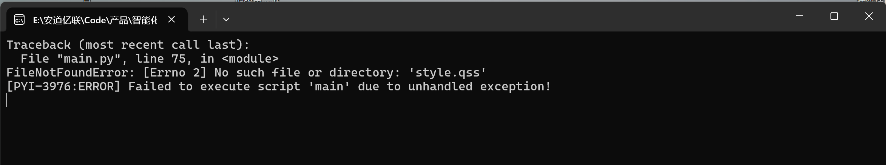

# Python使用

## 接口调用
1. 先安装依耐导入插件`requests`
```python
pip install requests
```
2. 导入插件
```python
import requests
```
3. 调用接口并传递参数
```python
url = 'http://localhost:8080/hello'
params = {'name': '张三'}
response = requests.get(url, params=params)
print(response.text)
```

## 依耐导出
1. 先安装依耐导入插件`requirements.txt`
```
pip install -r requirements.txt
```

2. 导出依耐
```
pip freeze > requirements.txt
```
导出成功后，在项目根目录下即可找到`requirements.txt`文件
这个文件中包含了项目所有的依耐，包括版本号（当前`python`解析器下安装的所有依耐）

## 项目打包
### 项目打包步骤
1. 先安装` pyinstaller`

2. 进入项目根目录，执行命令
```
pyinstaller --onefile main.py
```
* 这里的`main.py`是项目的入口文件，根据实际情况修改

3. 打包完成后，在dist目录下即可找到打包好的文件

**这种打包方式会将项目所有的文件都打包到一个文件中，比较大，但是运行起来比较方便**


### 遇到的问题

#### 文件引入问题
打包后，运行报如下错误


**解决方案**
1. 在文件开头添加 resource_path 函数和必要的导入
```python
import os
import sys

    def resource_path(relative_path):
        """ 获取资源文件的绝对路径，用于PyInstaller打包 """
        try:
            base_path = sys._MEIPASS
        except Exception:
            base_path = os.path.abspath(".")
        return os.path.join(base_path, relative_path)

    # 在加载样式表时调用resource_path函数    
    # 加载样式表
    with open(resource_path("style.qss"), 'r', encoding='utf-8') as f:
        app.setStyleSheet(f.read())

```
2. 使用以下命令打包
```python
pyinstaller --onefile --add-data "style.qss;." main.py
```

**注意，打包运行成功之后，发现项目中引入的图片没有正常显示，也是同样的问题**

**解决方案**
1. 在加载图片时调用resource_path函数
```python
    # 加载图片
    icon_path = resource_path('static/favico.png')
```
2.添加`static`文件夹下的所有资源到打包中

```python
pyinstaller --onefile --add-data "style.qss;." --add-data "static/static" main.py
```

### 更换打包后exe文件的图标
1. 先准备一个图标文件，格式为`.ico`

2. 在打包命令中添加`--icon`参数，指定图标文件的路径，我这里的图标文件是`static/favico.ico`
```python
pyinstaller --onefile --add-data "style.qss;." --add-data "static/static" --icon "static/favico.ico" main.py
```

3. 打包完成后，在`dist`目录下即可找到打包好的文件，文件图标可能不是指定的图标，把该`exe`文件复制出来图标可能就更新了。

### 窗口图标和任务栏图标
1. 先准备一个图标文件，格式为`.ico`、`.png`等

2. 在代码中添加窗口图标
```python
from utils.utils import resource_path
from PySide6.QtGui import QIcon

    #  这个图标会显示在任务栏、窗口左上角、Alt+Tab 切换等位置
    window.setWindowIcon(QIcon(resource_path('static/favico.ico'))) # 或 .ico，但 QIcon 通常能处理
```


