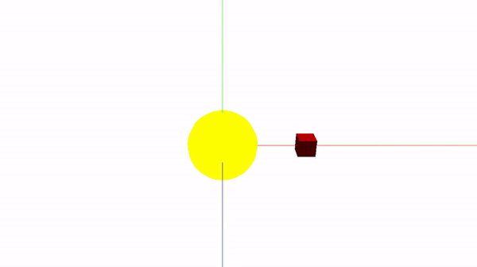
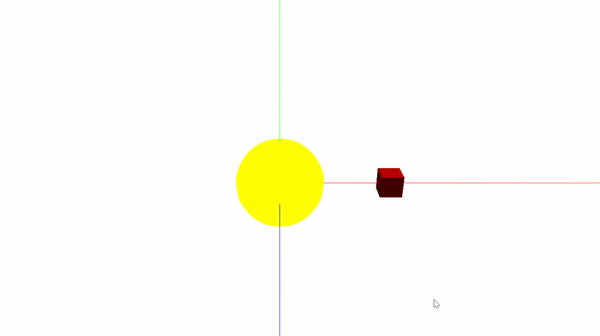

# cannon.js
Cannon.js 是一个开源的物理引擎，专为WebGL和游戏开发设计，尤其适合与Three.js这样的3D渲染库搭配使用

## 参考资料
[**官方英文文档**]([https://pmndrs.github.io/cannon-es/): https://pmndrs.github.io/cannon-es/

[**npm地址**]([https://www.npmjs.com/package/cannon-es): https://www.npmjs.com/package/cannon-es

## 物理模型
* 1. **球体（Sphere）:** 通过 CANNON.Sphere 类创建，只需指定球体的半径。
* 2. 盒子（Box）: 使用 CANNON.Box 创建，需要提供一个表示宽度、长度和高度的三维向量。
* 3. **平面（Plane）:** 虽然没有直接的平面形状，但可以通过创建一个具有足够大尺寸的 CANNON.Box 或非常薄的 CANNON.Trimesh 来模拟。
* 4. **长方体（Box）:** 实际上与盒子相同，通过 CANNON.Box 创建。
* 5. **圆柱体（近似）:** Cannon.js没有直接的圆柱体形状，但你可以通过组合两个半球和一个长方体来近似模拟。
* 6. **三角形网格（Trimesh）:** 使用 CANNON.Trimesh 可以创建复杂的不规则形状，适用于从三维模型导出的精确几何形状。
* 7. **复合形状（Compound）:** 如果需要组合多个基本形状来创建更复杂的物体，可以使用 CANNON.Compound。
* 8. **粒子（Particle）:** 通过 CANNON.Particle 可以创建没有体积的点状物体，常用于质点模拟。
* 9. **刚体（Rigidbody）:** CANNON.Body 是所有物理对象的基础类，包含了质量、位置、旋转等属性，并且可以附加上述任何形状。
* 10. **锥体（无直接支持）:** 类似圆柱体，Cannon.js没有直接的锥体形状，但可以通过创造性的形状组合来近似。

## 使用示例
### 自动碰撞检测场景

<details>
<summary><b>代码及效果展示</b></summary>

```html
<!DOCTYPE html>
<html>
<head>
    <meta charset=utf-8>
    <title>cannon.js自动碰撞</title>
    <link rel="stylesheet" href="../common.css">
</head>
<body onload="init()">
<script src="https://cdnjs.cloudflare.com/ajax/libs/cannon.js/0.6.2/cannon.js"></script>
<!-- 这里是本地js，使用时需要更改地址 -->
<script src="./js/three.js"></script>
<script src="./js/DragControls.js"></script>
<script src="./js/GLTFLoader.js"></script>
<script src="./js/OrbitControls.js"></script>
<script>
/**
   * 3D场景中进行平移，在不旋转的情况下，只看到物体跟随鼠标以平行于窗口的轨迹运动
*/
let renderer, camera, scene,
    light, mesh,
    cameraControls,
	group1, group2, model,
	cubeShape1, cubeBody1, cubeShape2, cubeBody2;
let xyz = {
	x: 1,
	y: 1,
	z: 1
}

// 创建物理引擎世界
let world = new CANNON.World()
// world.gravity.set(0, -9.82, 0);

  async function init() {
    initRenderer();//初始化渲染器
    initScene();//初始化场景
    initLight();//初始化光
    initCamera();//初始化相机
    await initMesh();//初始化模型
	animate();
    window.onresize = onWindowResize;
  }
  
  //初始化渲染器
  function initRenderer() {
    renderer = new THREE.WebGLRenderer();
    renderer.setSize(window.innerWidth, window.innerHeight);
	renderer.setClearColor(new THREE.Color('#fff')); 
    document.body.appendChild(renderer.domElement);
  }

  //初始化场景
  function initScene() {
    scene = new THREE.Scene();
	// 创建3维坐标系
	let AxesHelper = new THREE.AxesHelper(30)
	scene.add(AxesHelper)
  }

  //初始化相机
  function initCamera() {
    camera = new THREE.PerspectiveCamera(45, window.innerWidth / window.innerHeight, 0.1, 200);
    camera.position.set(0, 10, 20);//x,y,z
    camera.lookAt(0, 0, 0);
    scene.add(camera);
  }

  //初始化光
  function initLight() {
    scene.add(new THREE.AmbientLight(0x444444));

    light = new THREE.DirectionalLight(0xffffff);
    light.position.set(60, 30, 0);

    //平行光开启阴影投射
    light.castShadow = true;

    scene.add(light);
  }

   
	function initMesh() {
		// 创建第一个模型
		group1 = new THREE.Group();
		group1.name = 'group1'
		var geometry = new THREE.SphereGeometry( 2, 20, 20 );
		var material = new THREE.MeshBasicMaterial( {color: 0xffff00} );
		var mesh = new THREE.Mesh( geometry, material );
		group1.add(mesh);
		group1.position.set(0, 0, 0);
		scene.add(group1);
		
		// 创建第一个Cube的Cannon.js刚体
		// 创建Cannon.js中的球体几何体
		let radius = 2
		cubeShape1 = new CANNON.Sphere(radius);
		
		// 定义物理体的属性，如质量、位置等
		cubeBody1 = new CANNON.Body({
		    mass: 1, // 物体的质量，可以根据需要调整
		    position: new CANNON.Vec3(0, radius, 0), // 物理体的初始位置，这里假设与Three.js中的球体位置相同
		    shape: cubeShape1, // 使用上面创建的球体形状
		});
		cubeBody1.position.copy(group1.position);
		world.addBody(cubeBody1);
		// 创建第二个模型
		group2 = new THREE.Group();
		group2.name = 'group2';
		material = new THREE.MeshLambertMaterial({color: 'red'});
		geometry = new THREE.BoxGeometry(xyz.x, xyz.y, xyz.z);
		mesh = new THREE.Mesh(geometry, material);
		group2.add(mesh);
		group2.position.set(5, 0, 0);
		scene.add(group2);
		// 创建第二个Cube的Cannon.js刚体
		cubeShape2 = new CANNON.Box(new CANNON.Vec3(0.5, 0.5, 0.5));
		cubeBody2 = new CANNON.Body({ mass: 1, shape: cubeShape2 });
		cubeBody2.position.set(5, 0, 0);
		world.addBody(cubeBody2);
		// console.log(world, 'word')
		
		// 监听碰撞事件
		cubeBody2.addEventListener('collide', (e) => {
			console.log('cubeBody2', 'and', e);
		});
	}

  function render() {
    renderer.render(scene, camera);
  }

  function onWindowResize() {
    camera.aspect = window.innerWidth / window.innerHeight;
    camera.updateProjectionMatrix();
    renderer.setSize(window.innerWidth, window.innerHeight);
  }
  
  function animate() {
    requestAnimationFrame(animate);
    world.step(1 / 60);
    cubeBody2.position.x -= 0.02;
    // 更新Three.js模型的位置
    group1.position.copy(cubeBody1.position);
    group1.quaternion.copy(cubeBody1.quaternion);
    group2.position.copy(cubeBody2.position);
    group2.quaternion.copy(cubeBody2.quaternion);
	
	render()
  }

</script>
</body>
```
**自动碰撞检测场景演示**


</details>

### 拖拽碰撞检测场景

<details>
<summary><b>代码及效果展示</b></summary>

```html
<!DOCTYPE html>
<html>
<head>
    <meta charset=utf-8>
    <title>001-拖放控制器</title>
    <link rel="stylesheet" href="../common.css">
</head>
<body onload="init()">
<script src="https://cdnjs.cloudflare.com/ajax/libs/cannon.js/0.6.2/cannon.js"></script>
<!-- 这里是本地js，使用时需要更改地址 -->
<script src="./js/three.js"></script>
<script src="./js/DragControls.js"></script>
<script src="./js/GLTFLoader.js"></script>
<script src="./js/OrbitControls.js"></script>
<script>
  /**
   * 3D场景中进行平移，在不旋转的情况下，只看到物体跟随鼠标以平行于窗口的轨迹运动
   */
  let renderer, camera, scene,
    light, mesh,
    cameraControls,
	group1, group2, model,
	cubeShape1, cubeBody1, cubeShape2, cubeBody2;
let xyz = {
	x: 1,
	y: 1,
	z: 1
}

// 创建物理引擎世界
let world = new CANNON.World()
// world.gravity.set(0, -9.82, 0);

  async function init() {
    initRenderer();//初始化渲染器
    initScene();//初始化场景
    initLight();//初始化光
    initCamera();//初始化相机
    await initMesh();//初始化模型
    initControls();//轨道相机控制器
	animate();
    window.onresize = onWindowResize;
  }
  
  //初始化渲染器
  function initRenderer() {
    renderer = new THREE.WebGLRenderer();
    renderer.setSize(window.innerWidth, window.innerHeight);
	renderer.setClearColor(new THREE.Color('#fff')); 
    document.body.appendChild(renderer.domElement);
  }

  //初始化场景
  function initScene() {
    scene = new THREE.Scene();
	// 创建3维坐标系
	let AxesHelper = new THREE.AxesHelper(30)
	scene.add(AxesHelper)
  }

  //初始化相机
  function initCamera() {
    camera = new THREE.PerspectiveCamera(45, window.innerWidth / window.innerHeight, 0.1, 200);
    camera.position.set(0, 10, 20);//x,y,z
    camera.lookAt(0, 0, 0);
    scene.add(camera);
  }

  //初始化光
  function initLight() {
    scene.add(new THREE.AmbientLight(0x444444));

    light = new THREE.DirectionalLight(0xffffff);
    light.position.set(60, 30, 0);

    //平行光开启阴影投射
    light.castShadow = true;

    scene.add(light);
  }

   
	function initMesh() {
		// 创建第一个模型
		group1 = new THREE.Group();
		group1.name = 'group1';
		
		// 立方体
		// material = new THREE.MeshLambertMaterial({color: 'red'});
		// geometry = new THREE.BoxGeometry(xyz.x, xyz.y, xyz.z);
		// mesh = new THREE.Mesh(geometry, material);
		// group1.add(mesh);
		// group1.position.set(0, 0, 0);
		// scene.add(group1);

		// 球
		var geometry = new THREE.SphereGeometry( 2, 20, 20 );
		var material = new THREE.MeshBasicMaterial( {color: 0xffff00} );
		var mesh = new THREE.Mesh( geometry, material );
		group1.add(mesh);
		group1.position.set(0, 0, 0);
		scene.add(group1);

		// 创建第一个Cube的Cannon.js刚体
		// 立方体
		// cubeShape1 = new CANNON.Box(new CANNON.Vec3(0.5, 0.5, 0.5));
		// cubeBody1 = new CANNON.Body({ mass: 1, shape: cubeShape1 });
		// cubeBody1.position.set(0, 0, 0);
		// world.addBody(cubeBody1);

		// 球
		// 创建Cannon.js中的球体几何体
		let radius = 2
		cubeShape1 = new CANNON.Sphere(radius);
		
		// 定义物理体的属性，如质量、位置等
		cubeBody1 = new CANNON.Body({
		    mass: 1, // 物体的质量，可以根据需要调整
		    position: new CANNON.Vec3(0, radius, 0), // 物理体的初始位置，这里假设与Three.js中的球体位置相同
		    shape: cubeShape1, // 使用上面创建的球体形状
		});
		cubeBody1.position.copy(group1.position);
		world.addBody(cubeBody1);

		// 创建第二个模型
		group2 = new THREE.Group();
		group2.name = 'group2';
		material = new THREE.MeshLambertMaterial({color: 'red'});
		geometry = new THREE.BoxGeometry(xyz.x, xyz.y, xyz.z);
		mesh = new THREE.Mesh(geometry, material);
		group2.add(mesh);
		group2.position.set(5, 0, 0);
		scene.add(group2);
		// 创建第二个Cube的Cannon.js刚体
		cubeShape2 = new CANNON.Box(new CANNON.Vec3(0.5, 0.5, 0.5));
		cubeBody2 = new CANNON.Body({ mass: 1, shape: cubeShape2 });
		cubeBody2.position.set(5, 0, 0);
		world.addBody(cubeBody2);
		
		// 监听碰撞事件
		cubeBody2.addEventListener('collide', (e) => {
			group2.children[0].material.color.set(0x000000);
			console.log('cubeBody2',, e);
		});
	}

  function initControls() {
	console.log(scene, '----')
	let arr = [scene.children[4], scene.children[5]]
    let dragControls = new THREE.DragControls(arr, camera, renderer.domElement, false);

    dragControls.addEventListener('dragstart', function (event) {
		console.log(event, 'event前')
      cameraControls.enabled =false;
	  // 当开始拖拽时，禁用物理模拟
	  // cubeBody1.sleep();
	  // cubeBody2.sleep();
      // event.object.material.emissive.set(0xaaaaaa);
    });
	
	dragControls.addEventListener('drag', (event) => {
		// event.object.name
	  
	  // console.log(event, '999')
	  cubeBody2.position.copy(group2.position)
	  cubeBody2.quaternion.copy(group2.quaternion)
    });

    dragControls.addEventListener('dragend', function (event) {
		console.log(event, 'event后')
      // event.object.material.emissive.set(0x000000);
      cameraControls.enabled =true;
	  // 当拖拽结束时，重新启用物理模拟
	  // cubeBody1.wakeUp();
	  // cubeBody2.wakeUp();
    });
    cameraControls = new THREE.OrbitControls(camera, renderer.domElement);
  }

  function render() {
	// cannonDebugger.update()
    renderer.render(scene, camera);
  }

  function onWindowResize() {
    camera.aspect = window.innerWidth / window.innerHeight;
    camera.updateProjectionMatrix();
    renderer.setSize(window.innerWidth, window.innerHeight);
  }
  
  function animate() {
    // 更新帧数
    // stats.update()
    requestAnimationFrame(animate);
    world.step(1 / 60);
	render()
  }

</script>
</body>
```
**拖拽碰撞检测场景演示**


</details>