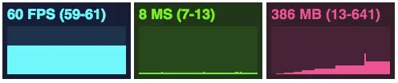

# three性能优化

## 性能监控
创建性能监控能够帮助我们更好的了解当前场景的渲染帧率（FPS）、延迟-毫秒（MS）、占用内存（MB），方便我们更好的进行性能优化。



```js
createStats(options = {}) {
    return new Promise(resolve => {
        const { id = 0, width = 100, position = { top: 0, left: 0, right: 0, bottom: 0 } } = options
        this.stats = new Stats()
        this.stats.setMode(id)
        this.stats.domElement.style.width = `${width}px`
        this.stats.domElement.style.position = 'absolute'
        this.stats.domElement.style.top = position.top
        this.stats.domElement.style.left = position.left
        this.stats.domElement.style.right = position.right
        this.stats.domElement.style.bottom = position.bottom
        document.getElementById(this.el).appendChild(this.stats.domElement)
        resolve()
    })
}
createStats({ id: 0, width: 80, position: { top: '80px', left: 'auto', right: '15px' } }),
```

## 创建模型时，尽量使用基类
通过Threejs提供的几何体类，比如球体、圆柱等几何体类创建几何体，最好使用基类是BufferGeometry而不是Geometry几何体类。

## 模型（材质）复用
尽量不要重复的创建模型，多使用`clone()`方法，但是特别注意该方法使用过后的模型就像对象一样拥有内存属性指针指向问题。

## 合理执行渲染方法
`Threejs`渲染器的`.render()`方法每次执行都需要调用大量的CPU、GPU等硬件资源，所以为了提高渲染性能，可以考虑尽量减少.`render()`的执行次数，这里说的尽量减少`.render()`的执行次数，不是简单地说越少越好，而是要在考虑渲染效果的基础上减少`.render()`的执行次数。如果场景有动画效果，就必须周期性执行`.render()`更新`canvas`画布图像，如果场景默认是静态的，没有动画，比如展示一个产品、建筑或机械零件的三维模型，只需要在鼠标旋转缩放三维模型，触发`.render()`执行即可，在没有发生鼠标事件的时候，可以不执行`.render()`。

对一些有动画的场景，可以适当控制`requestAnimationFrame()`函数周期性执行渲染的次数，比如把默认60FBS设置为30FBS。

修改帧率代码
```js
/**
 * 执行渲染程序
 */
render() {
    return new Promise(resolve => {
        if (!this.renderer) {
            return
        }
        // 控制帧率
        // 帧率越小，在货物数量较多的情况下越流畅，越大，在货物数量较少的情况下越流畅
        const targetFPS = 30; // 目标帧率
        const frameInterval = 1000 / targetFPS; // 每一帧的时间间隔（毫秒）
        const now = Date.now();
        if (this.lastFrameTime === undefined) {
            this.lastFrameTime = now;
        }
        const elapsed = now - this.lastFrameTime;
        if (elapsed >= frameInterval) {
            this.controls.update();
            this.stats && this.stats.update();
            // 渲染模糊处理【像素比】
            this.renderer.setPixelRatio(Math.min(window.devicePixelRatio, 2));
            this.renderer.render(this.scene, this.camera);
            this.lastFrameTime = now;
        }
        this.renderAnimate = requestAnimationFrame(this.render.bind(this)); // bind改变this指向不会立即调用函数
        resolve();
    })
}
```

帧率优化的思路主要是需要时才渲染，无操作时不调用`render()`。什么时候需要调用渲染呢？主要包含以下情况：
```
scene中object的增、删、改
object被选中、反选
相机位置、观察点变化
渲染区域大小变化
```
于是我们需要注意哪些操作会触发这些变化，主要有以下操作：
```
scene.add/remove方法被调用 （当模型被加载、移除等）
object material的变化，位置、缩放、旋转、透明度等变化
OrbitControls的的变化
camera的 'change'事件
鼠标的 mousedown/mouseup/mousemove等事件
键盘的w/a/s/d/up/down/left/right arrow等
```

## 减少模型的面数
Threejs渲染场景中网格模型Mesh的时候，如果网格模型Mesh几何体的三角形面数数量或者说顶点数量越多，那么需要的CPU和GPU的运算量就越大，几何体顶点数据占用的内存就多，这时候对于Threejs每次执行渲染.render()，花费的时间就越多，如果三角形面数过多，可能渲染帧率就会下降，鼠标操作三维模型的时候可能就会比较卡顿。

## 网格合并
多数情况下使用组可以很容易地操纵和管理大量网格。但是当对象的数量非常多时，性能就会成为一个瓶颈。使用组，每个对象还是独立的，仍然需要对它们分别进行处理和渲染。通过
THREE.Geometry.merge() 函数，你可以将多个几何体合并起来创建一个联合体。

当我们使用普通组的情况，绘制20000个立方体，帧率在15帧左右，如果我们选择合并以后，再绘制两万，就会发现，我们可以轻松的渲染20000个立方体，而且没有性能的损失。合并的代码如下：
```js
// 合并模型，则使用merge方法合并
var geometry = new THREE.Geometry()
// merge方法将两个几何体对象或者Object3D里面的几何体对象合并,(使用对象的变换)将几何体的顶点,面,UV分别合并.
// THREE.GeometryUtils: .merge() has been moved to Geometry.
Use geometry.merge( geometry2, matrix, materialIndexOffset ) instead.
for (var i=0; i<gui.numberOfObjects; i++) {
    var cube = addCube()
    cube.updateMatrix()
    geometry.merge(cube.geometry, cube.matrix)
}
scene.add(new THREE.Mesh(geometry, cubeMaterial))
```
**网格合并的优缺点**

缺点：组能够对每个单独的个体进行操作，而合并网格后则失去对每个对象的单独控制。想要移
动、旋转或缩放某个方块是不可能的。

优点：性能不会有损失。因为将所有的的网格合并成为了一个，性能将大大的增加。如果需要创建大型的、复杂的几何体。我们还可以从外部资源中创建、加载几何体。

## 删除模型时
删除模型时，将材质和几何体从内存中清除，不要忘记调用以下方法，因为可能导致内存泄漏
```js
1. item.geometry.dispose(); // 删除几何体
2. item.material.dispose(); // 删除材质
```

## 页面销毁时手动调用dispose方法，清除延时
```js
beforeDestroy () {
    clearTimeout()
    if (!this.scene) return
    const removeObj = (obj) => {
        let arr = obj.children.filter(x => x)
        arr.forEach(item => {
            if (item.children.length) {
                removeObj(item)
            } else {
                item.clear()
            }
        })
        obj.clear()
        arr = null
    }
    removeObj(this.scene)
    this.scene.children.map(model => {
        model.clear()
        this.scene.remove(model)
    })
    cancelAnimationFrame(this.renderAnimate)
    this.renderer.forceContextLoss()
    this.renderer.renderLists.dispose()
    this.renderer.dispose()
    this.renderer.content = null
    this.renderer.domElement = null
    this.scene.clear()
    THREE.Cache.clear()
    if (document.getElementById(this.el)) {
        document.getElementById(this.el).innerHTML = ''
    }
    // 清空变量
    this.length = null // 外层容器长
    this.width = null // 外层容器宽
    this.height = null // 外层容器高
    this.scene = null // 场景
    this.camera = null // 摄像头
    this.AxesHelper = null // 坐标轴
    this.spotLight = null // 聚光灯
    this.pointLight = null // 点光源
    this.ambientLight = null // 环境光
    this.renderer = null // 渲染器
    this.renderAnimate = null // 渲染动画
    this.controls = null // 控件
    this.plane = null // 平面
    this.text = null // 文字
    this.cube = null // 立方体
    this.border = null // 立方体边框
    this.group = null // 模型集合
    this.line = null // 线条
    this.dragControls = null
    // 键盘控制货物移动
    this.cargoData = {}
    this.cargoScene = {}
    // 货物集合
    this.sceneBoxList = []
}
```