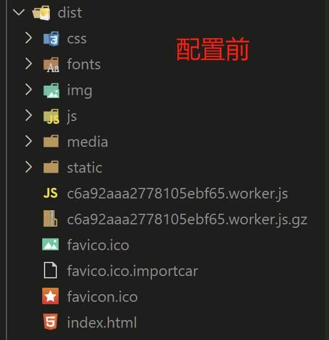
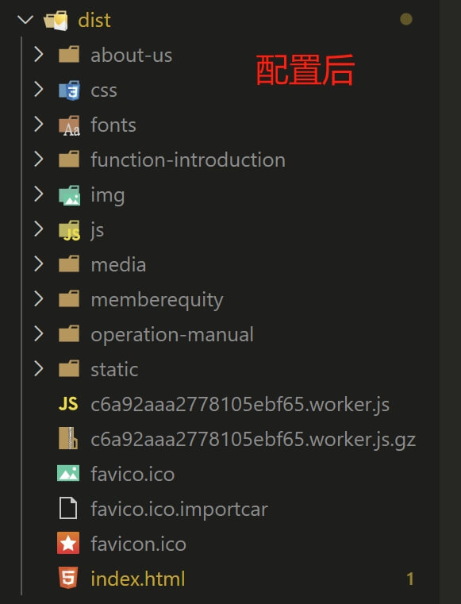
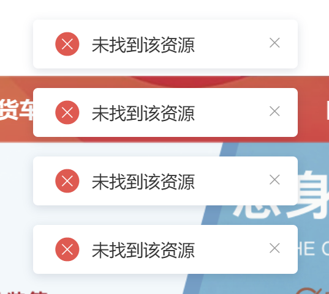

# SEO优化
## 场景
在产品推广阶段，通过`SEO`优化产品页面，使其在搜索引擎中排名更靠前。提升产品的知名度，便于运营人员推广产品。

## 实现
根据运营人员需求来选择如何实现`SEO`的优化

如果只需要一组关键词、描述，则可以直接在`public`文件夹下面的`index.html`内直接写死就可以了。

如果需要多组关键词、且让搜索引擎多收录几个页面时，我们就需要使用`prerender-spa-plugin`插件来实现

## 什么是prerender-spa-plugin
`prerender-spa-plugin`是一个用于`Vue.js`项目的`Webpack`插件，它能够在构建时针对指定的路由生成静态`HTML`文件。这些文件包含了页面的完整`HTML`结构，使得搜索引擎爬虫能够直接抓取到页面的内容，从而大幅提升SEO效果。

## 为什么要选择prerender-spa-plugin
`vue`项目是单页面应用`（SPA）`，为了优化`SEO`，预渲染技术应运而生`prerender-spa-plugin`，他可以通过配置，可以将我们的系统拆分成多页面应用。

## 安装prerender-spa-plugin
```
npm install prerender-spa-plugin

yarn add prerender-spa-plugin
```

## 配置prerender-spa-plugin
在`vue.config`配置
```js
const PrerenderSPAPlugin = require('prerender-spa-plugin')
const Renderer = PrerenderSPAPlugin.PuppeteerRenderer

// 预编译
const precompile = new PrerenderSPAPlugin({
    // 网页包的路径将应用程序输出到prerender
    staticDir: path.join(__dirname, 'dist'),
    // Routes to render 对应自己router
    routes: ['', '/function-introduction', '/operation-manual', '/about-us', '/memberequity'],
    // html文件压缩
    minify: {
        minifyCSS: true, // css压缩
        removeComments: true // 移除注释
    },
    // seo页面调用接口时解决跨域使用
    server: {
        proxy: {
            // 平台
            '/api': {
                target: 'http://110.123.1.1400:13002/',
                pathRewrite: { '^/api': '' }
            },
            '/file-view': {
                target: 'http://110.123.1.1300:13001/',
                pathRewrite: { '^/file-view': '' }
            }
        }
    },
    renderer: new Renderer({
        inject: {
            foo: 'bar'
        },
        // 渲染时显示浏览器窗口。对调试有用。
        headless: true,
        // 在 main.js 中 document.dispatchEvent(new Event('render-event'))，两者的事件名称要对应上。
        renderAfterDocumentEvent: 'render-event'
    })
})

module.exports = {
    configureWebpack: {
        plugins: [
            // 预编译影响项目启动和热更新，线上才开启
            ...(isProduction ? [precompile] : [])
        ]
    },
}
```
在`main.js`的配置
```js
new Vue({
  router,
  store,
  render: h => h(App),
  mounted() {
      document.dispatchEvent(new Event('render-event'))
    }
}).$mount('#app')
```
## 配置是否生效
预渲染配置前后的打包对比图




## 预渲染问题
1. 预渲染时首页，出现多的内容
2. 预渲染时首页，出现半截标签
3. 预渲染时首页，出现'未找到该资源'提示框



**出现以上问题时，都是预渲染开始时间太早，系统系统编译还未完成**

解决方案为：在`main.js`页面配置如下：
```js
new Vue({
    store,
    router,
    render: h => h(App),
    mounted() {
        setTimeout(() => {
            document.dispatchEvent(new Event('render-event'))
        }, 5000)
    }
}).$mount('#app')
```
**在编译完成后再开始预渲染的挂载**，配置后呈现出来的效果为：执行`yarn build`后系统`dist`文件先出现`prerender-spa-plugin配置`前的文件，5秒后（根据系统情况配置），再出现`prerender-spa-plugin配置`的文件。